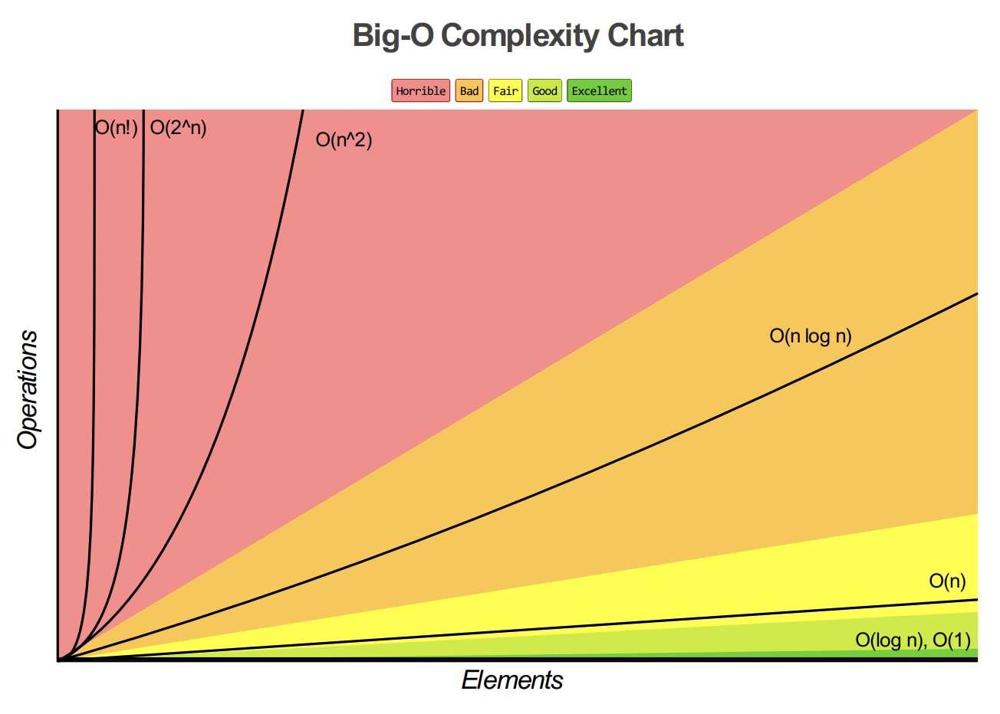

<!-- @import "[TOC]" {cmd="toc" depthFrom=1 depthTo=6 orderedList=false} -->

<!-- code_chunk_output -->

- [数据结构的基础概念](#数据结构的基础概念)
- [数据结构的内容](#数据结构的内容)
- [算法](#算法)
- [算法描述](#算法描述)
- [算法性能评价](#算法性能评价)
  - [时间性能分析](#时间性能分析)
  - [空间性能分析](#空间性能分析)
- [面向对象](#面向对象)

<!-- /code_chunk_output -->

# 数据结构的基础概念
1. **数据**：数据是描述客观事物的数值、字符以及能==输入==机器且能被==处理==的各种符号集合
2. **数据元素**：数据元素是组成数据的基本单位，是数据集合的个体
3. **数据对象**：数据对象是性质相同的数据元素的集合，是数据的一个子集
4. **数据结构**：数据结构是指相互之间存在一种或多种特定关系的数据元素集合
5. **数据类型**：数据类型是指一组性质相同的值集合以及定义在这个值集合上的一组操作的总称
    - 原子类型
    - 结构类型
6. **抽象数据类型**：定义了一个数据对象、数据对象中各元素间的结构关系以及一组处理数据的操作
    - ==数据抽象==
    - ==信息隐蔽==
   
       **抽象的本质是抽取反应问题的本质点，而非忽略非本质的细节，这是从事计算机研究的重要方法**
# 数据结构的内容
1. **逻辑结构**：数据元素间逻辑关系的描述
    - 线性结构：线性表、栈、队、字符串、数组、广义表
    - 非线性结构：数、图
2. **存储结构（物理结构）**：是逻辑结构在计算机中的存储映像，包括数据元素映像和关系映像
    - 顺序映像
    - 非顺序映像
3. **运算集合**

    **按某种逻辑结构关系组织起来的一批数据，按一定的映像方式把他们存放在计算机的存储器中，并在这些数据上定义一个运算的集合**

# 算法
算法+数据结构=程序

1. **算法**：算法是规则的有限集合，是为解决特定问题而规定的一系列操作
2. **算法的特性**：
   - 有限性
   - 确定性
   - 可行性
   - 输入：0个或多个
   - 输出：至少一个
3. **算法设计的要求**：
   - 正确性
   - 可读性
   - 健壮性（鲁棒性）：对非法输入的抵抗能力
   - 高效率和低存储量

# 算法描述
1. 自然语言：简单但易产生二义性
2. 框图：直观但不擅长表达数据的组织结构
3. 高级语言：准确、严谨但细节过多
4. 类语言

# 算法性能评价

## 时间性能分析
1. 算法耗费的时间
   
   一个算法的执行时间是指算法中所有语句执行时间的总和。每条语句执行时间等于该条语句执行次数乘执行一次的时间。

2. 语句频度
   
   语句频度指该语句在一个算法中重复执行的次数。

   一个算法的时间耗费就是该算法中所有语句频度之和。

3. **算法的时间复杂度**
   
   以算法中基本操作重复执行的频度作为度量标准 

   **T（n）=O（f（n））**
   

- O（1）:代码的执行时间不随 n 的增大而增长
```
let i = 8;
let j = 6;
let sum = i + j；
```
- O(logn)、O(nlogn)
```
let i=1;
while (i <= n)  {
i = i * 2;
 }
```
2^x=n

x=log2n
```
let i=1;
 while (i <= n)  {
   i = i * 3;
 }
```
3^x=n

x=log3n

log3n=log32∗log2n

O(log2n) 等于 O(log3n)

**O(Cf(n)) = O(f(n))**
- O(m+n)、O(m*n)
```
  function cal(m, n) {
  let sum_1 = 0;
  let i = 1;
  for (; i < m; ++i) {
    sum_1 = sum_1 + i;
  }
 
  let sum_2 = 0;
  let j = 1;
  for (; j < n; ++j) {
    sum_2 = sum_2 + j;
  }
 
  return sum_1 + sum_2;
}
```
O(m+n)

**T1(m)+T2(n)=O(f(m)+g(n))**

**T1(m)∗T2(n)=O(f(m)∗f(n))**
4 . 最坏时间复杂度
   
   一般不特别说明，讨论的时间复杂度都是最坏时间复杂度

## 空间性能分析
**算法空间复杂度**

**S（n）=O（f（n））**
- O(n)
```
for(i=0;<n;i++>)
   b[i]=a[n-i-1];
for(i=0;<n;i++>)
   a[i]=b[i];
```
- O(1)
```
for(i=0;i<n/2;i++>)
{
    t=a[i];
    a[i]=a[n-i-1];
    a[n-i-1]=t;
}
```
# 面向对象

面向对象=对象+类+继承+通信

**对象**：指在应用问题中出现的各种实体、事件和规格说明等，它由一组属性和在这组值上的一组服务构成，其中属性确定了对象的状态

**类**：把具有相同属性和服务的对象归到同一类，而把一个类中的每一个对象称为该类的一个实例，他们具有相同的服务

**继承**：面向对象方法的最具有特色的方面

**通信**：各个类的对象间通过消息进行通信


面向对象程序设计的特点
: 封装性
继承性
多态性


 
  
