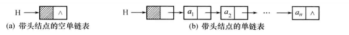

<!-- @import "[TOC]" {cmd="toc" depthFrom=1 depthTo=6 orderedList=false} -->

<!-- code_chunk_output -->

- [线性表的概念及其抽象数据类型定义](#线性表的概念及其抽象数据类型定义)
  - [线性表的逻辑结构](#线性表的逻辑结构)
  - [线性表的抽象数据类型定义](#线性表的抽象数据类型定义)
- [线性表的顺序存储](#线性表的顺序存储)
  - [线性表的顺序存储结构](#线性表的顺序存储结构)
  - [线性表顺序存储结构上的基本运算](#线性表顺序存储结构上的基本运算)
    - [查找操作](#查找操作)
    - [插入操作](#插入操作)
    - [删除操作](#删除操作)
    - [合并操作](#合并操作)
  - [线性表顺序存储结构的优缺点](#线性表顺序存储结构的优缺点)
- [线性表的链式存储](#线性表的链式存储)
  - [单链表](#单链表)
  - [单链表上的基本运算](#单链表上的基本运算)
    - [初始化单链表](#初始化单链表)
    - [建立单链表](#建立单链表)
    - [查找](#查找)
    - [求单链表长度](#求单链表长度)
    - [单链表插入操作](#单链表插入操作)
    - [单链表删除操作](#单链表删除操作)
    - [合并操作](#合并操作-1)
  - [循环链表](#循环链表)
    - [初始化循环单链表](#初始化循环单链表)
    - [建立循环单链表](#建立循环单链表)
    - [合并循环单链表](#合并循环单链表)
  - [双向链表](#双向链表)
    - [双向链表的前插操作](#双向链表的前插操作)
    - [双向链表的删除操作](#双向链表的删除操作)
- [线性表应用——一元多项式的表示及相加](#线性表应用一元多项式的表示及相加)
  - [一元多项式表示](#一元多项式表示)
  - [一元多项式存储](#一元多项式存储)
  - [一元多项式相加](#一元多项式相加)
- [顺序表和链表的综合比较](#顺序表和链表的综合比较)
  - [顺序表和链表](#顺序表和链表)
  - [线性表链式存储方式比较](#线性表链式存储方式比较)
- [典型例题](#典型例题)

<!-- /code_chunk_output -->


# 线性表的概念及其抽象数据类型定义
## 线性表的逻辑结构
**线性表**：是n个类型相同数据元素的有限序列，对n>0，除第一个元素无直接前驱、最后一个元素无直接后继外，其余每个元素只有一个前驱和一个后继，数据元素具有一对一关系（a_1，a_2，……a_n）

线性表的特点
: **同一性**:由同类数据元素组成
**有穷性**：由有限个数据元素组成
**有序性**：相邻元素之间存在序偶关系<a_i,a_i+1>

## 线性表的抽象数据类型定义

> **ADT LinearList**{
    **数据元素**：D={a_i|a_i∈D_0,i=1,2,……,n,n≥0，D_0为某一数据类型}
    **数据关系**：R={<a_i,a_i+1>|a_i,a_i+1∈D_0,i=1,2,……,n-1}
    **基本操作**：
    ①InitList(L)
     操作前提：L为未初始化线性表
     操作结果：将L初始化为空表
    ②ListLength(L)
     操作前提：线性表L已存在
     操作结果：如果L为空返回0，否则返回表中元素个数
    ③GetData(L,i)
     操作前提：表L存在，且1≤i≤ListLength(L)
     操作结果：返回表L中第i个元素的值
    ④InsList(L,i,e)
     操作前提：表L存在，e为合法元素1≤i≤ListLength(L)+1
     操作结果：在第i个位置之前插入新元素e，L长度加1
    ⑤DelList(L,i,e)
     操作前提：表L存在且非空，1≤i≤ListLength(L)
     操作结果：删除L的第i个数据元素，并用e返回其值，L长度减1
    ⑥Locate(L,e)
     操作前提：表L存在，e为合法数据元素值
     操作结果：如果L中存在e，则将当前指针指向数据元素e所在位置并返回TRUE，否则返回FALSE
    ⑦DestoryList(L)
     操作前提：表L存在
     操作结果：将L销毁
    ⑧ClearList(L)
     操作前提：表L存在
     操作结果：将L置空
    ⑨EmptyList(L)
     操作前提：表L存在
     操作结果：如果L为空则返回TRUE，否则返回FALSE  
}**ADT LinearList**;

# 线性表的顺序存储
## 线性表的顺序存储结构
指用一组地址连续的存储单元一次存储线性表中的各元素，使得线性表中在逻辑结构上相邻的数据元素存储在连续的物理存储单元中，通常成为**顺序表**→<u>关系线性化，节点顺序存</u>


1. 地址的计算
假设线性表有n个元素，每个元素占k个单元，第一个元素地址Loc(a_1),则**Loc(a_i)=Loc(a_1)+(i-1)K**,其中Loc(a_1)称为基址
2. 线性表顺序存储的表示
   C语言定义线性表：
   ```c
   #define MAXSIZE 100
   typedef struct
   {
       ElemType elem[MAXSIZE];
       int last;  /*线性表最后一个元素在数组elem[]中的下标值，空表置为-1*/
   }SeqList;
   ```
   注意：下标为0处开始存放第一个元素
   变量L的定义与使用：
   ①通过变量定义语句
   `SeqList L;`
   L.elem[i-1]→访问顺序表中序号为i的元素
   L.last→顺序表最后一个元素的下标
   L.last+1→顺序表长度
   ②通过指针变量定义语句
   `SeqList L_1,*L;L=&L_1`
   将L定义为指向SeqList类型的指针变量
   L->elem[i-1]→访问顺序表中序号为i的元素
   L->last+1→顺序表长度
## 线性表顺序存储结构上的基本运算
### 查找操作
1. 按序号查找GetData(L,i)
   `L.elem[i-1]`
2. 按内容查找Locate(l,e)
```c
   int Locate(SeqList L,ElemType e)
   {
       i=0;
       while((i<=L.last)&&(L.elem[i]!=e))
            i++;
       if(i<=L.last>)
          return(i+1);
       else
          return(-1);
   }
```
   算法时间复杂度O(n)
### 插入操作
```c

    #define OK 1
    #define ERROR 0

    int InsList(SeqList *L,int i,ElemType e)
    {
        int k;
        if((i<1)||(i>L->last+2))
        {
            printf("插入位置i不合法“);
            return(ERROR);
        }
        if(L->last>=MAXSIZE-1)
        {
            printf("表已满，无法插入");
            return(ERROR);
        }
        for(k=L->last;k>=i-1;K--)
           L->elem[k+1]=L->elem[k];
        L->elem[i-1]=e;
        L->last++;
        return(OK);
    }
```


### 删除操作
```c
int DelList(SeqList *L,int i,ElemType *e)
/*删除L中第i个元素并用指针参数e返回其值*/
{
    int k;
    if((i<1)||(i>L-last+1))
    {
        printf("删除位置不合法！");
        return(ERROR);
    }
    *e=L->elem[i-1];
    for(k=i;i<=L->last;K++)
        L->elem[k-1]=L->elem[k];
    L-last--;
    Rerurn(OK);
}
```

### 合并操作
<u>LA，LB是两个非递减顺序表，将它们合并为LC，要求LC也非递减</u>
**算法思想**：设两个指针i，j分别指向LA，LB中的元素，若LA.elem[i]>LB.elem[j],则将LB.elem[j]插入LC，若LA.elem[i]≤LB.elem[j],则将LA.elem[i]插入LC，直到一个表被扫描完，将另一个表剩余元素存入LC
**算法描述**：
```c
void mergeList(SeqList *LA,SeqList *LB,SeqList *LC)
{
    int i,j,k,l;
    i=0;j=0;k=0;
    while(i<=LA->last&&j<=LB->last)
    {
        if(LA->elem[i]<=LB->elem[j])
        {
            LC->elem[k]=LA->emem[i];
            i++:k++;
        }
        else
        {
            LC->elem[k]=LB->emem[j];
            j++:k++;           
        }
    }
    while(i<=LA->last)
    {
        LC->elem[k]=LA->elem[i];
        i++;k++;
    }
    while(j<=LB->last)
    {
        LC->elem[k]=LB->elem[j];
        j++;k++;
    }
    LC->last=LA->last+LB->last+1;
}
```
算法时间复杂度O(LA->last+LB->last)

## 线性表顺序存储结构的优缺点
1. 优点
   ①无须为表示节点间的逻辑关系而增加额外的存储空间
   ②可方便地随机存取表中任意元素
2. 缺点
   ①插入或删除运算不便，必须移动大量节点，效率低
   ②存储分配需预先进行静态分配，表长变化较大时，难以确定合适的存储规模
# 线性表的链式存储
## 单链表

数据域：存放结点的值
指针域：存储数据元素的直接后继的地址（或位置）
ps：设一个头指针指向头结点，最后一个结点的指针与为null


设头结点，其数据域可存储一些关于线性表长度等附加信息



单链表的存储结构描述：
```c
typedef struct Node
{
    ElemType data;
    struct Node * next;
}Node,* LinkList;
```
LinkList L,==L为单链表的头指针==
Node *p,==p为指向单链表中结点的指针变量==
e.g:对于带头结点的单链表L，令p=L->next,则p指向表中第一个元素结点，通过p->data可访问第一个元素值
## 单链表上的基本运算
### 初始化单链表
```c
InitList(LinkList *L)
{
    *L=(Linklist)malloc(sizeof(Node));
    (*L)->next=NULL;
}
```
==L是指向单链表的头结点的指针，用来接收主程序中待初始化单链表的头指针变量的地址==
==*L相当于主程序中待初始化单链表的头指针变量==

一个变量的(内存)地址称为该变量的“指针”
指针变量是用来存放另一个变量的地址的(即指针)

### 建立单链表
假设线性表中结点的数据类型是字符，逐个输入，并以$作为输入结束标志
1. 头插法建表


**算法描述**：
```c
void CreateFormHead(LinkList L)
{
    Node *s;
    char c;
    int flag=1;
    while(flag)
    {
        c=getchar();
        if(c!='$')
        {
            s=(Node*)malloc(sizeof(Node));/*建立新结点s*/
            s->data=c;
            s->next=L->next;/*将s结点插入表头*/
            L->next=s;
        }
        else flag=0;
    }
}
```
2. 尾插法建表


**算法思想**：
```c
void CreateFromTail(LinkList L)
{
    Node *r,*s;
    int flag=1;
    r=L; /*r指针动态指向链表表尾，初值指向头结点*/
    while(flag)
    {
        c=getchar();
        if(c!='$')
        {
            s=(Node*)malloc(sizeof(Node));
            s->data=c;
            r->next=s;
            r=s;
        }
        else
        {
            flag=0;
            r->next=NULL;/*将最后一个结点next置空，表示链表结束*/
        }
    }
}
```
### 查找
1. 按序号查找
**算法思想**：从头指针L出发，从头结点（L->next）顺着链域扫描，用指针p指向当前扫描到的结点，初值指向头结点，用j做计数器，初值为0，j==i时结束
**算法描述**：
```c
Node* Get(LinkList L,int i)
{
    int j;
    Node *p;
    if(i<=0)return NULL;
    p=L;j=0;
    while((p->next!=NULL)&&(j<i>))
    {
        p=p->next;
        j++;
    }
    if(i==j) return p;
    else return NULL;
}
```
O(n)
2. 按值查找
**算法思想**：从头指针指向的头结点出发，顺链逐个比较节点值和给定值e
**算法描述**：
```c
Node *Locate(LinkList L,ElemType key)
{
    Node *p;
    p=L->next;
    while(p!=NULL)
    {
        if(p->data!key)
        p=p->next;
        else break;
    }
    return p;
}
```
O(n)
### 求单链表长度
**算法思想**：从头结点开始数结点
**算法描述**：
```c
int ListLength(LinkList L)
{
    Node *p;
    p=L->next;
    j=0;
    while(p!=NULL)
    {
        p=p->next;
        j++;
    }
    rerurn j;
}
```
O(n)
### 单链表插入操作
在线性表第i个位置之前插入一个新元素e

**算法思想**：
（1）查找：在单链表中找到第i-1个结点并由指针pre指示
（2）申请：申请新结点s，将其数据域置为e
（3）插入挂链：通过修改指针域将新结点s挂入单链表L
**算法描述**：
```c
int InsList(LinkList L,int i,Elemtype e)
{
    Node *pre,*s;
    int k;
    if(i<=0;) return ERROR;
    pre=L;k=0;
    while(pre!=NULL&&k<i-1)
    {
        pre=pre->next;
        k=k+1;
    }
    if(pre==NULL)
    {
        printf("插入位置不合理！");
        return ERROR;
    }
    s=(Node*)malloc(sizeof(Node));
    s->data=e;
    s->next=pre->next;
    pre->next=s;
    return OK;
}
```
### 单链表删除操作
将线性表第i个元素e删除

**算法思想**：
（1）查找：通过计数方式找到第i-1个结点并由指针pre指示
（2）删除第i个结点并释放结点空间
**算法描述**：
```c
int DelList(LinkList L，int i,ElemType *e)
/*将删除的变量保存在变量*e中*/
{
    Node *pre,*r;
    int k;
    pre=L;k=0;
    while(pre->next!=NULL&&k<i-1>)/*与插入条件不同*/
    {
        pre=pre->next;
        k=k+1;
    }
    if(pre->next==NULL)
    {
        printf("删除位置i不合理！");
        return ERROR;
    }
    r=pre->next;
    pre->next=r->next;
    *e=r->data;
    free(r);
    return OK;
}
```
### 合并操作
<u>LA，LB是两个非递减顺序表，将它们合并为LC，要求LC也非递减（要求：利用现有表LA和LB中的元素结点空间，而不要额外申请）</u>
**算法思想**：通过更改next域重建表，尾插法
**算法实现**：
```c
LinkList MergeLinkList(LinkList LA,LinkList LB)
{
    Node *pa,*pb;
    LinkList LC;
    pa=LA->next;
    pb=LB->next;
    LC=LA;
    LC->next=NULL;
    r=LC;/*r初值为LC且始终指向LC的表尾*/
    /*当两个表均未处理完，选择较小值的结点插入LC*/
    while(pa!=NULL&&pb!=NULL)
    {
        if(pa->data<=pb->data)
        {
            r->next=pa;
            r=pa;
            pa=pa->next;
        }
        else
        {
            r->next=pb;
            r=pb;
            pb=pb->next;
        }
    }
    if(pa)
       r->next=pa;
    else
       r->next=pb;
    free(LB);/*释放LB*/
    return(LC);

}
```
## 循环链表
将单链表最后一个结点的指针域由NULL改为指向头结点

判断是否为表尾结点：
`P!=L或P->next!=L`
设置尾指针rear：
开始结点`rear->next->next`
终端结点`rear`
假设采用带头结点和头指针的循环单列表
### 初始化循环单链表
```c
InitCLinkList(LinkList *CL)
{
    *CL=(LinkList)malloc(sizeof(Node));
    (*CL)->next=NULL;
}
```
### 建立循环单链表
假设结点数据类型为字符型，逐个输入，以$作为结束标志
```c
void CreateCLinkList(LinkList CL)
{
    Node *rear,*s;
    char c;
    rear=CL;
    c=getchar();
    while(c!='$)
    {
        s=(Node*)malloc(sizeof(Node));
        s->data=c;
        rear->next=s;
        rear=s;
        c=getchar();
    }
    rear->next=CL;/*让最后一个结点（不是尾指针）的next指向头结点*/
}
```
### 合并循环单链表
将两个带头结点的循环单链表LA，LB合并为一个，其头指针为LA
**算法思想**：先找到LA，LB的表尾，并由指针ｐ，ｑ指向它们，然后将第一个链表的尾与第二个链表的第一个结点链接起来，并修改第二个表的表尾ｑ，使它的链域指向第一个表的头节点
**算法1**：
```c
LinkList merege_1(LinkList LA,LinkList LB)
{
    Node *p,*q;
    p=LA;
    q=LB;
    while(p->next!=LA) p=p->next;
    while(q->next!=LB) q=q->next;
    q->next=LA;/*LB尾指针指向LA头结点*/
    p->next=LB->next;/*LA尾指针指向LB第一个结点（不是头结点）*/
    free(LB);
    return(LA);
}
```
O(n)
**算法2**：设置尾指针

```c
LinkList merege_2(LinkList RA,LinkList RB)
{
    Node *p;
    p=RA->next;/*保存头结点地址*/
    RA->next=RB->next->next;/*RB的开始结点链接到RA的终端结点之后*/
    free(RB->next);/*释放RB头结点*/
    RB->next=p;/*RA头结点链接到RB终端结点之后*/
    return RB;/*返回新循环链表尾指针*/
}
```
## 双向链表

```c
typedef struct DNode
{
    ElemType data;
    struct DNode *prior,*next;
}DNode,* DoubleList;
```


`p->prior->next=p;`
`p->next->prior=p;`

### 双向链表的前插操作

```c
int DlinkIns(DoubleList L,int i,ElemType e)
{
    DNode *s,*p;
    .../*先检查i是否合法*/
    .../*若合法，找到第i个结点并让p指向它*/
    s=(DNode*)malloc(sizeof(DNode));
    if(s)
    {
        s->data=e;
        s->prior=p->prior;
        p->prior->next=s;
        s->next=p;
        p->prior=s;
        return TRUE;
    }
    else return FALSE;
}
```
### 双向链表的删除操作

```c
int DlinkDel(DoubleList L,int i,ElemType *e)
{
    DNode *p;
    .../*先检查i是否合法*/
    .../*若合法，找到第i个结点并让p指向它*/
    *e=p->data;
    p->prior->next=p->next;
    p->next->prior=p->prior;
    free(p);
    return TRUE;
}
```
# 线性表应用——一元多项式的表示及相加
## 一元多项式表示


## 一元多项式存储
1. 顺序存储
   （1）只存多项式系数，指数项用下标表示→浪费
   （2）只存储非零项（系数和指数）→适合存储非零项少的多项式
2. 链式存储

```c
typedef struct Polynode
{
    int coef;
    int exp;
    struct Polynode *next;
}Polynode,* Polylist;
```
**存储算法**：
**算法思想**：
通过键盘输入一组多项式系数和指数，用尾插法建议链表，以输入系数0为结束标志，并约定建立多项式链表时，指数按从小到大排
**算法描述**：
```c
Polylist PolyCreate()
{
    Polynnode *head,*rear,*s;
    int c,e;
    head=(Polynode*)malloc(sizeof(Polynode));
    rear=head;
    scanf("%d,%d",&c,&e);
    while(c!=0)
    {
        s=(Polynode*)malloc(sizeof(Polynode));
        s->coef=c;
        s->exp=e;
        rear->next=s;
        rear=s;
        scanf("%d,%d",&c,&e);
    }
    rear->next=NULL;
    return(head);
}
```
## 一元多项式相加
多项式相加运算规则：
①指数相同系数相加，若和不为零，则构成和多项式的一项
②指数不同的项按升幂顺序复制到和多项式中
**算法思想**：polya+polyb→将polyb结点插入polya中
设p，q分别指向polya和polyb当前项，比较指数
①若p->exp < q->exp,则结点p所指的结点应是和多项式的一项，令p后移
②若p->exp = q->exp,则系数相加，和不为零时修改p的系数域，释放q结点；若和为0，从polya中删去p结点，同时释放p，q
③若p->exp > q->exp,则结点q所指的结点是和多项式的一项，将结点q插入结点p之前，令p后移
**算法描述**：
```c
void PolyAdd(Polylist polya,Polylist polyb)
{
    Polynode *p,*q,*tail,*temp;
    int sum;
    p=polya->next;
    q=polyb->next;
    tail=polya;
    while(p!=NULL&&q!=NULL)
    {
        if(p->exp < q->exp)
        {
            tail->next=p;
            tail=p;
            p=p->next;
        }
        else if(p->exp = q->exp)
        {
            sum=p->coef+q->coef;
            if(sum!=0)
            {
                p->coef=sum;
                tail->next=p;
                tail=p;
                p=p->next;
                temp=q;
                q=q->next;
                free(temp);
            }
            else
            {
                temp=p;p=p->next;free(temp);
                temp=q;q=q->nexta;free(temp);
            }
        
        }
        else
        {
            tail->next=q;
            tail=q;
            q=q->next;
        }
    }
    if(p!=NULL)
       tail->next=p;
    else
       tail->next=q;
}
```
O(A+B)

# 顺序表和链表的综合比较
## 顺序表和链表
1. 当线性表长度变化较大，难以估计其存储规模时，采用动态链表存储好
   当线性表长度变化不大，易于事先确认其大小时，采用顺序表
2. 若主要操作是查找→顺序表
   若主要操作是插入删除→链表
   若主要操作是在首尾两端插入删除→带尾指针的单循环链表
## 线性表链式存储方式比较
|        | 找表中首元素结点 | 找表结尾结点 | 找P结点前驱结点 |
| ----------- | ----------- |----------- | ----------- |
|带头结点单链表L|L->next O(1)|一重循环 O(n)|顺P结点的next域无法找到P结点前驱|
|带头结点循环单链表L|L->next O(1)|一重循环 O(n)|O(n)|
|带尾指针的循环单链表R|R->next->next O(1)|R O(1)|O(n)|
|带头结点双向循环链表L|L->next O(1)|L->prior O(1)|P->prior O(1)|

# 典型例题
例1.<u>设计一个高效的算法，从顺序表L中删除所有值为x的元素，要求时间复杂度O(n)，空间复杂度O(1)</u>
**问题分析**:
- 从头开始扫描顺序表L，遇到值为x的元素，将其删掉（删除运算需将其后元素前移，时间复杂度为O(n)），整个问题时间复杂度为O(n^2^)→×
- 在原表空间重建一个新表，设置两个指示器i和j，i记录正在扫描到原表中元素的位置，j记录当前正在建立的新表表尾的下一个位置
**算法描述**:
```c
void delx(SeqList *L,Elemtype x)
{
    i=0;j=0;
    while(i<=L->last)
    {
        if(L->elem[i]!=x)
        {
            L->elem[j]=L->elem[i];
            i++;
            j++;
        }
        else i++;
    }
    L->last=j-1;
}
```
例2.<u>算法实现带头结点单链表的就地逆置问题</u>
**问题分析**:
对于顺序表，前后元素交换即可，对则单链表不行
**算法思想**：
从原有单链表中依次摘下结点，插入逆置链表的表头（表头结点和表中第一个结点之间）

**算法描述**：
```c
void ReverseList(LinkList L)
{
    p=L->next;/*p为原链表的当前处理结点*/
    L->next=NULL;/*逆置单链表初始为空*/
    while(p!=NULL)
    {
        q=p->next;
        p->next=L->next;
        L->next=p;/*将当前处理结点p插入逆置表L的表头*/
        p=q;/*p指向下一个待插入的结点*/
    }
}
```
例3.<u>已知带头结点单链表L，设计算法实现：以表中第一元素作为标准，将表中所有值小于第一个元素的结点均放在第一结点之前，所有值大于第一元素的结点均放在第一元素结点之后</u>
**问题分析**：
可以在单链表L中找到值小于第一个结点元素值的结点的前驱结点pre，删除pre->next对于的结点p，之后将p插入头结点L之后
**算法描述**：
```c
void changelist(LinkList L)
{
    if(L->next==NULL) return ERROR;
    p1=L->next;/*p1指向表中第一元素*/
    pre=p1;
    p=p1->next;
    while(p)
    {
        q=p->next;
        if(p->data>=p1->data)
        {
            pre=p;
            p=q;
        }
        else
        {
            pre->next=p->next;
            p->next=L->next;
            L->next=p;
            p=q;
        }
    }
}
```
例4.<u>建立一个带头结点的线性链表，用以存放输入的二进制数，链表中每个结点的data域存放一个二进制位。并在此链表上实现对二进制数加1的运算</u>
**问题分析**：
①建链表：用带头结点的单链表存储，第一个结点存最高位
②二进制加法规则：实现二进制加1，从地位到高位找到第一个值为0的位，从该位开始，对后面所有低位求反
③链表实现二进制加1时，从第一个结点开始找出最后一个值为0的结点，把该结点赋1，其后所有结点赋0
④若在链表中未找到值为0的结点，则申请一新结点，值为1，插入头结点与原表第一个结点之间，成为新链表第一个结点，其后所有结点值赋0
**算法描述**：
```c
void BinAdd(LinkList L)
{
    Node *q,*r,*s;
    q=L->next;
    r=L;
    while(q!=NULL)
    {
        if(q->data==0)
        r=q;
        q=q->next;
    }
    if(r!=L)
       r->data=1;
    else
    {
        s=(Node*)malloc(sizeof(Node));
        s->data=1;
        s->next=L->next;
        L->next=s;
        r=s;
    }
    r=r->next;
    while(r!=NULL)
    {
        r->data=0;
        r=r->next;
    }
    
}
```


