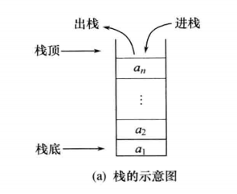
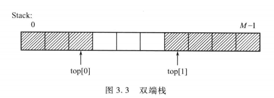
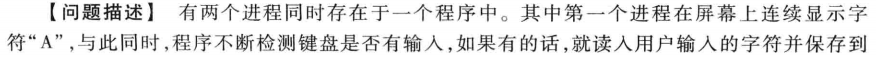

<!-- @import "[TOC]" {cmd="toc" depthFrom=1 depthTo=6 orderedList=false} -->

<!-- code_chunk_output -->

- [栈](#栈)
  - [栈的定义](#栈的定义)
  - [栈的表示与实现](#栈的表示与实现)
    - [顺序栈](#顺序栈)
    - [链栈](#链栈)
  - [栈的应用举例](#栈的应用举例)
    - [括号匹配问题](#括号匹配问题)
    - [表达式求值](#表达式求值)
  - [栈与递归的实现](#栈与递归的实现)
    - [汉诺塔问题](#汉诺塔问题)
    - [n阶乘的递归算法和递归调用过程](#n阶乘的递归算法和递归调用过程)
    - [递归算法到非递归算法的转换](#递归算法到非递归算法的转换)
      - [单向递归——斐波那契数列](#单向递归斐波那契数列)
      - [尾递归——n!问题](#尾递归n问题)
- [队列](#队列)
  - [队列的定义](#队列的定义)
  - [队列的表示和实现](#队列的表示和实现)
    - [链队列](#链队列)
    - [循环队列](#循环队列)
  - [队列的应用举例](#队列的应用举例)
    - [打印杨辉三角](#打印杨辉三角)
    - [键盘输入循环缓冲区问题](#键盘输入循环缓冲区问题)
- [典型例题](#典型例题)

<!-- /code_chunk_output -->


# 栈
## 栈的定义

特点：==后进先出==
>**ADT Stack**{
    **数据元素**：可以是任意类型的数据，但必须属于同一个数据对象
    **结构关系**：栈中数据元素之间是线性关系
    **基本操作**：
    ①InitStack(S)
    操作前提：S为未初始化的栈
    操作结果：将S初始化为空栈
    ②ClearStack(S)
    操作前提：栈S已存在
    操作结果：将栈S置成空栈
    ③IsEmpty(S)
    操作前提：栈S已存在
    操作结果：若S为空栈返回TRUE，否则返回FALSE
    ④IsFUll(S)
    操作前提：栈S已存在
    操作结果：若S为已满返回TRUE，否则返回FALSE
    ⑤Push(S,x)
    操作前提：栈S已存在
    操作结果：在S的顶部插入元素x。若S未满，将x插入栈顶，返回TRUE；若已满，返回FALSE
    ⑥Pop(S,x)
    操作前提：栈S已存在
    操作结果：删除S的顶部元素，并用x带回该值，返回TRUE；若栈为空，返回FALSE
    ⑦GetTop(S,x)
    操作前提：栈S已存在
    操作结果：取栈顶元素赋给x所指向单元，若栈空返回FALSE
}**ADT STACK；**
## 栈的表示与实现
### 顺序栈
```c
#define Stack_Size 50
typedef struct
{
    StackElementType elem[Stack_Size];
    int top;
}SeqStack;
```
初始化
```c
void InitStack(SeqStack *S)
{
    S->top=-1;
}
```
进栈
```c
int Push(SeqStack *S,StackElementType x)
{
    if(S->top==Stack_Size-1) return(FALSE);/*栈已满*/
    S->top++;
    S->elem[S->top]=x;
    return (TRUE);
}
```
出栈
```c
int Pop(SeqStack *S,StackElementType *x)
{
    if(S->top==-1) return(FALSE);/*栈为空*/
    else
    {
        *x=S->elem[top];
        S->top--;
        return(TRUE);
    }
}
```
读栈顶元素
```c
int GetTop(SeqStack *S,StackElementType *x)
{
    if(S->top=-1) return(FALSE);
    else
    {
        *x=S->elem[S->top];
        return(TRUE);
    }
}
```
多栈共享技术
e.g双端栈

```c
#define M 100
typedef struct
{
    StackElementType Stack[M];
    StackElementType top[2];
}DpStack;
```
双端栈初始化
```c
void InitStack(DpStack *S)
{
    S->top[0]=-1;
    S->top[1]=M;
}
```
双端栈进栈
```c
int Push(DpStack *S,StackElementType x,int i)
{
    if(S->top[0]+1==S->top[1]) return(FALSE);
    switch(i)
    {
        case 0:
          S->top[0]++;
          S->Stack[S->top[0]]=x;
          break;
        case 1:
          S->top[1]--;
          S->Stack[S->top[1]]=x;
          break;
        default:
          return(FALSE);
    }
    return(TRUE);
}
```
双端栈出栈
```c
int Pop(DpStack *S,StackElementType *x,int i)
{
    switch(i)
    {
        case 0:
          if(S->top[0]==-1) return(FALSE);
          *x=S->Stack[S->top[0]];
          S->top[0]--;
          break;
        case 1:
          if(S->top[1]==M) return(FALSE);
          *x=S->Stack[S->top[1]];
          S->top[0]++;
          break;
        default:
          return(FALSE);
    }
    return(TRUE);
}
```
### 链栈

```c
typedef struct node
{
    StackElementType data;
    struct node *next;
}LinkStackNode;
typedef LinkStackNode *LinkStack;
```
进栈
```c
int Push(LinkStack top,StackElementType x)
{
    LinkStackNode *temp;
    temp=(LinkStackNode*)malloc(sizeof(LinkStackNode));
    if(temp==NULL) return(FALSE);
    temp->data=x;
    temp->next=top->next;
    top->next=temp;
    return(TRUE);
}
```
出栈
```c
int Pop(LinkStack top,StackElementType *x)
{
    LinkStackNode *temp;
    temp=top->next;
    if(temp==NULL)
      return(FALSE);
    top->next=temp->next;
    *x=temp->data;
    free(temp);
    return(TRUE);
}
```
多栈运算
将多个链栈的栈顶指针放在一个一维指针数组中统一管理，从而实现同时管理和使用多个栈

```c
#define M 10
typedef struct node
{
    StackElementType data;
    struct node *next;
}LinkStackNode,*LinkStack;
LinkStack top[M];
```
## 栈的应用举例
### 括号匹配问题
设表达式中有三种括号：(),[],{}，可相互嵌套
**算法思想**：
检验算法可置一个栈，每读入一个括号
- 若是左括号，则直接入栈，等待相匹配的同类右括号；
- 若读入的是右括号，且与当前栈顶左括号同类型，则二者匹配，将栈顶左括号出栈，否则属于不合法情况；
- 若序列已读完，而栈中仍有等待匹配的左括号，或者读入了一个右括号，而栈中已无等待匹配的同类型括号，均属于不合法情况
- 当输入序列和栈同时为空时，说明所有括号完全匹配

**算法描述**：
```c
void BracketMatch(char *str)
{
    Stack S;int i;char ch;
    InitStack(&S);
    for(i=0;str[i]!='\0';i++)
    {
        switch(str[i]){
            case'(':
            case'[':
            case'{':
               Push(&S,str[i]);
               break;
            case')':
            case']':
            case'}':
               if(IsEmpty(&S))
               {printf("\n右括号多余！");return;}
               else
               {
                   GetTop(&S,&ch);
                   if(Match(ch,str[i]))
                      Pop(&S,&ch);
                    else
                    {
                        printf("\n对应的左右括号不同类");return;
                    }
               }
        }
    }
    if(IsEmpty(S))
    printf("\n括号匹配");
    else
    printf("\n左括号多余");
}
```
### 表达式求值
**算法思想**：
①规定运算符的优先级表
②设置两个栈：OVS(运算数栈)、OPTR(运算符栈)
③自左向右扫描，进行如下处理：
- 若遇到运算数则进OVS栈，若遇到运算符则与OPTR栈顶运算符进行优先级比较
  - 如果当前运算符优先级大于栈顶运算符优先级，则当前运算符进OPTR栈
  - 如果当前运算符优先级小于栈顶运算符优先级，则OPTR退栈一次，得到栈顶运算符x，OVS退栈两次得到两个运算数a，b，对a，b执行x操作，得到的结果T(i)进OVS栈

e.g

**算法描述**：
```c
int ExpEvaluation()
{
    InitStack(&OPTR);
    InitStack(&OVS);
    Push(&OPTR,'#');
    printf("\n\nPlease input ab expression(Ending with#):");
    ch=getchar();
    while(ch!='#'||GetTop(OPTR)!='#')
    {
        if(!In(ch,OPset))
        {
            n=GetNumber(ch);
            push(&OVS,n);
            ch=getchar();
        }
        else
        switch(Compare(ch,GetTop(OPTR)))
        {
            case'>':Push(&OPTR,ch);
                    ch=getchar();
                    break;
            case'=':
            case'<':Pop(&OPTR,&op);
                    Pop(&OVS,&b);
                    Pop(&OVS,&a);
                    v=Excute(a,op,b);
                    Push(&OVS,v);
                    break;
            
        }
    }
    v=GetTop(OVS);
    return(v);
}
```
## 栈与递归的实现
直接递归函数：一个函数在其定义体内直接调用自己
间接递归函数：一个函数经过一系列的中间调用语句，通过其他函数间接调用自己

### 汉诺塔问题

**算法思想**：
n=1时，只需将编号为1的圆盘从X直接移到Z
n>1时，需将压在编号n上的n-1个圆盘从X移到Y，可先将编号为n的圆盘从X移到Z，再将Y上的n-1个圆盘移到Z
<u>如何将n-1个圆盘从一个塔移到另一个塔的问题是一个和原问题具有相同特征属性的问题，问题的规模小1</u>
**算法描述**：
```c
void hanoi(int n,char x,char y,char z)
{
    if(n==1)
       move(x,1,z);
    else
    {
        hanoi(n-1,x,z,y);/*将1到n-1从x移到y*/
        move(x,n,z);
        hanoi(n-1,y,x,z);/*将1到n-1从y移到z*/
    }
}
```

```c
hanoi(3,a,b,c)
     hanoi(2,a,c,b)
          hanoi(1,a,b,c)
               move(a,1,c)
          move(a,2,b)
          hanoi(1,c,a,b)
               move(c,1,b)
    move(a,3,c)
    hanoi(2,b,a,c)
         hanoi(1,b,c,a)
              move(b,1,a)
         move(b,2,c)
         hanoi(1,a,b,c)
              move(a,1,c)
```
### n阶乘的递归算法和递归调用过程

```c
int f(int n)
{
    if(n==0) return(1);
    else return(n*f(n-1));
}
```
### 递归算法到非递归算法的转换
#### 单向递归——斐波那契数列

递归算法：
```c
Fib(int n)
{
    if(n==0||n==1) return n;        /*递归出口*/
    else return Fib(n-1)+Fib(n-2); /*递归调用*/
}
```
O(2^n^)
非递归算法
```c
int Fib(int n)
{
    int x,y,z;
    if(n==0||n==1) return n;
    else{
        x=0,y=1;
        for(i=2;i<=n;i++)
        {
            z=y;         /*z=Fib(i-1)*/
            y=x+y;       /*y=Fib(i)=Fib(i-1)+Fib(i-2)*/
            x=z;         /*x=Fib(i-1)*/
        }
        return y;
    }
}
```
O(n)

#### 尾递归——n!问题
指递归调用语句只有一个，且处于算法的最后
递归算法：
```c
long Fact(int n)
{
    if(n==1) return 1;
    return n*Fact(n-1);
}
```
非递归算法：
```c
long Fact(int n)
{
    int fac=1;
    for(int i=1;i<=n;i++)
        fac=fac*i;
    return fac;
}
```
# 队列
## 队列的定义
只允许在表的一端插入元素→队尾
另一端删除元素→队头
==先进先出==
>**ADT Queue**{
    **数据元素**:数据元素可以是任意类型的数据，但必须属于同一个数据对象
    **结构关系**:线性关系
    **基本操作**:
    ①InitQueue(Q)
    操作前提：Q为未初始化的队列
    操作结果：将Q初始化为一个空队列
    ②IsEmpty(Q)
    操作前提：Q已存在
    操作结果：若为空返回TRUE，否则返回FALSE
    ③IsFull(Q)
    操作前提：Q已存在
    操作结果：若为满返回TRUE，否则返回FALSE
    ④EnterQueue(Q,x)
    操作前提：Q已存在
    操作结果：在队尾插入x，若成功返回TRUE，否则返回FALSE
    ⑤DeleteQueue(Q,x)
    操作前提：Q已存在
    操作结果：将队头元素出队，并用x带回其值，若成功返回TRUE，否则返回FALSE
    ⑥GetHead(Q,x)
    操作前提：Q已存在
    操作结果：取队头元素，并用x带回其值，若成功返回TRUE，否则返回FALSE
    ⑦ClearQueue(q)
    操作前提：Q已存在
    操作结果：将Q置空
}**ADT Queue；**
## 队列的表示和实现
### 链队列

```c
typedef struct Node
{
    QueueElementType data;
    struct Node *next;
}LinkQueueNode;
typedef struct
{
    LinkQueueNode *front;
    LinkQueueNode *rear;
}LinkQueue;
```
初始化
```c
int InitQueue(LinkQueue *Q)
{
    Q->front=(LinkQueueNode*)malloc(sizeof(LinkQueueNode));
    if(Q->front!=NULL)
    {
        Q->rear=Q->front;
        Q->front->next=NULL;
        return(TRUE);
    }
    else return(FALSE);
}
```
入队
```c
int EnterQueue(LinkQueue *Q,QueueElementType x)
{
    LinkQueueNode * NewNode;
    NewNode=(LinkQueueNode *)malloc(sizeof(LinkQueueNode));
    if(NewNode!=NULL)
    {
        NewNode->data=x;
        NewNode->next=NULL;
        Q->rear->next=NewNode;
        Q->rear=NewNode;
        return(TRUE);
    }
    else return(FALSE);
}
```
出队
```c
int DeleteQueue(LinkQueue *Q,QueueElementType x)
{
    LinkQueueNode *p;
    if(Q->front==Q->rear) return(FALSE);
    p=Q->front->next;
    Q->front>next=p->next;
    if(Q->rear==p)/*只有一个元素，出队后变为空队*/
       Q->rear=Q->front;
    *x=p->data;
    free(p);
    return(TRUE);
}
```
### 循环队列

rear==MAXSIZE→可能造成假溢出→rear-front == MAXSIZE

进队：rear=(rear+1)mod MAXSIZE
出队：front=(front+1)mod MAXSIZE
front == rear j→可能是空队列也可能是满
损失一个元素空间或增设一个标志量
下面以损失一个元素空间为例：
```c
#define MAXSIZE 50
typedef struct
{
    QueueElementType element[MAXSIZE];
    int front;
    int rear;
}SeqQueue;
```
初始化
```c
void InitQueue(SeqQueue *Q)
{
    Q->front=Q->rear=0;
}
```
入队
```c
int EnterQueue(SeqQueue *Q,QueueElementType x)
{
    if((Q->rear+1)%MAXSIZE==Q->front)
    return(FALSE);
    Q->element[Q->rear]=x;
    Q->rear=(Q->rear+1)%MAXSIZE;
    return(TRUE);
}
```
出队
```c
int DeleteQueue(SeqQueue *Q,QueueElementType *x)
{
    if(Q->front==Q->rear)
    return(FALSE);
    *x=Q->element[Q->front];
    Q->front=(Q->front+1)%MAXSIZE;
    return(TRUE);
}
```
## 队列的应用举例
### 打印杨辉三角

```c
void YangHuiTriangle()
{
    SeqQueue Q;
    InitQueue(&Q);
    EnterQueue(&Q,1);/*第一行元素入队*/
    for(n=2;n<=N;n++)
    {
        EnterQueue(&Q,1);/*第n行第一个元素入队*/
        for(i=1;i<=n-2;i++)/*利用第n-1行元素产生第n行的中间n-2个元素并入队*/
        {
            DeleteQueue(&Q,&temp);
            Printf("%d",temp);/*打印n-1行的元素*/
            GetHead(Q,&x);
            temp=temp+x;
            EnterQueue(&Q,temp);
        }
        DeleteQueue(&Q,&x);
        printf("%d",&x);/*打印n-1行的最后一个元素*/
        EnterQueue(&Q,1);/*第n行最后一个元素入队*/
    }
    while(!IsEmpty(Q))/*打印最后一行元素*/
    {
        DeleteQueue(&Q,&x);
        printf("%d",&x);
    }
}
```
### 键盘输入循环缓冲区问题


```c
#include "stdio.h"
#include "conio.h"
#include "queue.h"
main()
{
    char ch1,ch2;
    SeqQueue Q;
    int f;
    InitQueue(&Q);
    for(;;)
    {
        for(;;)
        {
            printf("A");
            if(kbhit())
            {
                ch1=getchar();
                if(ch1==';'||ch1==',') break;
                f=EnterQueue(&Q,ch1);
                if(f==FALSE)
                {
                    printf("循环队列已满\n");
                    break;
                }
            }
        }
        while(!IsEmpty(Q))
        {
            DeleteQueue(&Q,&ch2);
            putchar(ch2);
        }
        if(ch1==';') break;
    }
}
```
# 典型例题

==辗转相除法→求最大公约数==
改进：
```c
void fun(int m,int n)
{
    int r;
    do
    {
        r=m%n;
        m=n;
        n=r;
    }while(r!=0);
    return(m);
}
```

**算法分析**：
用命令a表示病人到达
用命令n表示护士让下一位患者就诊
用命令q表示不再接受病人排队
采用链队存放患者病历号：
a→入队
n→出队
q→所有元素出队，程序终止
```c
void SeeDoctor()
{
    InitQueue(Q);
    flag=1;
    while(flag)
    {
        pritnf("\n请输入命令:");
        ch=getch();
        switch(ch){
            case'a':printf("\n病历号:");
                    scanf("%d",&n);
                    EnterQueue(&Q,n);
                    break;
            case'n':if(!IsEmpty(Q))
                    {
                        DeleteQueue(&Q,&n);
                        printf("\n病历号为%d的病人就诊",n);
                    }
                    else printf("无人等候就诊");
                    break;
            case'q':printf("\n今天停止挂号，下列病人依次就诊：");
                    while(!IsEmpty(Q))
                    {
                        DeleteQueue(&Q,&n);
                        printf("%d",n);
                    }
                    flag=0;
                    break;
            default:printf("\n非法命令！");

        }
    }
}
```