<!-- @import "[TOC]" {cmd="toc" depthFrom=1 depthTo=6 orderedList=false} -->

<!-- code_chunk_output -->

- [串的基本概念](#串的基本概念)
- [串的存储和实现](#串的存储和实现)
  - [定长顺序串](#定长顺序串)
    - [定义](#定义)
    - [串插入函数](#串插入函数)
    - [串删除函数](#串删除函数)
    - [串比较函数](#串比较函数)
    - [定位函数——==串的简单匹配Brute—Force算法==](#定位函数串的简单匹配bruteforce算法)
    - [改进算法KMP](#改进算法kmp)
      - [模式串移动距离的判断](#模式串移动距离的判断)
      - [Next函数的缺陷](#next函数的缺陷)
      - [KMP算法的实现](#kmp算法的实现)
  - [堆串](#堆串)
  - [块链串](#块链串)
- [串的应用——简单的行编辑器](#串的应用简单的行编辑器)
- [典型例题](#典型例题)

<!-- /code_chunk_output -->

# 串的基本概念
字符串是由零个或多个字符组成的有限序列，记为
S='a~1~a~2~……a~n~'(n≥0)
S是串的名字，每个a~i~可以是字母，数字或其他字符，n是串中字符的个数，成为串的长度，n=0称为空串
**串值必须用单引号括起来（C语言是双引号）**
**子串**：串中任意个连续的字符组成的子序列称为该串的子串
**主串**：包含子串的串称为主串
**子串在主串中的位置**：通常将字符在串中的序号称为该字符在串中的位置，子串在主串中的位置则以子串的第一个字符在主串中的位置来表示
**串相等**：当且仅当两个串的值相等时，称两个串相等，即长度相等且对应字符相等
**空串≠空格串**
>**ADT String**{
    **数据对象**：D={a~i~|a~i~∈CharacterSet,记为V，i=1，2，……，n，n≥0}
    **结构关系**：R={<a~i~,a~i+1~>|a~i~,a~i+1~∈V,i=1,……,n-1,n-1≥0}
    **基本操作**：
    1.StrAssign(S,chars)
      操作前提：chars是字符串常量
      操作结果：生成一个值等于chars的串S
    2.StrInsert(S,pos,T)
      操作前提：串S存在，1≤pos≤StrLength(S)+1
      操作结果：在串S的第pos个字符之前插入串T
    3.StrDelete(S,pos,len)
      操作前提：串S存在，1≤pos≤StrLength(S)+1
      操作结果：从串S中删除第pos个字符起长度为len的子串
    4.StrCopy(S,T)
      操作前提：串S存在
      操作结果：由串T复制S
    5.StrEmpty(S)
      操作前提：串S存在
      操作结果：若S为空返回TRUE，否则返回FALSE
    6.StrCompare(S,T)
      操作前提：串S和T存在
      操作结果：若S>T,返回值大于0；若S=T，返回0；若S<T,返回值小于0
    7.StrLength(S)
      操作前提：串S存在
      操作结果：返回S长度
    8.StrClear(S)
      操作前提：串S存在
      操作结果：将S清为空串
    9.StrCat(S,T)
      操作前提：串S和T存在
      操作结果：将T的值连接在串S后面
    10.StrString(Sub,S,pos,len)
      操作前提：串S存在，1≤pos≤StrLength(S)且1≤len≤StrLength(S)-pos+1
      操作结果：用sub字符串返回S第pos起长度为len的子串
    11.StrIndex(S,pos,T)
      操作前提：串S和T存在，T是非空串，1≤pos≤StrLength(S)
      操作结果：若串S中存在和串T相同的子串，则返回它在串S中第pos个字符之后第一次出现的位置；否则返回0
    12.StrReplace(S,T,V)
      操作前提：串S，T，V存在且T非空
      操作结果：用V替换串S中出现的所有与T相等的不重叠子串
    13.StrDestory(S)
      操作前提：串S存在
      操作结果：销毁S
}**ADT String;**

# 串的存储和实现
## 定长顺序串
### 定义
```c
#define MAXLEN 40
typedef struct{
    char ch[MAXLEN];
    int len;
}SString;
```
### 串插入函数
**问题分析**：插入位置pos将串分为两部分（假设为A，B，长度为LA，LB）及待插入部分（C，LC），串由AB变为ACB，可能出现以下三种情况：
①插入后串长（LA+LB+LC）≤MAXLEN，则将B后移LC个元素位置，在将C插入
②插入后串长＞MAXLEN且pos+LC≤MAXLEN,则B后移时有部分字符被舍弃
③插入后串长＞MAXLEN且pos+LC＞MAXLEN，则B的全部字符被舍弃，并且C在插入时也有部分字符被舍弃
**算法描述**：
```c
StrInsert(SString *s,int pos,SString t)
{
    int i;
    if(pos<0||pos>s->len) return(0);
    //①
    if(s->len+t.len<=MAXLEN)
    {
        for(i=s->len+t.len-1;i>=t.len+pos;i--)
        s->ch[i]=s->ch[i-t.len];
        for(i=0;i<t.len;i++)
        s->ch[i+pos]=t.ch[i];
        s->len=s->len+t.len;
    }
    //②
    else if(pos+t.len<=MAXLEN)
    {
        for(i=MAXLEN-1;i>t.len+pos-1;i--)
        s->ch[i]=s->ch[i-t.len];
        for(i=0;i<t.len;i++)
        s->ch[i+pos]=t.ch[i];
        s->len=MAXLEN;
    }
    //③
    else
    {
        for(i=0;i<MAXLEN-pos;i++)
        s->ch[i+pos]=t.ch[i];
        s->len=MAXLEN;
    }
    return(1);
}
```
### 串删除函数
```c
StrDelete(SString *s,int pos,int len)
{
    int i;
    if(pos<0||pos>(s->len-len)) return(0);
    for(i=pos+len;i<s->len;i++)
     s-ch[i-len]=s->ch[i];
    s->len=s->len-len;
    return(1);
}
```
### 串比较函数
```c
StrCompare(SString s,SString t)
{
    int i;
    //对应字符
    for(i=0;i<s.len&&i<t.len;i++)
       if(s.ch[i]!=t.ch[i]) return(s.ch[i]-t.ch[i]);
    //长度
    return(s.len-t.len);
}
```
### 定位函数——==串的简单匹配Brute—Force算法==
**算法思想**：从主串S的第pos个子开始，和模式串T的第一个字符开始比较，如果相等就比较后续字符，如果不等，则从主串S的第pos+1个字符重新开始比较，直到T中每一个字符全部匹配成功，返回和T中第一个字符相等的字符在S中的位置；或主串中没有和T匹配的序列，则匹配不成功
设置i，j，start三个指示器：
- i指向S中当前比较的字符，起始指向S的首字符，此后每比较一步，后移一个位置，一趟匹配失败时，回溯到该趟比较起点的下一位置
- j指向T中当前比较的字符，起始指向T的首字符，此后每比较一步，后移一个位置，一趟匹配失败时，回溯到T的首字符
- start记录每趟比较时在主串S中的起点，每趟比较后，后移一位，确定下一趟起始位置
e.g.
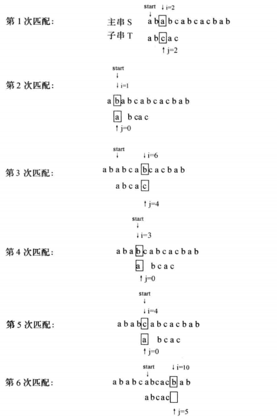
```c
StrIndex(SString s,int pos,SString t)
{
    int i,j,start;
    if(t.len==0) return(0);
    start=pos;i=start;j=0;
    while(i<s.len&&j<t.len)
    {
        if(s.ch[i]==t.ch[j]) {i++;j++}/*当前对应字符相等时推进*/
        else{/*当前对应字符不等时回溯*/
            start++;/*主串从start+1开始，T从0开始*/
            i=start;j=0;
        }
    }
    if(j>=t.len) return(start);/*匹配成功*/
    else return(-1);
}
```
最坏时间复杂度O(s.len×t.len)
### 改进算法KMP
对主串 A（"ABCABCE"）和模式串 B（"ABCE"）进行模式匹配，如果人为去判断，仅需匹配两次
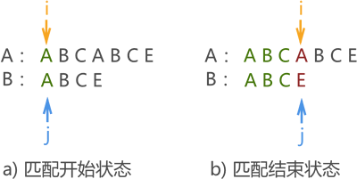
第一次如上图所示，最终匹配失败。但在本次匹配过程中，我们可以获得一些信息，模式串中 "ABC" 都和主串对应的字符相同，但模式串中字符 'A' 与 'B' 和 'C' 不同。

因此进行下次模式匹配时，没有必要让串 B 中的 'A' 与主串中的字符 'B' 和 'C' 一一匹配（它们绝不可能相同），而是直接去匹配失败位置处的字符 'A' ，如图 2 所示：
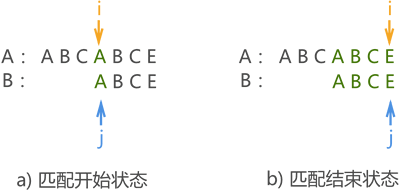
至此，匹配成功。若使用 BF 算法，则此模式匹配过程需要进行 4 次。

<font color=red>由此可以看出，每次匹配失败后模式串移动的距离不一定是 1，某些情况下一次可移动多个位置，这就是 KMP 模式匹配算法。</font>
#### 模式串移动距离的判断
<font color=red>匹配失败后模式串移动的距离和主串没有关系，只与模式串本身有关系</font>

例如，我们将前面的模式串 B 改为 "ABCAE"，则在第一次模式匹配失败，由于匹配失败位置模式串中字符 'E' 前面有两个字符 'A'，因此，第二次模式匹配应改为如图 3 所示的位置：
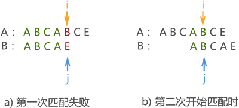
结合图 1、图 2 和图 3 不难看出，模式串移动的距离只和自身有关系，和主串无关。换句话说，不论主串如何变换，只要给定模式串，则匹配失败后移动的距离就已经确定了。

<u>不仅如此，模式串中任何一个字符都可能导致匹配失败，因此串中每个字符都应该对应一个数字，用来表示匹配失败后模式串移动的距离。</u>

这里要转换一下思想，==模式串向后移动等价于指针 j 前移==，如图 4 中的 a) 和 b)。换句话说，模式串后移相当于对指针 j 重定位。
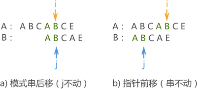
因此，我们可以给每个模式串配备一个数组（例如 next[]），用于存储模式串中每个字符对应指针 j 重定向的位置（也就是存储模式串的数组下标），比如 j=3，则该字符匹配失败后指针 j 指向模式串中第 3 个字符。

模式串中各字符对应 next 值的计算方式是，**取该字符==前面的==字符串（不包含自己），其前缀字符串和后缀字符串==相同字符的最大个数==再 +1 就是该字符对应的 next 值。**
>前缀字符串指的是位于模式串起始位置的字符串，例如模式串 "ABCD"，则 "A"、"AB"、"ABC" 以及 "ABCD" 都属于前缀字符串；后缀字符串指的是位于串结尾处的字符串，还拿模式串 "ABCD" 来说，"D"、"CD"、"BCD" 和 "ABCD" 为后缀字符串。

注意，模式串中**第一个字符对应的值为 0，第二个字符对应 1**，这是固定不变的。因此，图 3 的模式串 "ABCAE" 中，各字符对应的 next 值如图 5 所示：

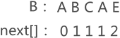

从图 5 中的数据可以看出，当字符 'E' 匹配失败时，指针 j 指向模式串数组中第 2 个字符，即 'B'，同之前讲解的图 3 不谋而合。

为什么字符 'C' 对应的 next 值为 1？因为字符串 "AB" 前缀字符串和后缀字符串相等个数为 0，0 + 1 = 1。那么，为什么字符 'E' 的 next 值为 2？因为紧挨着该字符之前的 'A' 与模式串开头字符 'A' 相等，1 + 1 = 2。

如果图 5 中模式串为 "ABCABE"，则对应 next 数组应为 [0,1,1,1,2,3]，为什么字符 'E' 的 next 值是 3 ？因为紧挨着该字符前面的 "AB" 与开头的 "AB" 相等，2 + 1 =3。

因此，我们可以设计这样一个算法，刚开始时令 j 指向模式串中第 1 个字符，i 指向第 2 个字符。接下来，对每个字符做如下操作：

如果 i 和 j 指向的字符相等，则 i 后面第一个字符的 next 值为 j+1，同时 i 和 j 做自加 1 操作，为求下一个字符的 next 值做准备，如图 6 所示：

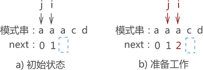

上图中可以看到，字符 'a' 的 next 值为 j +1 = 2，同时 i 和 j 都做了加 1 操作。当计算字符 'C' 的 next 值时，还是判断 i 和 j 指向的字符是否相等，显然相等，因此令该字符串的 next 值为 j + 1 = 3，同时 i 和 j 自加 1（此次 next 值的计算使用了上一次 j 的值）。如图 7 所示：

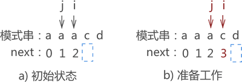

如上图所示，计算字符 'd' 的 next 时，i 和 j 指向的字符不相等，这表明最长的前缀字符串 "aaa" 和后缀字符串 "aac" 不相等，接下来要判断次长的前缀字符串 "aa" 和后缀字符串 "ac" 是否相等，这一步的实现可以用 j = next[j] 来实现，如图 8 所示：

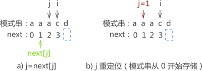

从上图可以看到，i 和 j 指向的字符又不相同，因此继续做 j = next[j] 的操作，如图 9 所示：

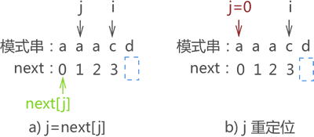

可以看到，j = 0 表明字符 'd' 前的前缀字符串和后缀字符串相同个数为 0，因此如果字符 'd' 导致了模式匹配失败，则模式串移动的距离只能是 1。
```c
void Next(char*T,int *next){
    next[1]=0;
    next[2]=1;
    int i=2;
    int j=1;
    while (i<strlen(T)) {
        if (j==0||T[i-1]==T[j-1]) {
            i++;
            j++;
            next[i]=j;
        }else{
            j=next[j];
        }
    }
}
```
#### Next函数的缺陷
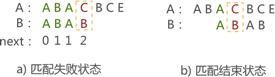

例如，在图 a) 中，当匹配失败时，Next 函数会由图 b) 开始继续进行模式匹配，但是从图中可以看到，这样做是没有必要的，纯属浪费时间。

出现这种多余的操作，问题在当 T[i-1]==T[j-1] 成立时，没有继续对 i++ 和 j++ 后的 T[i-1] 和 T[j-1] 的值做判断。改进后的 Next 函数如下所示：
```c
void Next(char*T,int *next){ 
    next[1]=0;
    next[2]=1;
    int i=2;
    int j=1;
    while (i<strlen(T)) {
        if (j==0||T[i-1]==T[j-1]) {
            i++;
            j++;
            if (T[i-1]!=T[j-1]) {
               next[i]=j;
            }
            else{
                next[i]=next[j];
            }
        }else{
            j=next[j];
        }
    }
}
```
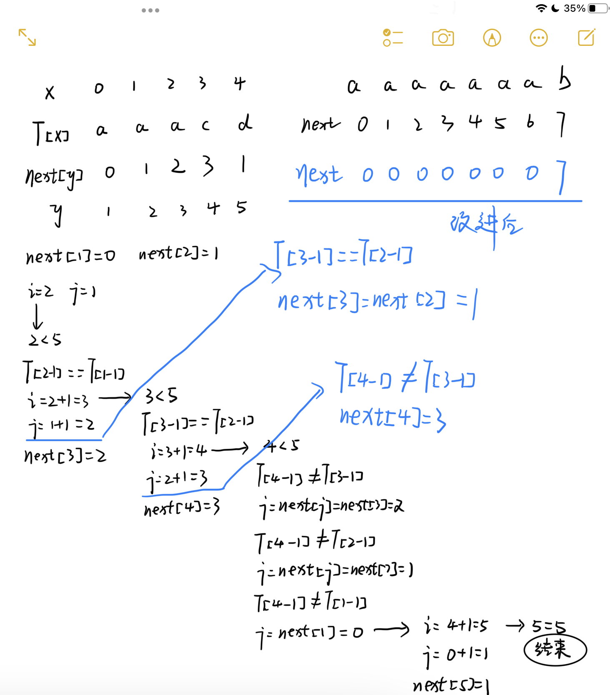

#### KMP算法的实现
假设主串 A 为 "ababcabcacbab"，模式串 B 为 "abcac"，则 KMP 算法执行过程为：
- 第一次匹配如图所示，匹配结果失败，指针 j 移动至 next[j] 的位置；
 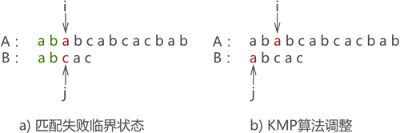
- 第二次匹配如图所示，匹配结果失败，依旧执行 j=next[j] 操作：
 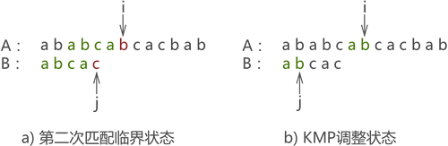
- 第三次匹配成功，如图 14 所示：
  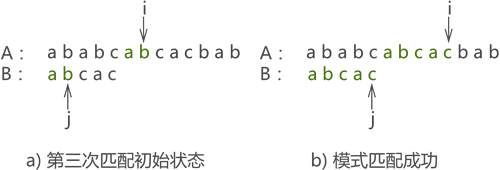
```c
#include <stdio.h>
#include <string.h>
void Next(char*T,int *next){
    int i=1;
    next[1]=0;
    int j=0;
    while (i<strlen(T)) {
        if (j==0||T[i-1]==T[j-1]) {
            i++;
            j++;
            next[i]=j;
        }else{
            j=next[j];
        }
    }
}
int KMP(char * S,char * T){
    int next[10];
    Next(T,next);//根据模式串T,初始化next数组
    int i=1;
    int j=1;
    while (i<=strlen(S)&&j<=strlen(T)) {
        //j==0:代表模式串的第一个字符就和当前测试的字符不相等；S[i-1]==T[j-1],如果对应位置字符相等，两种情况下，指向当前测试的两个指针下标i和j都向后移
        if (j==0 || S[i-1]==T[j-1]) {
            i++;
            j++;
        }
        else{
            j=next[j];//如果测试的两个字符不相等，i不动，j变为当前测试字符串的next值
        }
    }
    if (j>strlen(T)) {//如果条件为真，说明匹配成功
        return i-(int)strlen(T);
    }
    return -1;
}
int main() {
    int i=KMP("ababcabcacbab","abcac");
    printf("%d",i);
    return 0;
}
``` 


## 堆串
**串值→堆串存储**
以一组地址连续的存储单元顺序存放串中的字符，但它们的存储空间是在程序执行过程中动态分配的，系统将一个地址连续、容量很大的存储空间作为字符串的可用空间，每当建立一个新串时，系统从这个空间分配一个大小和字符串长度相同的空间用于存储串值
**串名→符号表**
所有串名的存储映像构成一个符号表
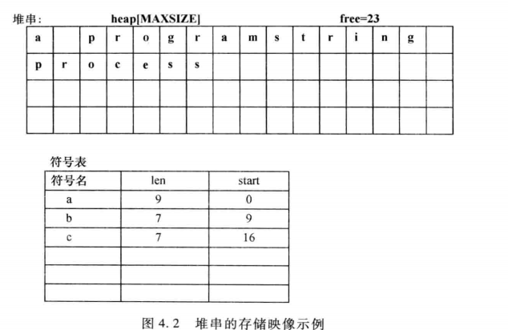
定义
```c
typedef struct
{
    char *ch;
    int len;
}HString;
```
堆串插入函数
```c
StrInsert(HString *s,int pos,HString *t)
{
    int i;
    char *temp;
    if(pos<0||pos>s->len||s->len==0) return(0);
    temp=(char*)malloc(s->len+t->len);
    if(temp==NULL) return(0);
    for(i=0;i<pos;i++)  temp[i]=s->ch[i];
    for(i=0;i<t->len;i++) temp[i+pos]=t->ch[i];
    for(i=pos;i<s->len;i++)  temp[i+t->len]=s-ch[i];
    s->len+=t->len;
    free(s->ch);
    s->ch=temp;
    return(1);
}
```
堆串赋值函数
```c
StrAssign(HString *s,char *tval)
{
    int len,i=0;
    if(s->ch!=NULL) free(s->ch);
    while(tval[i]!='\0') i++;
    len=i;
    if(len)
    {
        s->ch=(char*)malloc(len);
        if(s->ch==NULL) return(0);
        for(i=0;i<len;i++)
           s->ch[i]=tval[i];
    }
    else s-ch=NULL;
    s->len=len;
    return(1);
}
```
## 块链串
定义
```c
#define BLOCK_SIZE 4/*每个结点存放字符个数4*/
typedef struct Block{
    char ch[BLOCK_SIZE];
    struct Block *next;
}Block;

typedef struct{
    Block *head;
    Block *tail;
    int len;
}BLString;
```
结点大小等于1
```c
typedef struct chBlock{
    char ch;
    struct chBlock *next;
}chBlock;
```
节点大小大于1：当最后一个结点未满时，不足之处可用特定字符（如#）补齐，插入删除操作复杂，需考虑结点的拆分合并
# 串的应用——简单的行编辑器
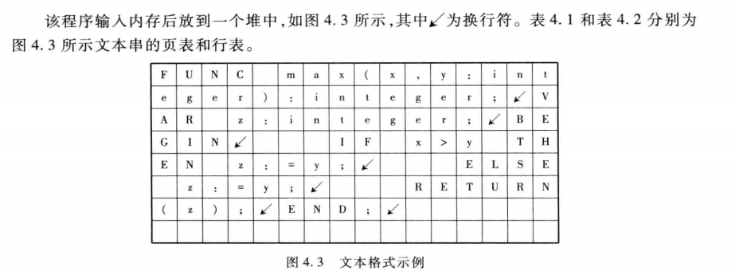
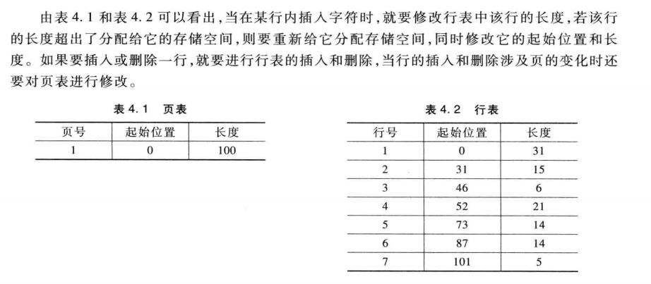
# 典型例题
要求编写一个用带头结点的单链表实现串的模式匹配算法，每个节点存放一个字符
**算法思想**：从主串s的第一个字符和模式串t的第一个字符开始比较，如果相等，就比较后续字符，如果不等，则从s的下一个开始重新比较，直至匹配成功返回主串当前起始位置指针，匹配不成功返回NULL
**算法描述**：
```c
Link *StrIndex(LKString *s,LKString *t)
{
    Link *sp,*tp,*start;
    if(t->len==0) return s->head->next;
    //记录主串的起始比较位置
    start=s->head->next;
    //主串从start开始
    sp=start;
    //模式串从第一个结点开始
    tp=t->head->next;

    while(sp!=NULL&&tp!=NULL)
    {
        if(sp->ch==tp->ch)
        {
            sp=sp->next;
            tp=tp->next;
        }
        else
        {
            start=start->next;
            sp=start;
            tp=t->head->next;
        }
    }
    if(tp==NULL) return start;
    else return NULL;
}
```

