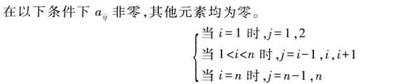

<!-- @import "[TOC]" {cmd="toc" depthFrom=1 depthTo=6 orderedList=false} -->

<!-- code_chunk_output -->

- [数组的定义与运算](#数组的定义与运算)
- [数组的顺序存储与实现](#数组的顺序存储与实现)
  - [一维数组的地址计算](#一维数组的地址计算)
  - [二维数组的地址计算](#二维数组的地址计算)
  - [三维数组的地址计算](#三维数组的地址计算)
  - [n维数组的地址计算](#n维数组的地址计算)
- [特殊矩阵的压缩存储](#特殊矩阵的压缩存储)
  - [规律分布的特殊矩阵](#规律分布的特殊矩阵)
    - [三角矩阵](#三角矩阵)
    - [带状矩阵](#带状矩阵)
  - [稀疏矩阵](#稀疏矩阵)
    - [三元组表示法](#三元组表示法)
    - [矩阵转置](#矩阵转置)
      - [经典算法](#经典算法)
      - [三元组实现稀疏矩阵转置](#三元组实现稀疏矩阵转置)
  - [十字链表表示法](#十字链表表示法)
- [广义表](#广义表)
  - [广义表的概念](#广义表的概念)
  - [广义表的存储结构](#广义表的存储结构)
    - [头尾链表存储结构](#头尾链表存储结构)
    - [同层结点链式存储结构](#同层结点链式存储结构)
  - [广义表的操作实现](#广义表的操作实现)
- [典型例题](#典型例题)

<!-- /code_chunk_output -->

# 数组的定义与运算
一维数组→线性表
二维数组→数据元素为一维数组的线性表
三维数组→数据元素为二维数组的线性表
……
N维数组→数据元素为N-1维数组的线性表
>**ADT Array**{
    数据对象：D={a~j1j2……jn~|n>0,称为数组的维数，j~i~是数组的第i维下标，1≤j~i~≤b~i~，b~i~为数组第i维长度，a~j1j2……jn~∈ElementSet}
    结构关系：R={R~1~,R~2~……R~n~}
             R~i~={<a~j1……ji……jn~，a~j1……ji+1……jn~>|1≤j~k~≤b~k~，1≤k≤n且k≠i，1≤j~i~≤b~i-1~，a~j1……ji……jn~，a~j1……ji+1……jn~∈D，i=1，……，n}
    基本操作：
    ①InitArray(A,n,bound~1~,……,bound~n~)
    ②DestoryArray(A)
    ③GetValue(A,e,index~1~,……,index~n~)
    ④SetValue(A,e,index~1~,……,index~n~)
}**ADT Array；**
# 数组的顺序存储与实现
## 一维数组的地址计算
Loc(A[i])=Loc(A[1])+(i-1)×size
## 二维数组的地址计算
以行为主存放A~m×n~
Loc(A[i][j])=Loc(A[1][1])+(n×(i-1)+j-1)×size
## 三维数组的地址计算

c~1~，c~2~，c~3~ 下限
d~1~，d~2~，d~3~ 上限
Loc(A[j~1~][j~2~][j~3~])=
Loc(A[c~1~][c~2~][c~3~])
+((d~2~-c~2~+1)×(d~3~-c~3~+1)×(j~1~-c~1~)
+(d~3~-c~3~+1)×(j~2~-c~2~)+
(j~3~-c~3~))×size
## n维数组的地址计算


# 特殊矩阵的压缩存储
## 规律分布的特殊矩阵
### 三角矩阵


Loc[i,j]=Loc[1,1]+(i×(i-1)/2+j-1)
对称矩阵将相等元素存一个
### 带状矩阵



2+2+3×(n-2)=3n-2


## 稀疏矩阵
指矩阵中大多数元素为0的矩阵（非零元素低于总元素的30%）
### 三元组表示法

```c
#define MAXSIZE 1000
typedef struct
{
    int row,col;
    ElementType e;
}Triple;
typedef struct
{
    Triple data[MAXSIZE+1];/*非零元素的三元组表data[0]未用*/
    int m,n,len;/*矩阵的行列数和非零元素个数*/
}TSMatrix;
```
### 矩阵转置
#### 经典算法
```c
void TransMatrix(ElementType source[m][n],ElementType dest[n][m])
{
    int i,j;
    for(i=0;i<m;i++)
       for(j=0;j<n;j++)
       dest[j][i]=source[i][j];
}
```
O(A.n×A.m)
#### 三元组实现稀疏矩阵转置
假设A和B是稀疏矩阵source和dest的三元组表，转置算法如下：
①A行列互换可得B中元素
②转置后矩阵三元组表B中的三元组不是以“行序为主序”存储，需对B按行下标以递增顺序重新排序→移动大量元素，影响效率
**列序递增转置法**

```c
void TransposeTSMatrix(TSMatrix A,TSMatrix *B)
{
    int i,j,k;
    B->m=A.n;
    B->n=A.m;
    B->len=A.len;
    if(B->len>0)
    {
        j=1;
        for(k=1;k<A.n;k++)
            for(i=1;i<A.len;i++)
               if(A.data[i].col==k)
               {
                   B->data[j].row=A.data[i].col;
                   B->data[j].col=A.data[i].row;
                   B->data[j].e=A.data[i].e;
                   j++;
               }
    }
}
```
O(A.n×A.len)
最坏情况A.len=A.m×A.n
**一次定位快速转置法**
- num[col]存放三元组A第col列（B第col行）中非零元素总个数
  - 将A扫描一遍，对于其中列号为col的元素，给相应的num数组下表为col的元素加1
- position[col]存放A第col列中第一个非零元素在B中的位置
  - position[1]=1
  - position[col]=position[col-1]+num[col-1],2≤col≤A.n
```c
void FastTransposeTSMatrix(TSMatrix A,TSMatrix *B)
{
    int col,t,p,q;
    int num[MAXSIZE],position[MAXSIZE];
    B->len=A.len;
    B->n=A.m;
    B->m=A.n;
    if(B->len)
    {
        for(col=1;col<A.n;col++)
            num[col]=0;
        for(t=1;t<A.len;t++)
            num[A.data[t].col]++;/*!!!!!!!!!!*/
        position[1]=1;
        for(col=2;col<A.n;col++)
            position[col]=position[col-1]+num[col-1];/*!!!!!!!!!!*/
        for(p=1;p<=A.len;p++)
        {
            col=A.data[p].col;
            q=position[col];
            B->data[q].row=A.data[p].col;
            B->data[q].col=A.data[p].row;
            B->data[q].e=A.data[p].e;
            position[col]++;/*!!!!!!!!!!*/
        }
    }
} 
```
O(A.n)+O(A.len)+O(A.n)+O(A.len)→O(A.n+A.len)

## 十字链表表示法
**优点**：能灵活的插入因运算而产生的新的非零元素，删除因运算而产生的新的零元素，实现矩阵的各种运算

right链接同一行中下一个非零元素
down链接同一列中下一个非零元素

row_head存放所有行链表的头指针
col_head存放所有列链表的头指针
十字链表定义如下：
```c
typedef struct OLNode
{
    int row,col;
    ElementType value;
    struct OLNode *right,*down;
}OLNode;*OLink;

typedef struct
{
    OLink *row_head,*col_head;
    int m,n,len;
}CrossList;
```
十字链表算法实现：
**算法思想**：
①读入稀疏矩阵的行数，列数，非零元素个数
②动态申请行链表的头指针向量，列链表的头指针向量
③逐个读入非零元素，分别插入行链表、列链表
**算法描述**：
```c
CreateCrossList(CrossList *M)
{
    scanf(&m,&n,&t);
    M->m=m;M->n=n;M->len=t;
    if(!(M->row_head=(OLink*)malloc((m+1)sizeof(OLink))))
    exit(OVERFLOW);
    if(!(M->col_head=(OLink*)malloc((n+1)sizeof(OLink))))
    exit(OVERFLOW);
    M->row_head[]=M->col_head[]=NULL;
    for(scanf(&i,&j,&e);i!=0;scanf(&i,&j,&e))
    {
        if(!(p=(OLNode*)malloc(sizeof(OLNode))))
         exit(OVERFLOW);
        p->row=i;
        p->col=j;
        p->value=e;
        if(M->row_head[i]==NULL)
           M->row_head[i]=p;
        else
        {
            q=M->row_head[i];
            while(q->right!=NULL&&q->right->col<j)
                  q=q->right;
            p->right=q->right;
            q->right=p;
        }
        if(M->col_head[j]==NULL) M->col_head[j]=p;
        else
        {
            q=M->col_head[j];
            while(q->down!=NULL&&q->down->row<j)
                  q=q->down;
            p->down=q->down;
            q->down=p;   
        }
    }
}
```
O(t×s)，t为非零元素个数，s=max(m,n)
# 广义表
## 广义表的概念
GL=(d~1~,d~2~,d~3~,……,d~n~)
d~i~既可以是单个元素也可以是广义表
d~1~是表头
(d~2~,d~3~,……,d~n~)是表尾
|   example   | length |
| ----------- | ----------- |
| D=()   | 0      |
| A=(a,(b,c))   | 2      |
|B=(A,A,D)|  3|
|C=(a,C)|2|
以A为例：
head(A)=a
tail(A)=((b,c))
广义表特点：
- 广义表是一个多层结构
- 广义表可被其他表共享
- 广义表具有递归性
## 广义表的存储结构
### 头尾链表存储结构

```c
typedef enum{ATOM,LIST} ElemTag;/*ATOM=0，表示原子；LIST=1，表示子表*/
typedef struct GLNode
{
    ElemTag tag;
    union
    {
        AtomType atom; /*原子结点的值域atom*/
        struct{struct GLNode *hp,*tp;} htp;/*表结点的指针域htp，包括表头指针hp和表尾指针tp*/
    }atom_htp;/*原子结点的值域和表结点的指针域的联合体*/
}GLNode *GList;
```
e.g

### 同层结点链式存储结构

```c
typedef enum{ATOM,LIST} ElemTag;
typedef struct GLNode
{
    ElemTag tag;
    union
    {
        AtomType atom; /*原子结点的值域atom*/
        struct GLNode *hp;/*表头指针域*/
    }atom_htp;/*原子结点的值域和表结点的表头指针域的联合体*/
    struct GLNode *tp;/*同层下一个结点的指针域*/
}GLNode *GList;
```

## 广义表的操作实现
以头尾链表存储结构为例：
求L的表头
```c
Glist Head(GList L)
{
    if(L==NULL) return(NULL);
    if(L->tag==ATOM) exit(0);
    else return(L->atom_htp.htp.hp);
}
```
求L的表尾
```c
GList Tail(GList L)
{
    if(L==NULL) return(NULL);
    if(L->tag==ATOM) exit(0);
    else return(L->atom_htp.htp.tp);
}
```
求广义表的长度
```c
int length(GList L)
{
    int k=0;
    GLNode *s;
    if(L==NULL) return(0);
    if(L->tag==ATOM) exit(0);
    s=L;
    while(s!=NULL)
    {
        k++;
        s=s->atom_htp.htp.tp;
    }
    return(k);
}
```
求广义表的深度
```c
int Depth(GList L)
{
    int d,max;
    GLNode *s;
    if(L==NULL) return(1);
    if(L->tag==ATOM) return(0);
    s=L;
    while(s!=NULL)
    {
        d=Depth(s->atom_htp.htp.hp);
        if(d>max) max=d;
        s=s->atom_htp.htp.tp;
    }
    return(max+1);
}
```
统计广义表中原子数目
```c
int CountAtom(GList L)
{
    int n1,n2;
    if(L==NULL) return(0);
    if(L->tag==ATOM) return(1);
    n1=CountAtom(L->atom_htp.htp.hp);
    n2=CountAtom(L->atom_htp.htp.tp);
    return(n1+n2);
}
```
复制广义表
```c
int CopyGList(GList S,GList *T)
{
    if(S==NULL) {*T=NULL;return(OK);}
    *T=(GLNode*)malloc(sizeof(GLNode));
    if(*T==NULL) return(ERROR);
    (*T)->tag=S->tag;
    if(S->tag==ATOM) (*T)->atom=S->atom;
    else
    {
        CopyGList(S->atom_htp.htp.hp,&(*T)->atom_htp.htp.hp);
        CopyGList(S->atom_htp.htp.tp,&(*T)->atom_htp.htp.tp);
    }
    return(OK);
}
```
# 典型例题
计算地址：

上三角矩阵地址计算：


广义表表头与表尾计算：
