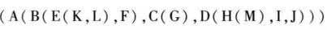
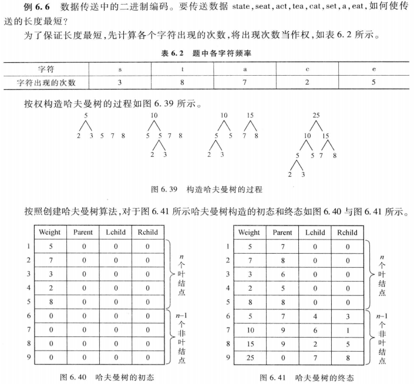

<!-- @import "[TOC]" {cmd="toc" depthFrom=1 depthTo=6 orderedList=false} -->

<!-- code_chunk_output -->

- [树的定义与基本术语](#树的定义与基本术语)
  - [树的基本概念](#树的基本概念)
  - [树的图解表示法](#树的图解表示法)
  - [树的相关术语](#树的相关术语)
  - [树的抽象数据类型](#树的抽象数据类型)
- [二叉树](#二叉树)
  - [二叉树的定义与基本操作](#二叉树的定义与基本操作)
  - [二叉树的性质](#二叉树的性质)
  - [二叉树的存储结构](#二叉树的存储结构)
    - [顺序存储结构](#顺序存储结构)
    - [链式存储结构](#链式存储结构)
- [二叉树的遍历与线索化](#二叉树的遍历与线索化)
  - [二叉树的遍历](#二叉树的遍历)
    - [先序遍历（DLR）](#先序遍历dlr)
    - [中序遍历（LDR）](#中序遍历ldr)
    - [后续遍历（LRD）](#后续遍历lrd)
  - [遍历算法应用](#遍历算法应用)
    - [输出二叉树中的结点](#输出二叉树中的结点)
    - [输出二叉树的叶子结点](#输出二叉树的叶子结点)
    - [统计叶子节点数目](#统计叶子节点数目)
    - [建立二叉链表方式存储的二叉树](#建立二叉链表方式存储的二叉树)
    - [求二叉树的高度](#求二叉树的高度)
    - [按树状打印二叉树](#按树状打印二叉树)
  - [基于栈的递归消除](#基于栈的递归消除)
    - [中序遍历二叉树的非递归算法](#中序遍历二叉树的非递归算法)
    - [后序遍历二叉树的非递归算法](#后序遍历二叉树的非递归算法)
  - [线索二叉树](#线索二叉树)
    - [基本概念](#基本概念)
    - [二叉树的线索化](#二叉树的线索化)
    - [在线索二叉树中找前驱、后继结点](#在线索二叉树中找前驱后继结点)
    - [遍历中序线索树](#遍历中序线索树)
  - [由遍历序列确定二叉树](#由遍历序列确定二叉树)
- [树、森林和二叉树的关系](#树森林和二叉树的关系)
  - [树的存储结构](#树的存储结构)
    - [双亲表示法](#双亲表示法)
    - [孩子表示法](#孩子表示法)
    - [孩子兄弟表示法](#孩子兄弟表示法)
  - [树、森林与二叉树的相互转换](#树森林与二叉树的相互转换)
    - [树转换为二叉树](#树转换为二叉树)
    - [森林转换为二叉树](#森林转换为二叉树)
    - [二叉树还原为树或森林](#二叉树还原为树或森林)
  - [树与森林遍历](#树与森林遍历)
    - [树的遍历](#树的遍历)
      - [先根遍历](#先根遍历)
      - [后根遍历](#后根遍历)
    - [树的遍历算法的实现](#树的遍历算法的实现)
    - [森林的遍历](#森林的遍历)
      - [先序遍历](#先序遍历)
      - [中序遍历](#中序遍历)
      - [后序遍历](#后序遍历)
- [哈夫曼树及其应用](#哈夫曼树及其应用)
  - [哈夫曼树](#哈夫曼树)
    - [哈夫曼树的基本概念](#哈夫曼树的基本概念)
    - [构造哈夫曼树](#构造哈夫曼树)
    - [哈夫曼树的类型定义](#哈夫曼树的类型定义)
    - [哈夫曼树的算法实现](#哈夫曼树的算法实现)
  - [哈夫曼编码](#哈夫曼编码)
    - [哈夫曼编码的概念](#哈夫曼编码的概念)
    - [哈夫曼编码的作用](#哈夫曼编码的作用)
    - [哈夫曼编码的算法实现](#哈夫曼编码的算法实现)
- [并查集与等价类划分](#并查集与等价类划分)
  - [并查集概念](#并查集概念)
  - [定义](#定义)
  - [初始化并查集](#初始化并查集)
  - [在并查集中查找某个元素](#在并查集中查找某个元素)
  - [合并并查集中的子集树](#合并并查集中的子集树)
  - [合并改进算法](#合并改进算法)
  - [查找改进算法](#查找改进算法)
- [典型例题](#典型例题)
  - [二叉树相似性判断](#二叉树相似性判断)
  - [求从二叉树根结点到r结点之间的路径](#求从二叉树根结点到r结点之间的路径)
  - [层次遍历二叉树](#层次遍历二叉树)

<!-- /code_chunk_output -->

# 树的定义与基本术语
## 树的基本概念
**树**是n个结点的有限集合T。当n=0时，称为空树。当n>0时，该集合满足下列条件：
1. 其中必有一个称为**根**的特定节点，它没有直接前驱，但有零个或多个直接后继
2. 其余n-1个结点可以划分为m个互不相交的有限集T~1~，T~2~,……T~m~，其中T~i~又是一棵树，称为根的**子树**，每个子树的根结点有且仅有一个直接前驱，但有零个或多个直接后继
## 树的图解表示法
1. 树形表示

2. 文氏图表示

3. 广义表形式

4. 凹入表示法

## 树的相关术语
**结点**：包括一个数据元素及若干指向其他结点的分支信息
**结点的度**：一个结点的子树个数
**叶结点**：度为0的结点，即无后继的结点，也称终端结点
**分支结点**：度不为0的结点，也称非终端结点
**结点的层次**：从根结点开始定义，根结点的层次为1，根的直接后继层次为2，以此类推
**结点的层次序号**：将树中结点按从上到下，从左到右的次序排成一个线性序列，依次给他们编以连续的自然数
**树的度**：树中所有结点的度的最大值
**树的高度（深度）**：树中所有结点的层次的最大值
**有序树**：在树T中，如果各子树T~i~之间有先后次序，则称为有序树
**森林**：m棵互不相交的树的集合。将一棵非空树的根结点删去，树就变成一个森林；反之，给森林加一个统一的根结点，森林就变成一棵树
**同构**：对两棵树，通过对相应的结点适当地重命名，就可以使两棵树完全相等（结点对应相等，对应结点的相关关系也相等），则称这两棵树同构
**孩子结点**：一个结点的直接后继结点
**双亲结点**：一个结点的直接前驱结点
**兄弟结点**：同一双亲结点的孩子结点间互称兄弟结点
**堂兄弟**：父亲是兄弟关系或堂兄关系的结点称为堂兄弟结点
**祖先结点**：一个结点的祖先结点是指从根结点到该结点的路径上所有结点
**子孙结点**：一个结点的直接后继和间接后继称为该结点的子孙结点
**前辈**：层号比该结点小的结点
**后辈**：层号比该结点大的结点
## 树的抽象数据类型
>**ADT Tree**{
    **数据对象**：一个集合D，该集合中所有元素具有相同的特性
    **结构关系**：若D为空集，则为空树；若D中只有一个数据元素，则R为空集，否则R={H}，H是如下的二元关系：
    ①在D中存在唯一的称为根的数据元素root，他在H关系下没有前驱
    ②除root外，D中每个结点在关系H下都有且仅有一个前驱
    **基本操作**：
    1.InitTree(Tree)
    操作前提：Tree是未初始化的树
    操作结果：将Tree初始化为空树
    2.DestoryTree(Tree)
    操作前提：树Tree已存在
    操作结果：销毁树Tree
    3.CreateTree(Tree)
    操作前提：Tree是一棵空树
    操作结果：创建树Tree
    4.TreeEmpty(Tree)
    操作前提：树Tree已存在
    操作结果：若Tree为空返回TRUE，否则返回FALSE
    5.Root(Tree)
    操作前提：树Tree已存在
    操作结果：返回Tree的根
    6.Parent(Tree,x)
    操作前提：树Tree已存在，x是Tree中某个结点
    操作结果：若x为非根结点，返回它的双亲，否则返回“空”
    7.FirstChild(Tree,x)
    操作前提：树Tree已存在，x是Tree中某个结点
    操作结果：若x为非叶结点，则返回它的第一个孩子结点，否则返回“空”
    8.NextSibling(Tree,x)
    操作前提：树Tree已存在，x是Tree中某个结点
    操作结果：若x不是其双亲的最后一个孩子结点，则返回x后面的下一个兄弟结点，否则返回“空”
    9.InsertChild(Tree,p,Child)
    操作前提：树Tree已存在，p指向Tree中某个结点，非空树Child与Tree不相交
    操作结果：将Child插入Tree中，做p指向的结点的子树
    10.DeleteChild(Tree,p,i)
    操作前提：树Tree已存在，p指向Tree中某个结点，1≤i≤d，d为p所指向的结点的度
    操作结果：删除Tree中p所指向结点的第i棵子树
    11.TraverseTree(Tree,Visit())
    操作前提：树Tree已存在，Visit()是对结点进行访问的函数
    操作结果：按照某种次序对树Tree的每个结点调用Visit()函数访问一次且最多一次，若Visit()访问失败则操作失败
}**ADT Tree；**

# 二叉树
## 二叉树的定义与基本操作
**定义**：把满足以下两个条件的树结构称为二叉树：
1. 每个结点的度都不大于2
2. 每个结点的孩子结点的次序不能任意颠倒

>二叉树的基本操作：
Inititate(bt)
Create(bt)
Destory(bt)
Empty(bt)
Root(bt)
Parent(bt,x)
LeftChild(bt,x)
RightChild(bt,x)
Traverse(bt)
Clear(bt)

## 二叉树的性质
1. 在二叉树的第i层上至多有2^i-1^个结点(i≥1)
2. 深度为k的二叉树至多有2^k^-1个结点(k≥1)
3. 对任意一棵二叉树T，若终端结点数为n~0~，而其度数为2的结点数为n~2~，则n~0~=n~2~+1

**满二叉树**：深度为k且有2^k^-1个结点的二叉树，每层结点都是满的
**完全二叉树**：深度为k，结点数为n的二叉树，如果其结点1-n的位置序号分别与等高的满二叉树的结点1-n的位置序号一一对应，则为完全二叉树


4. 具有n个结点的完全二叉树的深度为$\lfloor log~2~n \rfloor$+1
5. 对于具有n个结点的完全二叉树，如果按从上到下和从左到右的顺序对二叉树中的所有结点从1开始编号，则对于任意的序号为i的结点有：
   - 如果i=1，则序号为i的结点是根结点，无双亲结点
   - 如果i>1，则序号为i的结点的双亲结点序号为$\lfloor i/2 \rfloor$
   - 如果2i>n，则序号为i的结点无左孩子
   - 如果2i≤n，则序号为i的结点的左孩子序号为2i
   - 如果2i+1>n，则序号为i的结点无右孩子
   - 如果2i+1≤n，则序号为i的结点的右孩子序号为2i+1
## 二叉树的存储结构
### 顺序存储结构
- 对于完全二叉树，用一维数组存储
LChild(i)=2i
RChild(i)=2i+1
- 对于一般二叉树，必须用“虚结点”补成完全二叉树
造成存储空间浪费
### 链式存储结构


```c
typedef struct Node
{
    DataType data;
    struct Node *LChild;
    struct Node *RChild;
}BiTNode,*BiTree;
```
**若一个二叉树含有n个结点，则它的二叉链表中必含有2n个指针域，其中必有n+1个空的链域**
# 二叉树的遍历与线索化
## 二叉树的遍历

### 先序遍历（DLR）
若二叉树为空，则为空操作，否则依次执行如下操作：
①访问根结点
②按先序遍历左子树
③按先序遍历右子树
前缀：ABDFGCEH→波兰表达式
```c
void PreOrder(BiTree root)
{
    if(root!=NULL)
    {
        Visit(root->data);
        PreOrder(root->LChild);
        PreOrder(root->RChild);
    }
}
```
### 中序遍历（LDR）
若二叉树为空，则为空操作，否则依次执行如下操作：
①按中序遍历左子树
②访问根结点
③按中序遍历右子树
中缀：BFDGACEH
```c
void InOrder(BiTree root)
{
    if(root!=NULL)
    {
        InOrder(root->LChild);
        Visit(root->data);
        InOrder(root->RChild);
    }
}
```
### 后续遍历（LRD）
若二叉树为空，则为空操作，否则依次执行如下操作：
①按后序遍历左子树
②按后序遍历右子树
③访问根结点
后缀：FGDBHECAH→逆波兰表达式
```c
void PostOrder(BiTree root)
{
    if(root!=NULL)
    {
        PostOrder(root->LChild);
        PostOrder(root->RChild);
        Visit(root->data);  
    }
}
```
递归算法时间复杂度：设二叉树有n个结点，对每个结点都要进行一次入栈和出栈操作，即出栈和入栈各执行n次，对结点的访问也是n次，所以时间复杂度**O(n)**
## 遍历算法应用
### 输出二叉树中的结点
先序输出
```c
void PreOrder(BiTree root)
{
    if(root!=NULL)
    {
        printf(root->data);
        PreOrder(root->LChild);
        PreOrder(root->RChild);
    }
}
```
### 输出二叉树的叶子结点
先序输出
```c
void PreOrder(BiTree root)
{
    if(root!=NULL)
    {
        if(root->LChild==NULL&&root->RChild==NULL)/*条件*/
           printf(root->data);
        PreOrder(root->LChild);
        PreOrder(root->RChild);
    }
}
```
### 统计叶子节点数目
1.后序遍历统计
```c
/*LeafCount为保存叶子结点数目的全局变量，初始化为0*/
void leaf(BiTree root)
{
   if(root!=NULL)
    {
        leaf(root->LChild);
        leaf(root->RChild);
        if(root->LChild==NULL&&root->RChild==NULL)/*条件*/
           LeafCount++; 
    } 
}
```
2.==分治算法==
- 如果是空树，返回0
- 如果只有一个结点，返回1
- 否则，返回左右子树叶子结点之和
```c
int leaf(BiTree root)
{
    int LeafCount;
    if(root==NULL)
       LeafCount=0;
    else if(root->LChild==NULL&&root->RChild==NULL)
       LeafCount=1;
    else
       LeafCount=leaf(root->LChild)+leaf(root->RChild);
    return LeafCount;
}
```
### 建立二叉链表方式存储的二叉树

用扩展先序遍历序列为：AB.DF..G..C.E.H..
用扩展先序遍历序列创建二叉链表
```c
void CreateBiTree(BiTree *bt)
{
    char ch;
    ch=getchar();
    if(ch=='.') *bt==NULL;
    else
    {
        *bt=(BiTree)malloc(sizeof(BiTNode));
        (*bt)->data=ch;
        CreateBiTree(&((*bt)->LChild));
        CreateBiTree(&((*bt)->RChild));
    }
}
```
### 求二叉树的高度
二叉树的高度为二叉树中结点层次的最大值，也可视为其左、右子树高度的最大值加1

后序遍历求二叉树高度
```c
int PostTreeDepth(BiTree bt)
{
    int hl,hr,max;
    if(bt!=NULL)
    {
        hl=PostTreeDepth(bt->LChild);
        ht=PostTreeDepth(bt->RChild);
        max=hl>hr?hl:hr;
        return(max+1);
    }
    else return(0);
}
```
先序遍历求二叉树高度
```c
void PreTreeDepth(BiTree bt,int h)
/*h为bt指向结点所在层次，初值为1*/
/*depth为当前求得最大的层次，初值为0*/
{
    if(bt!=NULL)
    {
        if(h>depth) depth=h;
        PreTreeDepth(bt->LChild,h+1);
        PreTreeDepth(bt->RChild,h+1);
    }
}
```
### 按树状打印二叉树

- 逆中序RDL 
- 结点的左右位置与层深有关，需设置一个表示当前根结点层深的参数，每当递归进层时加1，这些操作应在访问根结点时实现
```c
void PrintTree(BiTree bt,int nLayer)
{
    if(bt==NULL) return;
    PrintTree(bt->RChild,nLayer+1);
    for(int i=0;i<nLayer;i++)
    {
        printf("");
    }
    printf("%c\n",bt->data);
    PrintTree(bt->LChild,nLayer+1);
}
```
## 基于栈的递归消除
### 中序遍历二叉树的非递归算法
1.初步思想
- 针对左递归，写出递归进层的三件事
- 接着写出左递归返回时应执行的语句：访问根结点
- 针对右递归，写出递归进层的三件事
- 针对递归退层，写出递归退层的三件事（左右递归公用）
```c
void inorder(BiTree root)
{
    int top=0;p=root;
    L1:if(p!=NULL)
    {
        top=top+2;
        if(top>m) return;/*栈满溢出*/
        s[top-1]=p;/*本层参数进栈*/
        s[top]=L2;/*返回地址进栈*/
        p=p->LChild;/*给下层参数赋值*/
        goto L1;
       L2:Visit(p->data);/*访问根*/
        top=top+2;
        if(top>m) return;/*栈满溢出*/
        s[top-1]=p;/*遍历右子树*/
        s[top]=L3;
        p=p->RChild;
        goto L1;
    }
    L3:if(top!=0)
    {
        addr=s[top];
        p=s[top-1];/*取出返回地址*/
        top=top-2;/*退出本层参数*/
        goto addr;
    }
}
```

中序遍历非递归算法需设置一个堆栈，用以保留结点指针，以便在遍历完某个结点的左子树后，由该结点指针找到该结点的右子树
2.直接实现栈操作
从根结点开始，只要当前结点存在，或者栈不空，则重复下面操作：
- 从当前结点开始，进栈并遍历左子树，直到左子树为空
- 退栈并访问
- 遍历右子树
```c
void inorder(BiTree root)
{
    top=0;p=root;
    do{
        while(p!=NULL)
        {
            if(top>m) return;
            top=top+1;
            s[top]=p;
            p=p->LChild;
        }
        if(top!=0)
        {
            p=s[top];
            top=top-1;
            Visit(p->data);
            p=p->RChild;
        }
    }while(p!=NULL||top!=0)
}
```
3.调用栈操作的函数
从根结点开始，只要当前结点存在，或者栈不空，则重复以下操作：
- 如果当前结点存在，则进栈并遍历左子树
- 否则退栈并访问，然后遍历右子树
```c
void Inorder(BiTree root)
{
    InitStack(&S);
    p=root;
    while(p!=NULL||!ISEmpt(S))
    {
        if(p!=NULL)
        {
            Push(&S,p);
            p=p->LChild;
        }
        else
        {
            Pop(&S,&p);
            Visit(p->data);
            p=p->RChild;
        }
    }
}
```
### 后序遍历二叉树的非递归算法
LRD，判断当前栈顶结点的左、右子树是否都已访问过？
- 判断刚访问过的结点q是不是当前栈顶结点p的右孩子

所以访问当前栈顶结点p，有以下两种情况：
- p无右孩子
- p的右孩子是刚访问过的结点q

**记录刚访问的结点**
从根结点开始，只要当前结点存在，或者栈不空，则重复下面操作：
- 从当前结点开始，进栈并遍历左子树，直到左子树为空
- 如果当前栈顶结点的右子树为空，或者栈顶结点的右孩子为刚访问过的结点，则退栈并访问，然后将当前结点指针置空
- 否则，遍历右子树
```c
void PostOrder(BiTree root)
{
    BiTNode *p,*q;
    Stack S;
    q=NULL;
    p=root;
    InitStack(&S);
    while(p!=NULL||!IsEmpty(S))
    {
        if(p!=NULL)
        {
            Push(&S,p);
            p=p->LChild;
        }
        else
        {
            GetTop(&S,&p);
            if((p->RChild==NULL)||(p->RChild==q))
            {
                visit(p->data);
                q=p;
                Pop(&S,&p);
                p=NULL;
            }
            else
                p=p->RChild;
        }
    }
}
```
## 线索二叉树
### 基本概念
在有n个结点的二叉链表中共有2n个链域，其中n+1个是空链域，可利用这空闲的n+1个链域来存放遍历过程中结点的前驱和后继信息，做如下规定：
- 若结点有左子树，则LChild指向其左孩子，否则指向其前驱结点
- 若结点有右子树，则RChild指向其左孩子，否则指向其后继结点

$$ Ltag=\left\{
\begin{aligned}
0,LChild域指示结点的左孩子\\
1,LChild域指示结点的遍历前驱\\
\end{aligned}
\right.
$$
$$ Ltag=\left\{
\begin{aligned}
0,RChild域指示结点的右孩子\\
1,RChild域指示结点的遍历后继\\
\end{aligned}
\right.
$$
指向前驱和后继结点的指针称为**线索**
以这种结构组成的二叉链表称为**线索链表**
对二叉树以某种次序进行遍历并加上线索的过程称为**线索化**
线索化了的二叉树称为**线索二叉树**
### 二叉树的线索化
中序线索化算法
**算法思想**：
1.中序线索化采用中序递归遍历算法框架
2.加线索的过程就是访问结点操作
3.加线索操作需利用刚访问过的结点与当前结点的关系，设置一个指针pre，始终记录刚访问过的结点，操作如下：
- 如果当前遍历结点root的左子域为空，则让左子域指向pre
- 如果前驱pre的右子域为空，则让右子域指向当前遍历结点root
- 为下次做准备，当前访问结点root作为下一个访问结点的前驱pre
- 
**算法描述**：
```c
void Inthread(BiTree root)
{
    if(root!=NULL)
    {
        Inthread(root->LChild);/*线索化左子树*/
        //线索化操作
        if(root->LChild==NULL)
        {
            root->LTag=1;
            root->LChild=pre;
        }
        if(pre!=NULL&&pre->RChild==NULL)
        {
            pre->RChild=root;
            pre->Tag=1;
        }
        pre=root;
        Inthread(root->RChild);/*线索化右子树*/
    }
}
```
### 在线索二叉树中找前驱、后继结点
在中序线索树中找结点前驱
```c
BiTNode *InPre(BiTNode *p)
{
    if(p->LTag==1) pre=p->LChild;
    else
    {
        for(q=p->LChild;q->Rtag==0;q=q->RChild);/*左子树最右下结点*/
        pre=q;
    }
    return(pre);
}
```
在中序线索树中找结点后继
```c
BiTNode *InNext(BiTNode *p)
{
    if(p->RTag==1) next=p->RChild;
    else
    {
        for(q=p->RChild;q->Ltag==0;q=q->LChild);/*右子树最左下结点*/
        next=q;
    }
    return(next);
}
```
在先序线索树查找后继
```c
if(p->Ltag==0) next=p->LChild;
else next=p->RChild;
```
### 遍历中序线索树
在中序线索树上求中序遍历的第一个结点
```c
BiTNode *InFirst(BiTree Bt)
{
    BiTNode *p=Bt;
    if(!p) return(NULL);
    while(p->LTag==0) p=p->LChild;
    return p;
}
```
遍历中序线索二叉树
```c
void TInOrder(BiTree Bt)
{
    BITNode *p;
    p=InFirst(Bt);
    while(p)
    {
        visit(p);
        p=InNext(p);
    }
}
```
## 由遍历序列确定二叉树
|两种遍历序列的组合|是否能唯一确定二叉树|
|---|---|
|先序+中序|是|
|后序+中序|是|
|先序+后序|否|
已知一棵二叉树的先序和中序分别为：
A B C D E F G H I
B C A E D G H F I
试构造该二叉树
**在先序序列第一个结点一定是二叉树的根**
**在中序序列，根结点将序列分为两个子序列，前一个是根结点的左子树，后一个是右子树**

# 树、森林和二叉树的关系
## 树的存储结构
### 双亲表示法


```c
#define MAX 100
typedef struct TNode
{
    DataType data;
    int parent;
}TNode;

typedef struct
{
    TNode tree[MAX];
    int nodenum;
}ParentTree;
```
### 孩子表示法
把每个结点的孩子结点排列起来，构成一个单链表，称为孩子链表，n个结点有n个孩子链表，而n个结点的数据和n个孩子链表的头指针又组成一个顺序表

```c
typedef struct ChildNode/*孩子链表结点的定义*/
{
    int Child;/*该孩子结点在线性表中的位置*/
    struct ChildNode *next;/*指向下一个孩子结点的指针*/
}ChildNode;

typedef struct/*顺序表结点的结构定义*/
{
    DataType data;/*结点信息*/
    ChildNode *FirstChild;/*指向孩子链表的头指针*/
}DataNode;

typedef struct/*树的定义*/
{
    DataNode nodes[MAX];/*顺序表*/
    int root;/*树的根结点在线性表的位置*/
    int num;/*树的结点个数*/
}ChildTree;
```
### 孩子兄弟表示法
二叉表表示法，以二叉链表作为存储结构，链表中每个结点设两个链域，分别指向该结点的第一个孩子结点和下一个兄弟（右兄弟）结点

```c
typedef struct CSNode
{
    DataType data;
    Struct CSNode *FirstChild;
    Struct CSNode *Nextsibling;
}CSNode,*CSTree;
```
## 树、森林与二叉树的相互转换
### 树转换为二叉树
- 树中所有相邻兄弟之间加一条线
- 对树中每个结点，只保留其与第一个孩子结点之间的连线，删去其与其他孩子结点之间的连线
- 以树的根结点为轴心，将整棵树顺时针旋转一定的角度，使之结构层次分明

### 森林转换为二叉树
- 将森林中的每棵树转换成相应的二叉树
- 第一棵二叉树不动，从第二棵二叉树开始，依次把后一棵二叉树的结点作为前一棵二叉树根结点的右孩子

递归描述：
将森林F看作树的有序集F={T~1~，T~2~，……,T~n~}，它对应的二叉树为B(F)
   - 若n=0，则B(F)为空
   - 若n>0，二叉树B(F)的根为森林中第一棵树T~1~的根；B(F)的左子树B({T~11~，T~12~，……,T~1m~}),其中{T~11~，T~12~，……,T~1m~}是T~1~的子树森林；B(F)的右子树是B({T~2~，T~3~，……,T~n~})
### 二叉树还原为树或森林
- 若某结点是其双亲的左孩子，则把该结点的右孩子，右孩子的右孩子……都与该结点的双亲连起来
- 删掉原来二叉树中所有双亲结点与右孩子的连线
- 整理上两步所得到的树或者森林，使之结构层次分明

递归描述：
若B是一棵二叉树，T是B的根结点，L是B的左子树，R为B的右子树，且B对应的森林F(B)中含有的n棵树为T~1~，T~2~，……,T~n~，则有：
   - B为空，则F(B)为空的森林（n=0）
   - B非空，则F(B)中第一棵树T~1~的根为二叉树B的根T；T~1~中根结点的子树森林由B的左子树L转换而成，即F(L)={T~11~，T~12~，……,T~1m~};B的右子树R转换为F(B)中其余树组成的森林，即F(R)={T~2~，T~3~，……,T~n~}
## 树与森林遍历
### 树的遍历

#### 先根遍历
若树非空：
- 访问根结点
- 从左到右，依次先根遍历结点的每一棵子树
ABECFHGD

先根遍历——转换后二叉树的**前序遍历**
#### 后根遍历
若树非空：
- 从左到右，依次后根遍历结点的每一棵子树
- 访问根结点
EBHFGCDA

后根遍历——转换后二叉树的**中序遍历**
### 树的遍历算法的实现
用孩子兄弟链表实现树的先根遍历
```c
void RootFirst(CSTree root)
{
    if(root!=NULL)
    {
        Visit(root->data);/*访问根结点*/
        p=root->FirstChild;
        while(p!=NULL)
        {
            RootFirst(p);/*访问以p为根的子树*/
            p=p->Nextsibling;
        }
    }
}
```
```c
void RootFirst(CSTree root)
{
    if(root!=NULL)
    {
        Visit(root->data);/*访问根结点*/
        RootFirst(root->FirstChild);/*先根遍历首子树*/
        RootFirst(root->Nextsibling);/*先根遍历兄弟树*/
    }
}
```
### 森林的遍历

#### 先序遍历
若森林非空：
- 访问森林中第一棵树的根结点
- 先序遍历第一棵树的根结点的子树森林
- 先序遍历除去第一棵树之后剩余的树构成的森林
ABCDEFGHIJ
#### 中序遍历
若森林非空：
- 中序遍历第一棵树的根结点的子树森林
- 访问森林中第一棵树的根结点
- 中先序遍历除去第一棵树之后剩余的树构成的森林
BCDAFHJIG
#### 后序遍历
若森林非空：
- 后序遍历第一棵树的根结点的子树森林
- 后先序遍历除去第一棵树之后剩余的树构成的森林
- 访问森林中第一棵树的根结点
DCBFJIHGEA
# 哈夫曼树及其应用
## 哈夫曼树
### 哈夫曼树的基本概念
1）路径和路径长度
**路径**：指从根结点到该结点的分支序列
**路径长度**：指根结点到该结点所经过的分支数目
2）结点的权和带权路径长度
**权**：给结点赋予一个具有某种实际意义的实数
**带权路径长度**：从树根到某一结点的路径长度与该结点的权的乘积
3）树的带权路径长度
树中从根到所有叶子结点的各个带权路径长度之和
$$WPL=\sum_{i=1}^n w_i ×l_i$$
n为叶子结点个数，w~i~为第i个叶子节点的权值，l~i~为第i个叶子结点的路径长度
<u>Q1：什么样的二叉树的路径长度PL最小？</u>
一棵树的路径长度
- 为0的结点至多有1个
- 为1的结点至多有2个
- 为2的结点至多有4个
- 为k的结点至多有2^k^个

n个结点的二叉树其路径长度至少等于如图所示序列前n项之和：

所以结点n对应的路径长度为$\lfloor log_2n \rfloor$
前n项之和为$$\sum_{k=1}^n\lfloor log_2k \rfloor$$
完全二叉树的路径长度=2^0^×0+2^1^×1+……+2^h^×h=$$\sum_{k=1}^h\lfloor log_2k \rfloor$$
所以完全二叉树具有最小路径长度，但并不具有唯一性，有些树不是完全二叉树也可以具有最小路径长度

<u>Q2:什么样的二叉树带权路径长度最小？</u>
**哈夫曼树**

### 构造哈夫曼树
**哈夫曼树**是由n个带权叶子结点构成的所有二叉树中带权路径长度最短的二叉树，又称**最优二叉树**
构造步骤：
- **初始化**：用给定的n个权值{w1，w2……，wn}构造n棵二叉树并构成森林F={T~1~，T~2~……T~n~}，其中每一棵二叉树T~i~(1≤i≤n)都只有一个权值为wi的根结点，其左右子树为空
- **找最小树**：在森林F中选择两棵根结点权值最小的二叉树，作为一棵新二叉树的左、右子树，标记新二叉树的根结点权值为其左右子树的根结点权值之和
- **删除与加入**：从F中删除被选中的那两棵树，同时把新构成的二叉树加入F
- **判断**：重复23步，直到森林中只含有一棵二叉树为止
### 哈夫曼树的类型定义
存储结构：由于哈夫曼树中没有度为1的结点，因此一棵有n个叶子的哈夫曼树共有2n-1个结点，可用2n-1的一维数组存储（0号单元不使用，从1开始）


为实现方便，将叶子结点集中存储在前面部分1~n个位置
```c
#define N 20
#define M 2*N-1
typedef struct
{
    int weight;
    int parent;
    int LChild;
    int RChild;
}HTNode,HuffmanTree[M+1];
```
### 哈夫曼树的算法实现
创建哈夫曼树
```c
void CrtHuffmanTree(HuffmanTree ht,int w[],int n)
{
    //初始化
    for(i=1;i<=n;i++) ht[i]={w[i],0,0,0};/*叶子结点*/
    m=2*n-1;
    for(i=n+1;i<=m;i++) ht[i]={0,0,0,0}/*非叶结点*/
    for(i=n+1;i<=m;i++)
    {
        select(ht,i-1,&s1,&s2);
        ht[i].weight=ht[s1].weight+ht[s2].weight;
        ht[s1].parent=i;ht[s2].weight=i;
        ht[i].LChild=s1;ht[i].RChild=s2;
    }
}
```
查找算法
```c
//HT数组中存放的哈夫曼树，end表示HT数组中存放结点的最终位置，s1和s2传递的是HT数组中权重值最小的两个结点在数组中的位置
void Select(HuffmanTree HT, int end, int *s1, int *s2)
{
    int min1, min2;
    //遍历数组初始下标为 1
    int i = 1;
    //找到还没构建树的结点
    while(HT[i].parent != 0 && i <= end){
        i++;
    }
    min1 = HT[i].weight;
    *s1 = i;
   
    i++;
    while(HT[i].parent != 0 && i <= end){
        i++;
    }
    //对找到的两个结点比较大小，min2为大的，min1为小的
    if(HT[i].weight < min1){
        min2 = min1;
        *s2 = *s1;
        min1 = HT[i].weight;
        *s1 = i;
    }else{
        min2 = HT[i].weight;
        *s2 = i;
    }
    //两个结点和后续的所有未构建成树的结点做比较
    for(int j=i+1; j <= end; j++)
    {
        //如果有父结点，直接跳过，进行下一个
        if(HT[j].parent != 0){
            continue;
        }
        //如果比最小的还小，将min2=min1，min1赋值新的结点的下标
        if(HT[j].weight < min1){
            min2 = min1;
            min1 = HT[j].weight;
            *s2 = *s1;
            *s1 = j;
        }
        //如果介于两者之间，min2赋值为新的结点的位置下标
        else if(HT[j].weight >= min1 && HT[j].weight < min2){
            min2 = HT[j].weight;
            *s2 = j;
        }
    }
}
```

## 哈夫曼编码
### 哈夫曼编码的概念
用电子方式处理符号时，需先对符号进行二进制编码，例如计算机中英文使用ASCII编码，ASCII是一种定长编码
为缩短数据文件长度，可采用不定长编码，基本思想是给使用频度较高的字符编以较短的编码，这也是数据压缩技术的最基本的思想
- 前缀编码
  如果在一个编码系统中，任一编码都不是其他任何编码的前缀（最左子串），则称该编码系统中的编码是前缀编码
  若是前缀编码，在电文中各字符对应的编码之间不需要分隔符
- 哈夫曼编码
  对一棵具有n个叶子的哈夫曼树，若对树中的每个左分支赋予0，右分支赋予1，则从根到每个叶子的通路上，各分支的赋值分别构成一个二进制串，该二进制串就称为哈夫曼编码
  ==哈夫曼编码是最优前缀编码==
### 哈夫曼编码的作用


### 哈夫曼编码的算法实现
从叶子结点一直找到根结点，逆向记录途中经过的标记
```c
//由于每个哈夫曼编码是变长，因此使用指针数组存放每个编码串的头指针
typedef char * HuffmanCode[N+1]
//从叶子结点到根，逆向求每个叶子结点对应的哈夫曼编码
void CrtHuffmanCode(HuffmanTree ht,HuffmanCode hc,int n)
{
    char *cd;
    cd=(char*)malloc(n*sizeof(char));
    cd[n-1]='\0';/*从左到右逐位存放编码，首先存放编码结束符*/
    for(i=1;i<=n;i++)
    {
        //从叶子结点出发，得到的哈夫曼编码是逆序的，需要在字符串数组中逆序存放
        start=n-1;/*初始化编码起始指针*/
        //当前结点在数组中的位置
        c=i;
        //当前结点的父结点在数组中的位置
        p=ht[i].parent;/*从叶子结点开始倒推*/
        // 一直寻找到根结点
        while(p!=0)
        {
            --start;
            // 如果该结点是父结点的左孩子则对应路径编码为0，否则为右孩子编码为1
            if(ht[p].LChild==c) cd[start]='0';
            else   cd[start]='1';
            //以父结点为孩子结点，继续朝树根的方向遍历
            c=p;
            p=ht[p].parent;/*向上倒推*/
        }
        hc[i]=(char*)malloc((n-start)*sizeof(char));/*为第i个编码分配空间*/
        strcpy(hc[i],&cd[start]);/*把编码复制到hc[i]中
        */
    }
    free(cd);
}
```
从根结点出发，一直到叶子结点，记录途中经过的标记
```c
//HT为哈夫曼树，HC为存储结点哈夫曼编码的二维动态数组，n为结点的个数
void HuffmanCoding(HuffmanTree HT, HuffmanCode *HC,int n){
    *HC = (HuffmanCode) malloc((n+1) * sizeof(char *));
    int m=2*n-1;
    int p=m;
    int cdlen=0;
    char *cd = (char *)malloc(n*sizeof(char));
    //将各个结点的权重用于记录访问结点的次数，首先初始化为0
    for (int i=1; i<=m; i++) {
        HT[i].weight=0;
    }
    //一开始 p 初始化为 m，也就是从树根开始。一直到p为0
    while (p) {
        //如果当前结点一次没有访问，进入这个if语句
        if (HT[p].weight==0) {
            HT[p].weight=1;//重置访问次数为1
            //如果有左孩子，则访问左孩子，并且存储走过的标记为0
            if (HT[p].left!=0) {
                p=HT[p].left;
                cd[cdlen++]='0';
            }
            //当前结点没有左孩子，也没有右孩子，说明为叶子结点，直接记录哈夫曼编码
            else if(HT[p].right==0){
                (*HC)[p]=(char*)malloc((cdlen+1)*sizeof(char));
                cd[cdlen]='\0';
                strcpy((*HC)[p], cd);
            }
        }
        //如果weight为1，说明访问过一次，即是从其左孩子返回的
        else if(HT[p].weight==1){
            HT[p].weight=2;//设置访问次数为2
            //如果有右孩子，遍历右孩子，记录标记值 1
            if (HT[p].right!=0) {
                p=HT[p].right;
                cd[cdlen++]='1';
            }
        }
        //如果访问次数为 2，说明左右孩子都遍历完了，返回父结点
        else{
            HT[p].weight=0;
            p=HT[p].parent;
            --cdlen;
        }
    }
}
```
# 并查集与等价类划分
## 并查集概念
一组互不相交的子集：
- 确定一个元素所在的子集
- 合并两个子集

采用树结构表示，树中每个结点对应集合中的一个元素，为操作方便，树中每个结点含有一个指向双亲的指针，并约定用根结点代表这个集合
- 给定一个结点，只需沿父指针找到根结点，就可确定其所在子集
- 只要让一棵子集树的根指向另一棵子集树的根，即可实现并操作


## 定义
```c
typedef ParentTree ParentForest;
typedef ParentForest MFSst;
```
## 初始化并查集
```C
//用S中n个元素构造n个单根树，代表n个单元素集合S0，S1，……，Sn-1，这n个单根树构成一个森林，代表并查集SS
void Initialization(MFSst *SS,SeqList *S)
{
    int i;
    SS->nodenum=S->last+1;
    for(i=0;i< SS->nodenum;i++)
    {
        SS->tree[i].data=S->elem[i];
        SS->tree[i].parent=-1;
    }
}
```
o(n),n为集合S中元素个数
## 在并查集中查找某个元素
```c
//确定x属于并查集SS中哪个子集合，如果不属于SS中任一子集，则返回-1，否则返回所在子集树的根结点下标
int Find_1(MFSst *SS,DataType x)
{
    //确定x在SS->tree[]中的下标
    pos=Locate(SS,x);
    //如果不属于SS中任一子集，则返回-1
    if(pos<0) return -1;
    //从pos开始沿着双亲指针查找根结点
    i=pos;
    while(SS->tree[i].parent>0)
    i=SS->tree[i].parent;
    return i;
}
```
o(h),h为x所在子集树的高度
## 合并并查集中的子集树
```c
//合并两个互不相交的非空子集树，将root2并入root1
int Merge_1(MFSst *SS,int root1,int root2)
{
    if(root1<0||root1>SS->nodenum-1) return ERROR;
    if(root2<0||root2>SS->nodenum-1) return ERROR;
    SS->tree[root2].parent=root1;
    return OK;
}
```
O(1)
## 合并改进算法
如果每次都将高度较小的树并入高度较大的树，则最终森林中最高的树会变小，可以提高平均查找率，一般而言，子集树的结点越多，树的高度值也越有可能较大，因此可以用根结点的parent域存放树中结点数目的负值，用来指导合并操作
```c
int Merge_2(MFSst *SS,int root1,int root2)
{
    if(root1<0||root1>SS->nodenum-1) return ERROR;
    if(root2<0||root2>SS->nodenum-1) return ERROR;   
    if(SS->tree[root1].parent < SS->tree[root2].parent)/*第一棵子集树结点多*/
    {
        SS->tree[root2].parent=root1;
        SS->tree[root1].parent+=SS->tree[root2].parent;
    }
    else
    {
        SS->tree[root1].parent=root2;
        SS->tree[root2].parent+=SS->tree[root1].parent;
    }
    return OK;
}
```
## 查找改进算法
如果能在查找过程中动态地调整子集树，降低其高度，可进一步提高效率
调整方法如下：
对任意结点x，找到x所在子集树的根root后，将x及x的所有祖先（除了root）均改为root的子结点

```c
int Find_2(MFSst *SS,DataType x)
{
    pos=Locate(SS,x);
    if(pos<0) return -1;
    i=pos;
    while(SS->tree[i].parent>0)
    i=SS->tree[i].parent;
    root=i;
    i=pos;
    while(i!=root)
    {
        temp=SS->tree[i].parent;
        SS->tree[i].parent=root;
        i=temp;
    }
    return root;
}
```
# 典型例题
## 二叉树相似性判断
二叉树t1和t2相似，指的是t1和t2都是空的二叉树；或者t1的左子树与t2的左子树相似，同时t1的右子树与t2的右子树相似
**问题分析**：
f(t1,t2)=TRUE,若t1=t2=NULL；
f(t1,t2)=FALSE,若t1与t2之一为NULL，另一个不为NULL；
f(t1,t2)=f(t1->left,t2->left)&&f(t1->right,t2->right)，若t1与t2均不为NULL
**算法描述**：
```c
int like(BiTree t1,BiTree t2)
{
    int like1,like2;
    if(t1==NULL&&t2=NULL)
    return 1;
    else if(t1==NULL||t2==NULL)
    return 0;
    else
    {
        like1=like(t1->left,t2->left);
        like2=like(t1->right,t2->right);
        return(like1&&like2);
    }
}
```
## 求从二叉树根结点到r结点之间的路径
假设二叉树用二叉链表的方式存储，root指向根结点，r所指结点为任一给定结点
**问题分析**：
- 后序遍历访问到r所指结点时，此时栈中所有结点均为r所指结点的祖先，由这些祖先构成一条从根结点到r所指结点之间的路径，所以采取后序遍历
- 由于递归方式的栈区是由系统隐式控制，为了能在找到结点r时控制输出，需将递归方式中系统隐含的栈变为用户自己控制的栈，故使用非递归的后序遍历
```c
void path(BiTree root,BiTNode *r)
{
    BiTNode *p,*q;
    int i,top=0;
    BiTree s[Stack_Size];
    q=NULL;/*用q保存刚遍历过的结点，初始为空*/
    p=root;
    while(p!=NULL||top!=0)
    {
        while(p!=NULL)
        {
            top++;
            if(top>=Stack_Size)
            OverFlow();
            s[top]=p;
            p=p->LChild;
        }
        if(top>0)/*遍历左子树*/
        {
            p=s[top];/*根结点*/
            if(p->RChild==NULL||p->RChild==q)
            {
                if(p==r)/*找到r所指结点，则显示从根结点到r所指结点之间路径*/
                {
                    for(i=1;i<top;i++)
                       printf("%d",s[i]->data);
                    return;
                }
                else
                {
                    q=p;/*用q保存刚遍历过的结点*/
                    top--;
                    p=NULL;/*跳过前面左遍历，继续退栈*/
                }
            }
            else p=p->RChild;/*遍历右子树*/
        }
    }
}
```
## 层次遍历二叉树
**问题分析**：层次遍历，需设置一个队列Q，暂存某层已访问过的结点，同时也保存该层结点访问的先后顺序
- 初始化空队列Q
- 若二叉树bt为空树，则直接返回
- 将二叉树的根结点指针bt放入队列Q
- 若队列非空，则重复如下操作
   - 队头元素出队并访问该元素
   - 若该结点的左孩子非空，则将左孩子结点指针入队
   - 若该结点的右孩子非空，则将右孩子结点指针入队
```c
int LayerOrder(BiTree bt)
{
    SeqQueue Q;
    BiTree p;
    InitQueue(&Q);
    if(bt==NULL) return ERROR;
    EnterQueue(&Q,bt);/*根结点bt入队*/
    while(!IsEmpty(Q))
    {
        DeleteQueue(&Q,&p);/*队头元素出队并访问*/
        visit(p->data);
        if(p->LChild) EnterQueue(&Q,p->LChild);
        if(p->RChild) EnterQueue(&Q,p->RChild);
    }
    return OK;
}
```

