<!-- @import "[TOC]" {cmd="toc" depthFrom=1 depthTo=6 orderedList=false} -->

<!-- code_chunk_output -->

- [图的定义与基本术语](#图的定义与基本术语)
  - [图的定义](#图的定义)
  - [基本术语](#基本术语)
- [图的存储结构](#图的存储结构)
  - [邻接矩阵表示法（数组表示法）](#邻接矩阵表示法数组表示法)
  - [邻接表表示法](#邻接表表示法)
  - [十字链表](#十字链表)
  - [邻接多重表（无向图）](#邻接多重表无向图)
- [图的遍历](#图的遍历)
  - [深度优先搜索DFS](#深度优先搜索dfs)
  - [广度优先搜索](#广度优先搜索)
- [图的应用](#图的应用)
  - [图的连通性问题](#图的连通性问题)
    - [无向图的连通分量](#无向图的连通分量)
    - [图中两个顶点之间的简单路径](#图中两个顶点之间的简单路径)
    - [图的生成树与最小生成树](#图的生成树与最小生成树)
      - [普里姆算法——加点法](#普里姆算法加点法)
      - [克鲁斯卡尔算法——加边法](#克鲁斯卡尔算法加边法)
  - [有向无环图的应用](#有向无环图的应用)
    - [拓扑排序](#拓扑排序)
    - [关键路径](#关键路径)
  - [最短路径问题](#最短路径问题)
    - [某一顶点到其他各顶点的最短路径（Dijkstra）](#某一顶点到其他各顶点的最短路径dijkstra)
    - [任意一对顶点间的最短路（Floyd）](#任意一对顶点间的最短路floyd)
- [典型例题](#典型例题)
  - [求距离顶点v0的最短路径长度为K的所有顶点](#求距离顶点v0的最短路径长度为k的所有顶点)
  - [设计算法在图g中找出一条包含所有顶点的简单路径](#设计算法在图g中找出一条包含所有顶点的简单路径)
  - [求图的中心顶点](#求图的中心顶点)

<!-- /code_chunk_output -->

# 图的定义与基本术语
## 图的定义
**Graph=(V,R)
V={x|x∈DataObject}
R={VR}
VR={<x,y>|P(x,y)且(x,y∈V)}**

DataObject是一个集合，该集合中所有元素具有相同特性
V中的数据元素通常称为顶点
VR是两个顶个顶点之间的关系集合
P(x,y)表示x和y之间有特定的关联属性P

若<x,y>∈VR，则<x,y>表示从顶点x到y的一条**弧**，并称x为**弧尾**或起始点，称y为**弧头**或终端点，此时图中的边是有方向的，称为**有向图**
若<x,y>∈VR，必有<y,x>∈VR，则VR是对称关系，这时以无序对(x,y)来代替两个有序对，表示x和y之间的一条**边**，此时称为**无向图**

顶点在图中的位置→该顶点在这个人为的随意排列中的位置序号，同理，也可对某个顶点的邻接点进行人为排序，最后一个邻接点的下一个邻接点为空

>**ADT Graph**{
    数据对象V：一个集合，该集合中所有的元素具有相同的特性
    数据关系R：R={VR}，VR={<x,y>|P(x,y)且(x,y∈V)}
    基本操作：
    1.CreateGraphy(G)
      操作前提：已知图G不存在
      操作结果：创建图G
    2.DestoryGraphy(G)
      操作前提：已知图G存在
      操作结果：销毁图G
    3.LocateVertex(G,v)
      操作前提：已知图G存在，顶点v合法
      操作结果：若G存在v，返回v的位置，若没有，则返回“空”
    4.GetGraph(G,i)
      操作前提：已知图G存在
      操作结果：返回第i个顶点的值，若i大于图G的顶点数，返回空
    5.FirstAdjVertex(G,v)
      操作前提：已知图G存在，顶点v合法
      操作结果：返回G中顶点v的第一个邻接点，若v无邻接点或G中无顶点v，返回空
    6.NextAdjVertex(G,v,w)
      操作前提：已知图G存在，w是图G中顶点v的某个邻接点
      操作结果：返回顶点v的下一邻接点（w后），若w是最后一个邻接点，返回空
    7.InsertVertex(G,u)
      操作前提：已知图G存在，u合法
      操作结果：在图中增加一个顶点u
    8.DeleteVertex(G,v)
      操作前提：已知图G存在，v合法
      操作结果：删除顶点v，及与v相关联的弧
    9.InsertArc(G,v,w)
      操作前提：已知图G存在，v，w合法
      操作结果：在图G中增加一条从v到w的弧
    10.DeleteArc(G,v,w)
      操作前提：已知图G存在，v，w合法，存在弧(v,w)
      操作结果：删除弧从v到w的弧
    11.TraverseGraphy(G)
      操作前提：已知图G存在
      操作结果：按照某种次序，对图G每个顶点访问一次且仅访问一次
}**ADT Graph;**

## 基本术语
- 完全图、稀疏图和稠密图
n表示图中顶点个数，e表示边或弧的数目（不考虑每个顶点到自身的边或弧）
对无向图而言，e取值范围0~n(n-1)/2，有n(n-1)/2条边（每个顶点和其余n-1个顶点都有边相连）的无向图称为**无向完全图**
对有向图而言，e取值范围0~n(n-1),有n(n-1)条边（每个顶点和其余n-1个顶点都有弧相连）的无向图称为**有向完全图**
对于有很少条边的图（e<n log~n~）称为**稀疏图**，反之为**稠密图**
- 子图
设有两个图G=(V,{E})和图G'=(V',{E'}),若V⊆V'且E⊆E'则称图G'为G的**子图**
- 邻接点
对于无向图G=(V,{E})，如果边(v,v')∈E，则称顶点v,v'互为**邻接点**，即v,v'**相邻接**。边(v,v')**依附于**顶点v和v'，或者说(v,v')与顶点v和v'**相关联**。
对于有向图G=(V,{A})，若弧<v,v'>∈A，则称顶点v**邻接到**顶点v'，顶点v'**邻接自**v，或者说<v,v'>与顶点v，v'相关联。
- 度、入度和出度
对于无向图，顶点v的**度**指和v相关联边的数目，记作TD(v)
对于有向图，以顶点v为弧头的弧的数目称为该顶点的**入度**，记作ID(v);以顶点v为弧尾的弧的数目称为该顶点的**出度**，记作OD(v),顶点的度为TD(v)=ID(v)+OD(v)
一般地，若图有n个顶点，e条边或弧，则:
$$e=(\sum_{i=1}^nTD(v_i))/2$$
- 权与网
在实际应用中，图的边或弧上有与它相关的数，称为**权**，权可表示从一个顶点到另一个顶点的距离或耗费等信息，带权的图称为**赋权图**或**网**
- 路径与回路
无向图G=(V,{E})中从顶点v到v'的路径是一个顶点序列v~i0~，v~i1~，……v~in~，其中(v~ij-1~，v~ij~)∈E，1≤j≤n。如果G是有向图，则路径也是有向的，顶点序列应满足<v~ij-1~，v~ij~>∈A，1≤j≤n。路径长度指路径上经过的弧或边的数目。在一个路径中，若其第一个顶点和最后一个顶点是相同的，即v=v'，则称该路径为一个**回路**或**环**，若表示路径的顶点序列中各顶点各不相同，则称为**简单路径**。除了第一个和最后一个顶点外，其余各顶点均不重复出现的回路称为**简单回路**
- 连通图
在无向图G=(V,{E})中，若从顶点v~i~到v~j~有路径相通，则称v~i~与v~j~是**连通**的。如果对于图中任意两个顶点都是连通的，则称该无向图G为**连通图**；无向图中的极大连通子图称为该无向图的**连通分量**
在有向图G=(V,{A})中，若对于每对顶点v~i~，v~j~∈V且v~i~≠v~j~,从v~i~到v~j~和v~j~到v~i~都有路径，则称该有向图为**强连通图**；有向图的极大强连通子图称为有向图的**强连通分量**
一个连通图的生成树是一个极小连通子图，它含有图中全部顶点，但只有连通n个点的n-1条边
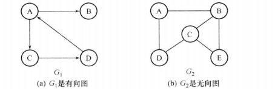
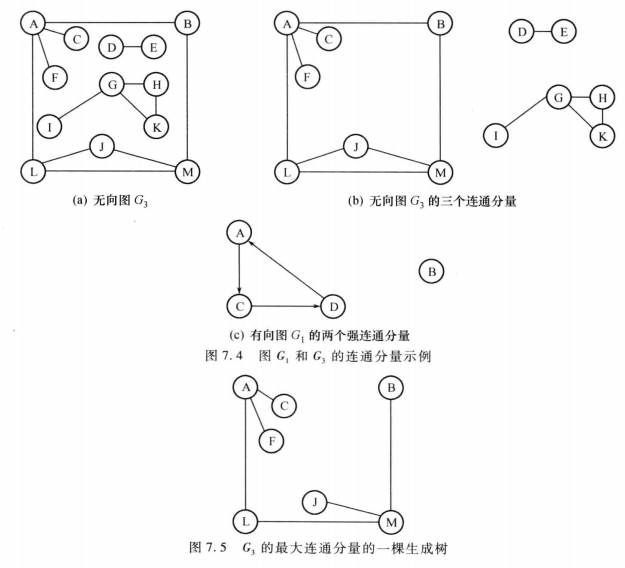
# 图的存储结构
## 邻接矩阵表示法（数组表示法）
- 一个一维数组用来存储顶点信息
- 一个二维数组用来存储图中顶点之间的关联关系

若G是一个具有n个顶点的无权图，G的邻接矩阵是n×n的矩阵A：
$$A~ij~=
\begin{cases}
1& \text{若<v~i~,v~j~>或(v~i~,v~j~)∈VR}\\
0& \text{反之}
\end{cases}$$
若G是一个有n个顶点的网，G的邻接矩阵是n×n的矩阵A：
$$A~ij~=
\begin{cases}
w_{ij}& \text{若<v~i~,v~j~>或(v~i~,v~j~)∈VR}\\
∞& \text{反之}
\end{cases}$$
c语言描述如下：
```c
#define MAX_VERTEX_NUM 20
#define INFINITY 32768

//DG有向图，DN有向网，UDG无向图，UDN无向网
typedef enum{DG,DN,UDG,UDN}GraphKind;
typedef char VertexData;
typedef struct ArcNode{
    AdjType adj;
    OtherInfo info;
}ArcNode;
typedef struct{
    VertexData vertex[MAX_VERTEX_NUM];
    ArcNode arcs[MAX_VERTEX_NUM][MAX_VERTEX_NUM];
    int vexnum,arcnum;//顶点数和弧数
    GraphKind kind;//图的种类标志
}AdjMatrix;
```

- 存储空间
  对于无向图而言，邻接矩阵是对称矩阵，可压缩存储，只存下三角即可，需n(n-1)/2个空间
  对于有向图而言，需n^2^个空间
- 便于运算
  A~ij~=0或1判断顶点之间是否有边相连
  对于无向图，第i个顶点的度：
  $$TD(v_i)=\sum_{j=1}^nA_{ij}$$
  对有向图，第i个顶点的出度：
  $$OD(v_i)=\sum_{j=1}^nA_{ij}$$
  对有向图，第i个顶点的度入：
  $$ID(v_i)=\sum_{i=1}^nA_{ij}$$
  访问图G中v顶点第一个邻接点的函数FirstAdjVertex(G,v)：
  - 由LocateVertex(G,v)找到v在图中的位置，即v在一维数组vertex的序号i
  - 二维数组arcs中第i行上第一个adj域非零的分量所在列号j，便是v的第一个邻接点在G的位置
  - 取出vertex[j]中的数据信息即可

**稀疏图不用邻接矩阵，会造成存储空间的浪费**
采用邻接矩阵表示法创建有向图：
```c
int LocateVertex(AdjMatrix *G,VertexData v)
{
    int j=Error,k;
    for(k=0;k< G->vexnum;k++)
        if(G->vertex[k]==v)
        {j=l;break;}
    return(j);
}
int CreateDN(AdjMatrix *G)
{
    int i,j,k,weight;VertexData v1,v2;
    scanf("%d,%d",&G->arcnum,&G->vexnum);
    for(i=0;i< G->vexnum;i++)
       for(i=0;i< G->vexnum;i++)
          G->arcs[i][j].adj=INFINITY;
    for(i=0;i< G->vexnum;i++)
       scanf("%c",&G->vextex[i]);
    for(k=0;i< G->arcnum;k++)
    {
        scanf("%c,%c,%d",&v1,&v2,&weight)；
        i=LocateVex_M(G,v1);
        j=LocateVex_M(G,v2);
        G->arcs[i][j].adj=weight;
    }
    return(OK);
}
```
O(n^2^+en)
## 邻接表表示法
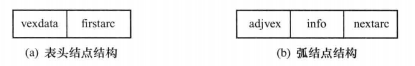
- 表头结点
  - 数据域存放顶点的名或其他有关信息
  - 链域用于指向链表中第一个顶点
- 弧结点
  -  邻接点域存放与顶点v~i~相邻接的顶点在图中的位置
  -  链域用于指向与顶点v~i~相关联的下一条边或弧的结点
  -  数据域用于存放与边或弧相关的信息
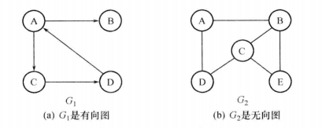
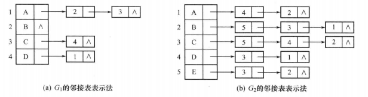
```c
#define MAX_VERTEX_NUM 20
typedef enum{DG,DN,UDG,UDN}GraphKind;
typedef struct ArcNode{
    int adjvex;
    struct ArcNode *nextarc;
    OtherInfo info;
}ArcNode;

typedef struct VertexNode{
    VertexData data;
    ArcNode *firstarc;
}VertexNode;

typedef struct{
    VertexNode vertex[MAX_VERTEX_NUM];
    int vexnum,arcnum;
    GraphKind kind;
}AdjList;
```
- 存储空间
  对于有n个顶点，e条边的无向图而言，需n个表头结点和2e个表结点
- 无向图的度
  顶点v~i~的度恰好是第i个单链表上结点的个数
- 有向图的度
  第i个单链表上结点的个数是v~i~的出度
  求入度需遍历整个邻接表
  可用**逆邻接表**解决
  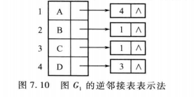
## 十字链表
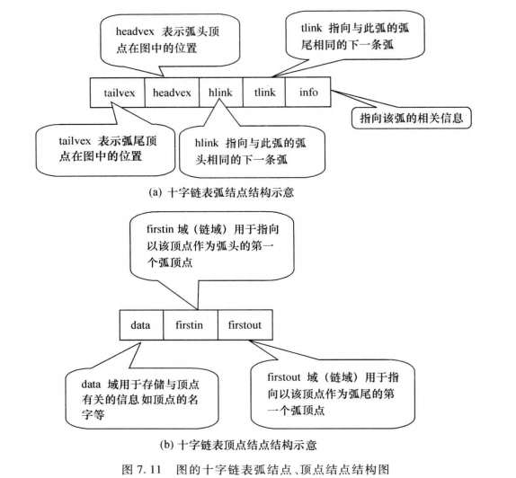
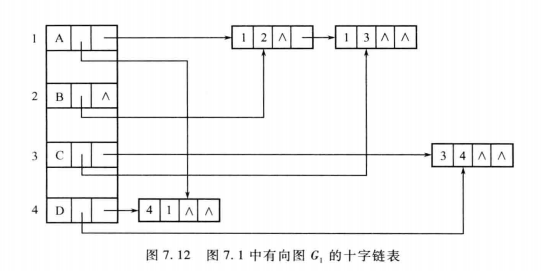
```c
#define MAX_VERTEX_NUM 20
typedef enum{DG,DN,UDG,UDN}GraphKind;

typedef struct ArcNode{
    int tailvex,headvex;
    struct ArcNode *hlink,*tlink;
}ArcNode;

typedef struct VertexNode{
    VertexData data;
    ArcNode *firstin,*firstout;
}VertexNode;

typedef struct{
    VertexNode vertex[MAX_VERTEX_NUM];
    int vexnum,arcnum;
    GraphKind kind;
}OrthList;
```
创建图的十字链表
```c
void CrtOrthList(OrthList *g)
{
    scanf("%d,%d",&n,&e);
    g->vexnum=n;
    g->arcnum=e;
    for(i=0;i<n;i++)
    {
        scanf("%c",&(g->vertex[i].data));
        g->vertex[i].firstin=NULL;
        g->vertex[i].firstout=NULL;
    }
    for(k=0;k<e;k++)
    {
        scanf("%c,%c",&vt,&vh);
        i=LocateVertex(g,vt);
        j=LocateVertex(g,vh);
        p=(ArcNode*)malloc(sizeof(ArcNode));
        p->tailvex=i;p->headvex=j;
        p->tlink=g->vertex[i].firstout;
        g->vertex[i].firstout=p;
        p->hlink=g->vertex[j].firstin;
        g->vertex[j].firstin=p;
    }
}
```
## 邻接多重表（无向图）
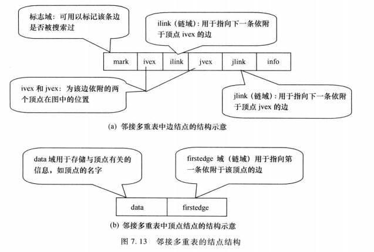
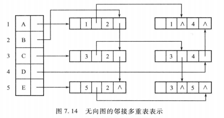
```c
#define MAX_VERTEX_NUM 20
typedef enum{DG,DN,UDG,UDN}GraphKind;

typedef struct EdgeNode{
    int mark,ivex,jvex;
    struct EdgeNode *ilink,jlink;
}EdgeNode;

typedef struct {
    VertexData data;
    EdgeNode *firstedge;
}VertexNode;

typedef struct{
    VertexNode vertex[MAX_VERTEX_NUM];
    int vexnum,arcnum;
    GraphKind kind;
}AdjMultiList;
```
# 图的遍历
设置访问标志数组visited[n]，用于标示图中每个顶点是否被访问过
## 深度优先搜索DFS
类似树的先根遍历
基本思想：
- 从图中某个顶点v~0~出发，首先访问v~0~
- 找出刚访问过的顶点的第一个未被访问的邻接点，然后访问该顶点，以该顶点为新顶点，重复此步骤，直到刚被访问过的顶点没有未被访问的邻接点为止
- 返回前一个刚访问过的且仍有未被访问的邻接点的顶点，找出该顶点的下一个未被访问的邻接点，然后访问该顶点，执行步骤2
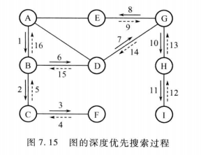
ABCFDGEHI

**算法思想**：
首先实现对v~0~所在连通子图的深度优先搜索，用递归算法实现：
- 访问出发点v~0~
- 依次以v~0~的未被访问的邻接点为出发点，深度优先搜索图，直至图中所有与v~0~有路径相通的顶点都被访问
- 若是非连通图，需从图中另选一个未被访问的顶点作为起点，重复上述过程，直至所有顶点被访问

深度优先遍历图g
```c
#define True 1
#define False 0
#define Error -1
#define OK 1
int visited[MAX_VERTEX_NUM];

void TraverseGraph(Graph g)
{
    for(vi=0;vi<g.vexnum;vi++) visited[vi]=False;
    for(vi=0;vi<g.vexnum;vi++)/*循环调用深度优先遍历连通子图的操作，若g是连通图，执行一次*/
       if(!visited[vi]) DepthFirstSearch(g,vi);
}
```
深度优先遍历v0所在的连通子图
```c
void DepthFirstSearch(Graph g,int v0)
{
    visit(v0);visited[v0]=True;
    w=FirstAdjVertex(g,v0);
    while(w!=-1)/*邻接点存在*/
    {
        if(!visited[w]) DepthFirstSearch(g,w);
        w=NextAdjVertex(g,v0,w);/*找下一个邻接点*/
    }
}
```
- 采用邻接矩阵的DepthFirstSearch
  ```c
  void DepthFirstSearch(AdjMatrix g,int v0)
  {
    visit(v0);visited[v0]=True;
    for(vj=0;vj<g.vexnum;vj++)
       if(!visited[vj]&&g.arcs.[v0][vj].adj==1)
          DepthFirstSearch(g,vj);
  }
  ```
- 采用邻接表的DepthFirstSearch
  ```c
  void DepthFirstSearch(AdjList g,int v0)
  {
    visit(v0);visited[v0]=True;
    p=g.vertex[v0].firstarc;
    while(p!NULL)
    {
        if(!visited[p->adjvex]) DepthFirstSearch(g.p->adjvex);
        p=p->nextarc;
    }
  }
  ```
  O(n+e)
- 使用非递归实现DepthFirstSearch
  ```c
  void DepthFirstSearch(Graph g,int v0)
  {
    InitStack(&S);
    Push(&S,v0);
    while(!IsEmpty(S))
    {
        Pop(&S,&v);
        if(!visited[v])
        {
            visit(v);
            visited[v]=True;
            w=FirstAdjVertex(g,v);
            while(w!=-1)
            {
                if(!visited[w]) Push(&S,w);
                w=NextAdjVertex(g,v,w);
            }
        }
    }
  }
  ```
## 广度优先搜索
类似树的层次遍历
基本思想：
- 从图中某个顶点v~0~出发，首先访问v~0~
- 依次访问v~0~的各个未被访问的邻接点
- 分别从这些邻接点出发，依次访问它们的各个未被访问的邻接点，访问时应保证：如果v~i~和v~k~为当前端结点，且v~i~在v~k~之前被访问，则v~i~所有未被访问的邻接点应在v~k~所有未被访问的邻接点之前访问，重复③直到所有端结点均没有未被访问的邻接点为止
- 若此时还有顶点未被访问，选一个未被访问的顶点作为起始点，重复上述过程，直到所有顶点被访问过为止
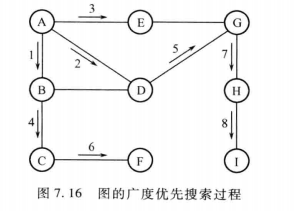

设置访问标志数组visited[n],和队列Q（保证访问顺序）
**算法思想**：
- 首先访问v0，并置访问标志，将v0入队
- 只要队不空，重复下述处理：
  - 队头结点v出队
  - 对v的所有邻接点w，如果w为访问，则访问w并置访问标志，然后将w入队

广度优先搜索图g中v0所在连通子图
```c
void BreadthFirstSearch(Graph g,int v0)
{
    visit(v0);visited[v0]=True;
    InitQueue(&Q);
    EnterQueue(&Q,v0);
    while(!IsEmpty(Q))
    {
        DeleteQueue(&Q,&v);
        w=FirstAdjVertex(g,v)；
        while(w!=-1)
        {
            if(!visited[w])
            {
                visit(w);visited[w]=True;
                EnterQueue(&Q,w);
            }
            w=NextAdjVertex(g,v,w);
        }
    }
}
```
邻接表O(n+e)
邻接矩阵O(n^2^)
# 图的应用
## 图的连通性问题
### 无向图的连通分量
连通图遍历时只调用一次搜索过程
调用几次搜索过程，说明有几个连通分量
### 图中两个顶点之间的简单路径
可以看成是有条件的图遍历过程
**算法思想**：
从顶点u开始，进行深度（或广度）优先搜索，如果能搜索到顶点v，则表明，从u到v有一条路径。
设置数组pre[n]，当从某个顶点v~i~找到其邻接点v~j~进行访问时，将pre[j]置为i，这样当退出搜索后，可根据pre数组从顶点v追溯到顶点u，从而输出简单路径，具体设计时可用pre代替visited数组，**pre[j]=-1表示v~j~未被访问，pre[j]!=-1表示已被访问**。
深度优先找简单路径
```c
int *pre;
void one_path(Graph *G,int u,int v)
{
  int i;
  pre=(int *)malloc(G->vexnum*sizeof(int));
  for(i=0;i<G-> vexnum;i++) pre[i]=-1;
  pre[u]=-2;/*将pre[u]置为-2表示u已被访问*/
  DFS_path(G,u,v);
  free(pre);
}

int DFS_path(Graph *G,int u,int v)
{
  int j;
  for(j=firstadj(G,u);j>=0;j=nextadj(G,u,j))
      if(pre[j]==-1)
      {
        pre[j]=u;
        if(j==v)
        {
          print_path(pre,v);
          return;
        }
        else if(DFS_path(G,j,v)) return 1;
      }
   return 0;
}
```
### 图的生成树与最小生成树
**生成树**：一个连通图的生成树指一个极小连通子图，它含有图中全部顶点，但只有足以构成一个树的n-1条边；如果在一棵生成树上加一条边，必定构成一个环；如果一个图有n个顶点且边数小于n-1条，则该图一定是非连通图
**最小生成树**：在一个连通网的所有生成树中，各边代价之和最小的那棵树称为最小代价生成树（MST）
- 性质：设N=(V,{E})是一个连通网，U是顶点集V的一个非空子集，若(u,v)是一条具有最小权值的边，其中u∈U，v∈V-U，则存在一棵包含边(u,v)的最小生成树
#### 普里姆算法——加点法
设N=(V,{E})是一个连通网，TE为最小生成树中边的集合
- 初始U={u~0~}(u~0~∈V)，TE≠∅
- 在所有u∈U，v∈V-U的边中选一条代价最小的边(u~0~,v~0~)并入集合TE，同时将v~0~并入U
- 重复②直到U=V为止

设置数组closedge[ ]，记录U到V-U具有最小代价的边，对于v∈V-U，closedge[v]记录所有与v邻接的，从U到V-U的那组边中最小边的信息，closedge[v]包含两个域：adjvex（顶点）和lowcost（权值）
**closedge[v].lowcost=Min({cost(u,v)|u∈U})**
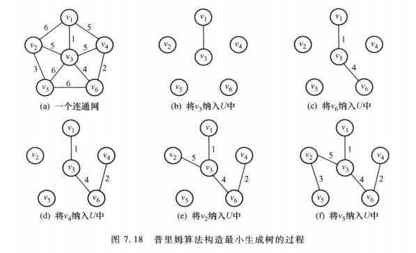
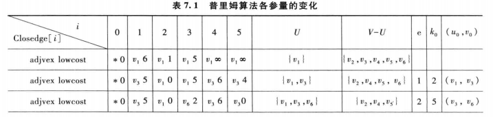
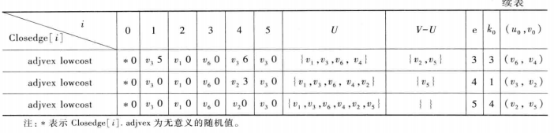
**算法思想**：
- 将初始顶点u加入U，对其余每一个顶点i，将closedge[i]初始化为i到u的边信息
- 循环n-1次如下处理：
  - 从各组最小边中选出最小的最小边clsoedge[v]
  - 将v加入U 
  - 更新剩余每组最小边的信息closedge[i] (i∈V-U)
    对于以i为中心的那组边，新增了一条从v到i的边，如果新权值比closedge[v].lowcost小，则更新
**算法描述**：
```c
struct{
  int adjvex;
  int lowcost;
}closedge[MAX_VERTEX_NUM];

MiniSpanTree_Prim(AdjMatrix gn,int u)
{
  closedge[u].lowcost=0;
  for(i=0;i<gn.vexnum;i++)
      if(i!=u)
      {
        closedge[i].adjvex=u;
        closedge[i].lowcost=gn.arcs[u][i].adj;
      }
  for(e=1;e<gn.vexnum-1;e++)
  {
    v=Minium(closedge);
    u=closedge[v].adjvex;
    printf(u,v);
    closedge[v].lowcost=0;
    for(i=0;i<vexnum;i++)
       if(gn.arcs[v][i].adj<closedge[i].lowcost)
       {
         closedge[i].lowcost=gn.arcs[v][i].adj;
         closedge[i].adjvex=v;
       }
  }
}
```
O(n^2^)
#### 克鲁斯卡尔算法——加边法
设N=(V,{E})是一个连通网，将N中的边按权值从小到大排列
- 将n个顶点看成n个集合
- 按权值从小到大的顺序选边，所选的边应满足两个顶点不在同一个顶点集合内，将该边放到生成树的边的集合中，同时将该边的两个顶点所在顶点集合合并
- 重复②直到所有顶点在一个集合

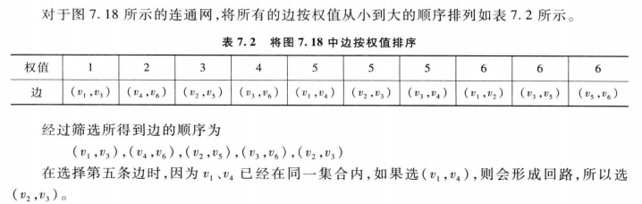
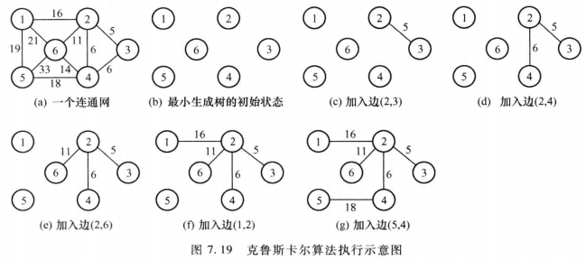
## 有向无环图的应用
### 拓扑排序
用顶点表示活动，用弧表示活动间的优先关系的有向无环图，称为**顶点表示活动的网**，简称**AOV-网**
- 传递性，若<v~i~,v~j~><v~j~,v~k~>，则必存在<v~i~,v~k~>
- 拓扑序列不唯一

拓扑排序的基本思想：
- 从有向图选择一个无前驱的结点输出
- 将此结点和以它为起点的边删除
- 重复①②直到不存在无前驱的结点
- 若此时输出的结点数小于有向图顶点数，则说明有向图存在回路，否则输出的顶点顺序即为一个拓扑序列

**基于邻接矩阵的存储结构**：
A为有向图G的邻接矩阵：
- 找无前驱结点——在A中找值全为0的列
- 删除以i为起点的所有弧——将矩阵中i对应的行全部置零

算法步骤：
- ①取1作为第一新序号
- ②找一个未编号的，值全0的列j，若找到转③；否则，若所有的列全编过号，排序结束；若有列未曾被编号，则图有回路
- ③输出列号对应的顶点j，把新序号赋给所找到的列
- ④将矩阵j对应的行全置0
- ⑤新序号加1，转②
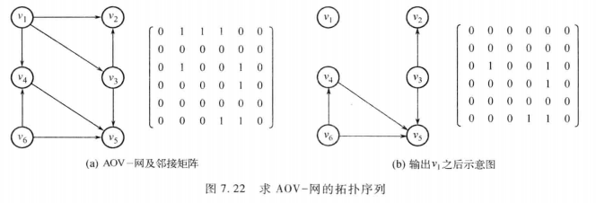
上图拓扑序列为v1,v6,v4,v3,v2,v5或v1,v3,v2,v6,v4,v5

**基于邻接表的存储结构**：
设置一个存放各顶点入度的数组indegree[]
- 找无前驱结点——找indegree[i]=0的顶点i
- 删除以i为起点的所有弧——对链在i后面的所有邻接点k，将对应indegree[k]-1
- 未避免重复检测入度为0的顶点，可以在设置一个辅助栈，若某一顶点的入度减为0，则入栈，当输出某一顶点时，从栈中删除该顶点
**算法思想**：
- 求各顶点的入度，将入度为0的顶点入栈
- 只要栈不空，则重复以下处理
  - 将栈顶顶点i出栈打印
  - 将i的每一个邻接点k的入度减1，如果k的入度变为0，则k入栈

拓扑排序算法
```c
int ToppSort(AdjList G)
{
  Stack S;
  int indegree[MAX_VERTEX_NUM];
  int i,count,k;
  ArcNode *p;
  FindID(G,indegree);
  InitStack(&S);
  for(i=0;i<G->vexnum;i++)
     if(indegree[i]==0) Push(&S,i);
  count=0;
  while(!IsEmpty(S))
  {
    Pop(&S,&i);
    printf("%c",G.vertex[i].data);
    count++;
    p=G.vertex[i].firstarc;
    while(p!=NULL)
    {
      k=p->adjvex;
      indegree[k]--;
      if(indegree[k]==0) Push(&S,k);
      p=p->nextarc;
    }
 
  }
  if(count<G.vexnum) return(Error);
    else return(OK);
} 
```
O(n+e)
求入度算法
```c
void FindID(AdjList G,int indegree[MAX_VERTEX_NUM])
{
  int i;ArcNode *p;
  for(i=0;i<G.vexnum;i++)
     indegree[i]=0;
  for(i=0;i<G.vexnum;i++)
  {
    p=G.vextex[i].firstarc;
    while(p!=NULL)
    {
      indegree[p->adjvex]++;
      p=p->nextarc;
    }
  }
}
```
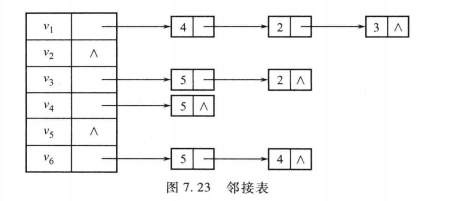
v6,v1,v3,v2,v4,v5
入度：indegree[v~1~]=0,v1入栈
indegree[v~2~]=2,
indegree[v~3~]=1,
indegree[v~4~]=2,
indegree[v~5~]=3,
indegree[v~6~]=0，v6入栈
v6出栈，indegree[v~5~]=2,indegree[v~4~]=1
v1出栈，indegree[v~4~]=0,v4入栈，indegree[v~2~]=1,indegree[v~3~]=0,v3入栈
v3出栈，indegree[v~5~]=1，indegree[v~2~]=0，v2入栈
v2出栈
v4出栈，indegree[v~5~]=0，v5入栈
v5出栈
### 关键路径
用顶点表示活动，用弧表示活动，弧的权值表示活动所需时间的有向无环图，称为**边表示活动的网**，简称**AOE-网**

在AOE-网中存在唯一的，入度为0的顶点，称为**源点**，存在唯一的，出度为0的顶点，称为**汇点**；从源点到汇点的最长路径长度即为完成整个工程任务所需时间，称该路径为**关键路径**，关键路径上的活动称为**关键活动**
- 事件v~i~的最早发生时间ve(i)：从源点到v~i~的最长路径长度
- 事件v~i~的最晚发生时间vl(i)：保证汇点按其最早发生时间发生的前提下，v~i~的最晚发生时间
- 活动a~i~的最早开始时间e(i)：a~i~对应<j,k>,e(i)等于从源点到j的最长路径长度，即e(i)=ve(j)
- 活动a~i~的最晚开始时间l(i)：a~i~对应<j,k>，持续时间dut(<j,k>)，l(i)=vl(k)-dut(<j,k>)
- 活动a~i~的松弛时间（时间余量）:l(i)-e(i),**松弛时间=0的活动为关键活动**

求关键路径的步骤：
- 对图中顶点进行拓扑排序，在排序过程中按拓扑序列求每个事件最早发生时间ve(i)
- 按逆拓扑排序求每个事件vl(i)
- 求每个活动e(i)和l(i)
- 找出l(i)=e(i)的活动，即为关键活动

求最早发生时间
**算法思想**：
- 求各顶点的入度，将入度为0的顶点入栈
- 将各顶点ve[i]=0
- 只要S不空，重复以下处理
   - 将栈顶顶点j出栈并压入栈T（生成逆拓扑序列）
   - 将j的每一个邻接点k的入度减1，如果k入度为0，则将k入栈
   - 根据顶点j的ve[j]和弧<j,k>的权值，更新k的ve[k]
```c
int ve[MAX_VERTEX_NUM];
int ToppOrder(AdjList G,Stack *T)
{
  Stack S;
  int indegree[MAX_VERTEX_NUM];
  int i,j,count,k;
  ArcNode *p;
  FindID(G,indegree);
  InitStack(&S);
  InitStack(T);
  for(i=0;i<G->vexnum;i++)
     if(indegree[i]==0) Push(&S,i);
  count=0;
  //addition
  for(i=0;i<G->vexnum;i++)
     ve[i]=0;

  while(!IsEmpty(S))
  {
    Pop(&S,&j);
    Push(T,j);
    count++;
    p=G.vertex[j].firstarc;
    while(p!=NULL)
    {
      k=p->adjvex;
      if(--indegree[k]==0) Push(&S,k);
      //addition
      if(ve[j]+p->Info.weight>ve[k]) ve[k]=ve[j]+p->Info.weight;

      p=p->nextarc;
    }
 
  }
  if(count<G.vexnum) return(Error);
    else return(OK);
} 
```
求关键路径
**算法思想**：
- 调用修改后的拓扑排序算法，求最早发生时间和逆拓扑序列栈T
- 将vl[i]=ve[i]
- 若T不为空，重复下列处理
  - 将栈顶j出栈
  - 对于j的每一邻接点k，根据k的vl[k]和<j,k>的权值更新vl[j]
- 扫描每一条弧，计算其ei和li，如果ei=li输出该边
```c
int CriticalPath(AdjList G)
{
  Stack T;
  int i,j,k,dut,ei,li;
  char tag;
  ArcNode *p;
  int vl[MAX_VERTEX_NUM];
  if(!TopoOrder(G,&T)) return(Error);
  for(i=0;i<G->vexnum;i++)
     vl[i]=ve[G.vexnum-1];/*将各顶点最迟发生时间初始化为汇点最早发生时间*/
  while(!IsEmpty(&T))
  {
    Pop(&T,&j);
    p=G.vertex[j].firstarc;
    while(p!=NULL)
    {
      k=p->adjvex;
      dut=p->weight;
      if(vl[k]-dut<vl[j]) vl[j]=vl[k]-dut;
      p=p->nextarc;
    }
  }
  for(j=0;j<G.vexnum;j++)
  {
    p=G.vertex[j].firstarc;
    while(p!=NULL)
    {
      k=p->adjvex;
      dut=p-Info.>weight;
      ei=ve[j];
      li=vl[k]-dut;
      tag(ei==li)?'*':' ';
      printf("%c,%c,%d,%d,%d,%c\n",G.vertex[j].data,G.vertex[k].data,dut,ei,li,tag)
      p=p->nextarc;
    }
  }
  return(OK);
} 
```
O(n+e)
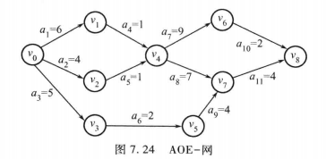
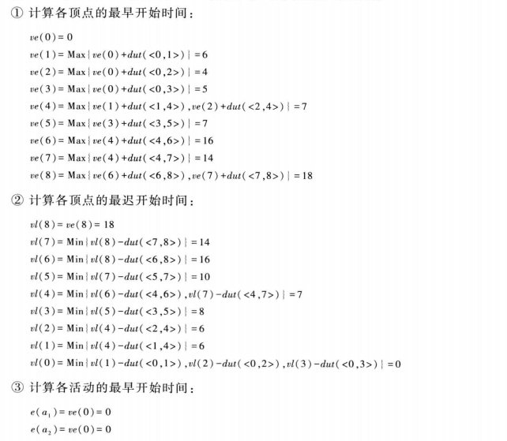
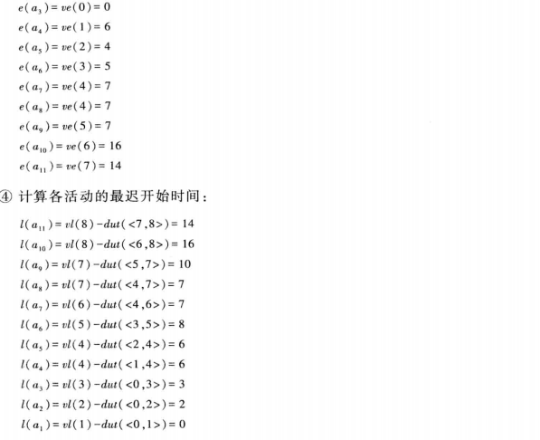
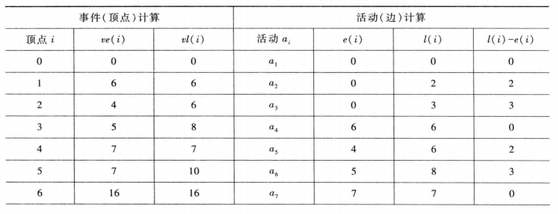
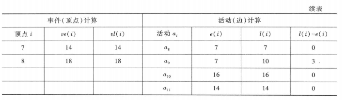
关键路径有两条a1,a4,a7,a10&a1,a4,a8,a10
## 最短路径问题
### 某一顶点到其他各顶点的最短路径（Dijkstra）
G=(V,{E})
S:已求出的最短路径的终点集合（开始为{v~0~}）
V-S:未求出的最短路径的顶点集合（开始为V-{v~0~}）
**定理**：下一条最短路径或者是弧(v~0~,v~x~)，或者是中间经过S中某些顶点，而后到达v~x~的路径
设置辅助数组dist[i],表示目前已找到的，从v~0~到v~i~的当前最短路径长度，它的初值：若从v~0~到v~i~有弧，则为弧的权值，否则为∞
dist[k]=Min{dist[i] | v~i~∈V-S}
设置辅助数组path[i],记录从v~0~到其余各点的顶点序列，它的初值：若从v~0~到v~i~有弧，则为(v~0~,v~i~)，否则为空
**算法思想**：
g为用邻接矩阵表示的带权图
- {v~0~}→S；dist[i]=g.arcs[v0][vi].adj;(v~i~∈V-S)
- 选择vk使得dist[k]=Min{dist[i] | v~i~∈V-S},vk为目前求得的下一条从v0出发的最短路径的终点
- vk加入S
- 修正从v0出发到V-S上任一点vi的最短路径长度
  dist[k]+g.arcs[k][i].adj<dist[i],则dist[i]=dist[k]+g.arcs[k][i].adj
- 重复②~④共n-1次

```c
#define INFINITY 32768
typedef unsigned int WeightType;
typedef WeightType AdjType;
typedef SeqList VertexSet;

ShortestPath_DJS(AdjMatrix g,int v0,WeihtType dist[MAX_VERTEX_NUM],VertexSet path[MAX_VERTEX_NUM])
{
  VertexSet s;
  for(i=0;i<g.vexnum;i++)
  {
    InitList(&path[i]);
    dist[i]=g.arcs[v0][i].adj;
    if(dist[i]<INFINITY)
    {
      AddTail(&path[i],g.vertex[v0]);
      AddTail(&path[i],g.vertex[i]);
    }
  }
  InitList(&s);
  AddTail(&s,g.vertex[v0]);
  for(t=1;t<g.vexnum-1;t++)
  {
    min=INFINITY;
    for(i=0;i<g.vexnum;i++)
       if(!Member(g.vertex[i],s)&&dist[i]<min)
       {k=i;min=dist[i];}
    if(min==INFINITY) return;
    AddTail(&s,g.vertex[k]);
    for(i=0;i<g.vexnum;i++)
       if(!Member(g.vertex[i],s)&&g.arcs[k][i]!=INFINITY&&(dist[k]+g.arcs[k][i].adj<dist[i]))
          {
            dist[i]=dist[k]+g.arcs[k][i].adj;
            path[i]=path[k];
            AddTail(&path[i],g.vertex[i]);
          } 
  }
}
```
O(n^2^)
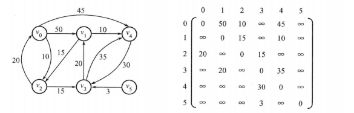
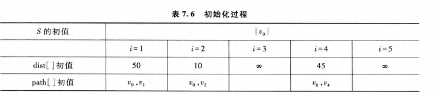
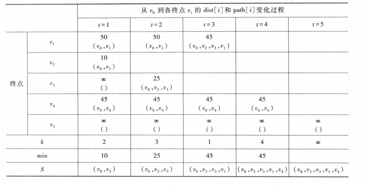
### 任意一对顶点间的最短路（Floyd）
**算法思想**：
g是用邻接矩阵表示的图
- 将v~i~到v~j~的最短路径初始化为g.arcs[i][j].adj,然后进行如下n次比较和修正：
- 在v~i~和v~j~间加入v~0~，比较(v~i~,v~0~,v~j~)和(v~i~,v~j~)，取较短的路径作为v~i~到v~j~的且中间顶点号不大于0的最短路径
- 在v~i~和v~j~间加入v~1~，得到(v~i~,……,v~1~)和(v~1~,……,v~j~)，将(v~i~,……,v~1~,……,v~j~)与上一步的到比较，取较短的路径作为v~i~到v~j~的且中间顶点号不大于1的最短路径
……
以此类推经n次比较修正，在n-1步求得v~i~到v~j~的且中间顶点号不大于n-1的最短路径，这必是v~i~到v~j~的最短路径
g中所有顶点偶对v~i~与v~j~间的最短路径长度对应一个n阶方阵D，在上述n-1步中，D的值不断变化，对应一个n阶方阵序列

定义：n阶方阵序列D^-1^,D^0^,……,D^N-1^,其中，
D^-1^[i][j]=g.arcs[i][j].adj
D^k^[i][j]=Min{D^k-1^[i][j],D^k-1^[i][k]+D^k-1^[k][j]},0≤k≤n-1
D^N-1^中为所有顶点偶对的最终最短路径长度
**算法描述**：
```c
typedef SeqList VertexSet;
ShortestPath_Floyd(AdjMatrix g,WeihtType dist[MAX_VERTEX_NUM][MAX_VERTEX_NUM],VertexSet path[MAX_VERTEX_NUM][MAX_VERTEX_NUM])
{
  for(i=0;i<g.vexnum;i++)
   for(j=0;j<g.vexnum;j++)
   {
     InitList(&path[i][j]);
     dist[i][j]=g.arcs[i][j].adj;
     if(dist[i][j]<INFINITY)
     {
       AddTail(&path[i][j],g.vertex[i]);
       AddTail(&path[i][j],g.vertex[j]);
     }
   }
  for(k=0;k<g.vexnum;k++)
    for(i=0;i<g.vexnum;i++)
      for(j=0;j<g.vexnum;j++)
          if(dist[i][k]+dist[k][j]<dist[i][j])
          {
            dist[i][j]=dist[i][k]+dist[k][j];
            path[i][j]=JoinList(path[i][k],path[k][j]);/*合并线性表*/
          }
}
```
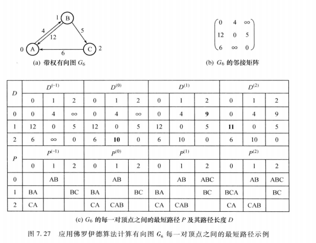
# 典型例题
## 求距离顶点v0的最短路径长度为K的所有顶点
无向图g
**问题分析**：从v0开始广度优先搜索，将一步可达，两步可达……直到K步可达的所有顶点记下来，同时用一个队列记录每个结点的层号，输出第K+1层所有点即可
```c
void bfsKLevel(Graph g,int v0,int K)
{
    InitQueue(Q1);
    InitQueue(Q2);
    for(i=0;i<g.vexnum;i++) 
       visited[i]=FALSE;
    visited[v0]=TRUE;
    Level=1;
    EnterQueue(Q1,v0);
    EnterQueue(Q2,Level);

    while(!IsEmpty(Q1)&&Level<K+1)
    {
        v=DeleteQueue(Q1);
        Level=DeleteQueue(Q2);
        w=FirstAdjVertex(g,v)；
        while(w!=-1)
        {
            if(!visited[w])
            {
                visited[w]=True;
                //v的Level为K，表示w的Level为K+1，符合要求，输出，该结点无需入队
                if(Level==K) printf("%d",w);
                else {
                  EnterQueue(Q1,w);
                  EnterQueue(Q2,Level+1);
                }            
            }
            w=NextAdjVertex(g,v,w);
        }
    }
}
```
## 设计算法在图g中找出一条包含所有顶点的简单路径
**问题分析**：从任一顶点开始进行深度优先搜索，同时记录当前路径结点序列和当前路径结点数目，递归层进时结点数目+1，退层-1，当结点数目=结点总数时输出
```c
int visited[MAX_VERTEX_NUM];
int path[MAX_VERTEX_NUM];
int n=0;
int DepthFirstSearch(Graph g,int v0)
{
  visited[v0]=TRUE;
  n=n+1;
  path[n]=v0;
  if(n==g.vexnum)
  {
    Display(path);
    return 1;
  }
  w=FirstAdjVertex(g,v0);//第一个邻接点
  while(w!=-1)
  {
    if(!visited[w]&&DepthFirstSearch(g,w)==1) return 1;//从w继续往下搜索
    w=NextAdjVertex(g,v0,w);//下一个邻接点
  }
  visited[v0]=FALSE;//退层时取消访问标志
  n=n-1;//退层-1
  return 0;//失败
}

void Hamilton(Graph g)
{
  for(i=0;i<g.vexnum;i++)
     visited[i]=FALSE;
  n=0;
  for(i=0;i<g.vexnum;i++)
      if(DepthFirstSearch(g,i)==1) return;
}
```
## 求图的中心顶点
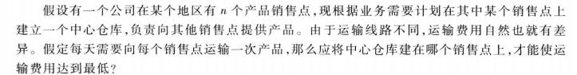
**算法分析**：
首先用弗洛伊德算法求出各顶点之间的最短路径长度
再求出每个顶点到其余各顶点的最短路径之和
从中选取一个最短路径长度之和最小的顶点
```c
#define MAXLEN 3E38
#define MAX 20
int CenterVex(AdjMatrix G)
{
  int i,j,k;
  float min,len;
  float A[MAX][MAX];//存放最短路径长度
  for(i=0;i<G.vexnum;i++)
  {
    for(j=0;j<G.vexnum;j++)
       A[i][j]=G.arcs[i][j].adj;
    A[i][i]=0;
  }
  for(k=0;k<G.vexnum;k++)//求每一对顶点之间的最短路径长度
    for(i=0;i<G.vexnum;i++)
      for(j=0;j<G.vexnum;j++)
         if(A[i][k]+A[k][j]<A[i][j])
            A[i][j]=A[i][k]+A[k][j];
  min=MAXLEN;
  k=0;
  for(i=0;i<G.vexnum;i++)
  {
    len=0;
    for(j=0;j<G.vexnum;j++)//vi到其余顶点最短路径长度之和
        len=len+A[i][j];
    if(len<min){
      k=i;
      min=len;
    }
  }
  return(k);
}
```
