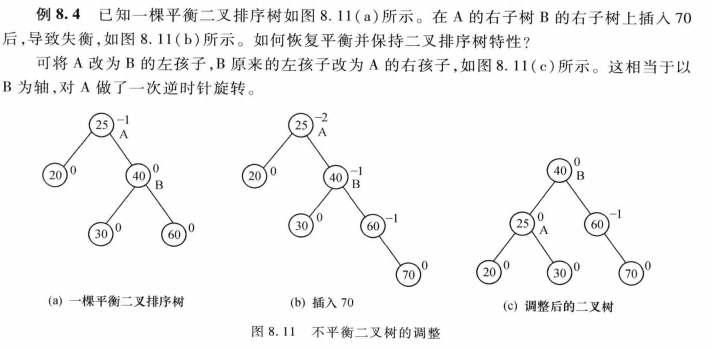
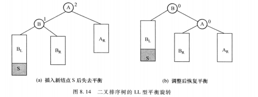

<!-- @import "[TOC]" {cmd="toc" depthFrom=1 depthTo=6 orderedList=false} -->

<!-- code_chunk_output -->

- [查找的基本概念](#查找的基本概念)
- [基于线性表的查找法](#基于线性表的查找法)
  - [顺序查找法](#顺序查找法)
    - [设置监视哨的顺序查找](#设置监视哨的顺序查找)
    - [不设置监视哨](#不设置监视哨)
  - [折半查找法（二分法）](#折半查找法二分法)
  - [分块查找法](#分块查找法)
- [基于树的查找法](#基于树的查找法)
  - [二叉排序树](#二叉排序树)
    - [定义与描述](#定义与描述)
    - [插入与创建](#插入与创建)
    - [查找](#查找)
    - [删除](#删除)
    - [二叉排序树的特性](#二叉排序树的特性)
  - [平衡二叉排序树——AVL树](#平衡二叉排序树avl树)
    - [失衡类型及相应的调整方法](#失衡类型及相应的调整方法)
    - [平衡二叉排序树插入操作的完整算法](#平衡二叉排序树插入操作的完整算法)
  - [B树*](#b树)
    - [m路查找树](#m路查找树)
    - [B树及其查找](#b树及其查找)
    - [B树插入](#b树插入)
    - [在B树删除一个关键字](#在b树删除一个关键字)
- [计算式查找法——哈希法](#计算式查找法哈希法)
  - [哈希函数的构造方法](#哈希函数的构造方法)
    - [数字分析法](#数字分析法)
    - [平方取中法](#平方取中法)
    - [分段叠加法](#分段叠加法)
    - [除留余数法](#除留余数法)
    - [伪随机数法](#伪随机数法)
  - [处理冲突的方法](#处理冲突的方法)
    - [开发定址法（再散列法）](#开发定址法再散列法)
    - [再哈希法](#再哈希法)
    - [链地址法](#链地址法)
    - [建立公共溢出区](#建立公共溢出区)
  - [哈希表的查找过程](#哈希表的查找过程)
  - [哈希法性能分析](#哈希法性能分析)
- [典型例题](#典型例题)

<!-- /code_chunk_output -->
# 查找的基本概念
**列表**：由同一类型的数据元素构成的集合，可用任意数据结构实现
**关键字**：数据元素的某个数据项的值，用它可以标识列表中的一个或一组数据元素。如果一个关键字可以唯一标识列表中的一个数据元素，则称其为**主关键字**，否则为**次关键字**。当数据元素仅有一个数据项时，数据元素的值就是关键字
**查找**：根据给定的关键字值，在特定的列表中确定一个其关键字与给定值相同的数据元素，并返回该数据元素在列表中的位置。
静态查找：只是对数据元素进行查找
动态查找：在查找的同时，插入找不到的元素，或从查找表中删除已查到的某个元素，允许表中元素变化
查找算法涉及三类参量：
**查找对象K**（找什么）
**查找范围L**（在哪找）
K在L中位置（**查找结果**）
**平均查找长度**：为确定数据元素在列表中的位置，需和给定值进行比较的关键字个数的期望值，称为查找算法在查找成功时的平均查找长度，对于长度为n的列表，$$ASL=P_1C_1+P_2C_2+……+P_nC_n=\sum_{i=1}^nP_iC_i$$
其中，P~i~为查找列表中第i个数据元素的概率，C~i~为找到列表第i个数据元素时，已经进行过的关键字比较次数
**查找的基本方法**
- **比较式查找法**
  - 基于线性表
  - 基于树 
- **计算式查找法**
  - 哈希查找法
# 基于线性表的查找法
## 顺序查找法
顺序结构数据类型的定义
```c
#define LIST_SIZE 20
typedef struct{
    KeyType key;
    OtherType other_data;
}RecordType;
typedef struct{
    RecordType r[LIST_SIZE+1];//r[0]为工作单元
    int length;
}RecordList;
```
### 设置监视哨的顺序查找
在表的一端设置一个监视哨，存放关键字，从表的另一端开始查找，如果在监视哨找到要查找的关键字，返回失败信息，否则返回相应下标
```c
int SeqSearch(RecodList l,KeyType k)
{
    l.r[0].key=k;
    i=l.length;
    while(l.r[i].key!=k) i--;
    return(i);
}
```
l.r[0]是监视哨，可以**防止越界**
$$ASL=\sum_{i=1}^nP_iC_i=1/n\sum_{i=1}^nC_i=1/n\sum_{i=1}^n(n-i+1)=1/2(n+1)$$
### 不设置监视哨
```c
int SeqSearch(RecodList l,KeyType k)
{
    i=l.length;
    while(i>=1&&l.r[i].key!=k) i--;
    if(i>=1) return(i);
    else return(0);
}
```
## 折半查找法（二分法）
要求：
- 必须采用顺序存储结构
- 必须按关键字大小有序排列
```c
int BinSrch(RecordList l,KeyType k)
{
    low=1;
    high=l.length;
    while(low<=high)
    {
        mid=(low+high)/2;
        if(k==l.r[mid].key) return(mid);
        else if(k<l.r[mid].key) high=mid-1;
        else low=mid+1;
    }
    return (0);
}
```
假定表长n=2^h^-1，则相应判定树必为深度为h=log~2~(n+1)的满二叉树，假设每个记录的查找概率相等

**优点**：比较次数少，查找速度快，平均性能好
**缺点**：要求待查表为有序表，插入删除困难，不适用于经常变动而查找频繁的有序列表
## 分块查找法
要求将列表组织成以下两种索引顺序结构
- 首先将列表分为若干块（子表）。一般块长度均匀，最后一块可以不满。块内无序，块间有序
- 构造一个索引表。每个索引项对应一个块并记录每块的起始位置，以及每块中的最大（最小）关键字，索引表按关键字有序排列


查找步骤：
- 首先将待查关键字k与索引表中的关键字比较，确定待查记录所在的块
- 进一步用顺序查找法，在相应块内查找关键字为k的元素

ASL~bs~=L~B~+L~W~
假设将长度为n的表分为b块，且每块含s个元素，则b=n/s，假定表中每个元素的查找概率相等，则每个索引项的查找概率为1/b，块中每个元素的查找概率为1/s

# 基于树的查找法
## 二叉排序树
### 定义与描述
定义：二叉排序树或是一棵空树，或是具有如下性质的二叉树
- 若它的左子树非空，则左子树上所有结点的值均小于根结点的值
- 若它的右子树非空，则右子树上所有结点的值均大于（或大于等于）根结点的值
- 它的左右子树也分别为二叉排序树

使用二叉链表作为存储结构：
```c
typedef struct node{
    KeyType key;
    struct node *lchild,*rchild;
}BSTNode,*BSTree;
```
### 插入与创建
插入：
**算法思想**：
已知一个关键字值为key的结点s，将其插入二叉排序树
- 若二叉排序树是空树，则key成为根
- 若二叉排序树非空，则将key与二叉排序树的根进行比较
  - 如果key的值等于根结点的值，则停止插入
  - 如果key的值小于根结点的值，则将key插入左子树
  - 如果key的值大于根结点的值，则将key插入右子树

二叉排序树的递归插入算法：
```c
void InsertBST(BSTree *bst,KeyType key)
{
    BiTree s;
    if(*bst==NULL)
    {
        s=(BSTree)malloc(sizeof(BSTNode));
        s->key=key;
        s->lchild=NULL;
        s->rchild=NULL;
        *bst=s;
    }
    else if(key<(*bst)->key)
            InsertBST(&((*bst)->lchild),key);
    else if(key>(*bst)->key)
            InsertBST(&((*bst)->rchild),key);
}
```
O(log~2~n)
创建：
**算法思想**：
首先将二叉树初始化为一棵空树，然后逐个读入元素，每读入一个元素就建立一个新结点，并插入当前已经生成的二叉排序树中，插入时比较结点的顺序始终是从二叉排序树的根结点开始
```c
void CreateBST(BSTree *bst)
{
    KeyType key;
    *bst=NULL;
    scanf("%d",&key);
    while(key!=ENDKEY)//自定义常量
    {
        InsertBST(bst,key);
        scanf("%d",&key);
    }
}
```
O(nlog~2~n)
### 查找
**算法思想**：
首先将key与根结点关键字t比较，如果：
- key=t，则返回根结点地址
- key<t，则进一步查左子树
- key>t，则进一步查右子树

递归：
```c
BSTree SearchBST(BSTree bst,KeyType key)
{
    if(!bst) return NULL;
    else if(bst->key==key) return bst;
    else if(bst->key>key) return SearchBST(bst->lchild,key);
    else  return SearchBST(bst->rchild,key);
}
```
非递归：
```c
BSTree SearchBST(BSTree bst,KeyType key)
{
    BSTree q;
    q=bst;
    while(q)
    {
        if(q->key==key) return q;
        if(q->key>key) q=q->lchild;
        else q=q->rchild;
    }
    return NULL;
}
```
二叉排序树的平均查找长度ASL与二叉排序树的形态有关，二叉排序树的分支越均衡，树的深度越浅，ASL越小
最坏情况：顺序查找（n+1）/2
最好情况：二分查找log~2~n
n个结点，有n！棵二叉排序树（其中有的形态相同），对这些树的ASL进行平均，得到的ASL=O（log~2~n）
<u>对于需要经常做插入、删除、查找的表，宜采用二叉排序树</u>
### 删除
首先查找要删除的结点，看是否在二叉排序树中，若不在则不做任何操作；否则假设要删除的结点为p，p的双亲结点为f，并假设p是f的左孩子，则：
- 若p为叶结点，则直接删除**f->lchild=NULL;free(p);**
- 若p的结点只有左子树，或只有右子树，则将p的左子树或右子树直接改为其双亲结点f的左子树**f->lchild=p->lchild(f->rchild=p->rchild;);free(p);**
- 若p既有左子树，又有右子树，此时有两种处理方法：
  - 首先找到p在中序序列中的直接前驱s，将p的左子树改为f的左子树，而将p的右子树改为s的右子树**f->lchild=p->lchild;s->rchild=p->rchild;free(p);**
  - 首先找到p在中序序列中的直接前驱s，用s结点的值代替p结点的值，再将s结点删除，原s结点的左子树改为s双亲结点q的右子树**p->data=s->data;q->rchild=s->lchild;free(s);**


使用第二种方法实现如下：
```c
BSTNode * DelBST(BSTree t,KeyType k)
{
    BSTNode *p,*f,*s,*q;
    p=t;
    f=NULL;
    while(p)
    {
        if(p->key==k) break;
        f=p;
        if(p->key>k) p=p->lchild;
        else p=p->rchild;
    }
    if(p==NULL) return t;
    if(p->lchild==NULL)//p无左子树
    {
        if(f=NULL) t=p->rchild;//p是原二叉排序树的根
        else if(f->lchild==p)//p是f的左子树
                f->lchild=p->rchild;//将p的右子树链到f左链上
        else f->rchild=p->rchild;//p是f右子树，将p的右子树链到f左链上
        free(p);
    }
    else//p有左子树
    {
        q=p;
        s=p->lchild;
        while(s->rchild)//在p的左子树中查找最右下结点
        {q=s;s=s->rchild;}
        if(q==p) q->lchild=s->lchild;//将s左子树链到q上
        else q->rchild=s->lchild;
        p->key=s->key;//将s的值赋给p
        free(s);
    }
    return t;
}
```
### 二叉排序树的特性
**中序遍历一个二叉排序树可以得到一个递增有序序列**
**逆中序遍历一个二叉排序树可以得到一个递减有序序列**
逆中序：先中序遍历右子树，访问根结点，再中序遍历左子树
## 平衡二叉排序树——AVL树
一棵平衡二叉排序树或是空树，或是具有下列性质的二叉排序树：
- 左子树与右子树的高度之差的绝对值小于等于1
- 左子树和右子树也是平衡二叉排序树

二叉排序树的ASL=O(log~2~n)
结点的**平衡因子**：结点的左子树深度与右子树深度之差
对一棵平衡二叉树而言，其结点的平衡因子只能是1，0，-1





一般情况下,只有新插人结点的祖先结点的平衡因子受影响,即以这些祖先结点为根的子树有可能失衡。下层的祖先结点恢复平衡,将使上层的祖先结点恢复平衡，因此应该调整最下面的失衡子树。因为平衡因子为0的祖先不可能失衡,所以从新插人结点开始向上,遇到的第一个其平衡因子不等于0的祖先结点为第一个可能失衡的结点,如果失衡,则应调整以该结点为根的子树。失衡情况不同,调整的方法也不同。
### 失衡类型及相应的调整方法
**LL型**

在一般二叉排序树的结点中增加一个存放平衡因子的域bf
LL型特点：A->bf=2,B->bf=1
```c
A->lchild=B->rchild;
B->rchild=A;
A->bf=0;
B->bf=0;
```
令A原来的父指针为FA
```c
if(FA==NULL) t=B;
else if(A==FA->lchild) FA->lchild=B;
else FA->rchild=B;
```
**LR型**

LR型特点：A->bf=2,B->bf=-1
```c
B->rchild=C->lchild;
A->lchild=C->rchild;
C->lchild=B;
C->rchild=A;
```
```c
if(S->key<C->key)//在C_L下插入S
{A->bf=-1;B->bf=0;C->bf=0;}
else if(S->key>C->key)//在C_R下插入S
{A->bf=0;B->bf=1;C->bf=0;}
else if(S->key==C->key)//C本身就是新插入结点S
{A->bf=0;B->bf=0;}
```
令A原来的父指针为FA
```c
if(FA==NULL) t=C;
else if(A==FA->lchild) FA->lchild=C;
else FA->rchild=C;
```
**RR型**

RR型特点：A->bf=-2,B->bf=-1
```c
A->rchild=B->lchild;
B->lchild=A;
A->bf=0;
B->bf=0;
```
令A原来的父指针为FA
```c
if(FA==NULL) t=B;
else if(A==FA->lchild) FA->child=B;
else FA->rchild=B;
```
**RL型**

RL型特点：A->bf=-2,B->bf=1
```c
B->lchild=C->rchild;
A->rchild=C->lchild;
C->lchild=A;
C->rchild=B;
```
```c
if(S->key<C->key)//在C_L下插入S
{A->bf=0;B->bf=-1;C->bf=0;}
else if(S->key>C->key)//在C_R下插入S
{A->bf=1;B->bf=0;C->bf=0;}
else if(S->key==C->key)//C本身就是新插入结点S
{A->bf=0;B->bf=0;}
```
令A原来的父指针为FA
```c
if(FA==NULL) t=C;
else if(A==FA->lchild) FA->lchild=C;
else FA->rchild=C;
```
### 平衡二叉排序树插入操作的完整算法
**算法思想**：
- 查找应插位置，同时记录插入位置最近的可能失衡结点A
- 插入新结点S
- 确定结点B，并修改A的平衡因子
- 修改从B到S路径上各结点的平衡因子
- 根据A，B的平衡因子，判断是否失衡及失衡类型，并作相应处理

**算法描述**：
AVLTree为平衡二叉排序树类型
AVLTNode为二叉平衡排序树结点类型
```c
void ins_AVLtree(AVLTree *avlt,KeyType k)
{
    S=(AVLTree)malloc(sizeof(AVLTNode));
    S->key=k;
    S->lchild=S->rchild=NULL;
    s->bf=0;
    if(*avlt==NULL) *avlt=S;
    else
    {
        //首先查找S的插入位置fp，同时记录距S的插入位置最近且平衡因子不等于0（等于1或-1）的结点A
        A=*avlt;FA=NULL;
        p=*avlt;fp=NULL;
        while(p!=NULL)
        {
            if(p->bf!=0)
            {A=p;FA=fp;}
            fp=p;
            if(K<p->key) p=p->lchild;
            else p=p->rchild;
        }
        //插入S
        if(K<fp->key) fp->lchild=S;
        else fp->rchild=S;
        //确定结点B，并修改A的平衡因子
        if(K<A->key) 
        {B=A->lchild;A->bf=A->bf+1;}
        else {B=A->rchild;A->bf=A->bf-1;}
        //修改B到S路径上各点的平衡因子
        p=B;
        while(p!=S)
            if(K<p->key) {p->bf=1;p=p->lchild;}
            else {p->bf=-1;p=p->rchild;}
        //判断失衡类型
        if(A->bf=2&&B->bf=1)
        {
           A->lchild=B->rchild;
           B->rchild=A;
           A->bf=0;
           B->bf=0; 
           if(FA==NULL) t=B;
           else if(A==FA->lchild) FA->lchild=B;
           else FA->rchild=B;
        }
        else if(A->bf=2&&B->bf=-1)
        {
            C=B->lchild;
            B->rchild=C->lchild;
            A->lchild=C->rchild;
            C->lchild=B;
            C->rchild=A;
            if(S->key<C->key)//在C_L下插入S
            {A->bf=-1;B->bf=0;C->bf=0;}
            else if(S->key>C->key)//在C_R下插入S
            {A->bf=0;B->bf=1;C->bf=0;}
            else if(S->key==C->key)//C本身就是新插入结点S
            {A->bf=0;B->bf=0;}
            if(FA==NULL) t=C;
            else if(A==FA->lchild) FA->lchild=C;
            else FA->rchild=C;
        }
        else if(A->bf=-2&&B->bf=1)
        {
            C=B->lchild;
            B->lchild=C->rchild;
            A->rchild=C->lchild;
            C->lchild=A;
            C->rchild=B;
            if(S->key<C->key)//在C_L下插入S
            {A->bf=0;B->bf=-1;C->bf=0;}
            else if(S->key>C->key)//在C_R下插入S
            {A->bf=1;B->bf=0;C->bf=0;}
            else if(S->key==C->key)//C本身就是新插入结点S
            {A->bf=0;B->bf=0;}
            if(FA==NULL) t=C;
            else if(A==FA->lchild) FA->lchild=C;
            else FA->rchild=C;
        }
        else if(A->bf=-2&&B->bf=-1)
        {
            A->rchild=B->lchild;
            B->lchild=A;
            A->bf=0;
            B->bf=0;
            if(FA==NULL) t=B;
            else if(A==FA->lchild) FA->child=B;
            else FA->rchild=B;
        }
    }
}
```
O(log~2~n)
## B树*
### m路查找树
一棵m路查找树，或是一棵空树，或是满足如下性质的树：
- 结点最多有m棵子树，m-1个关键字，结构如下：
  
  其中n为关键字个数，P~i~ 0≤i≤n为指向子树根结点的指针，K~i~ 0≤i≤n为关键字
- K~i~<K~i+1~，1≤i≤n-1
- 子树P~i~的所有关键字均大于K~i~，小于K~i+1~，1≤i≤n-1
- 子树P~0~的所有关键字均小于K~1~，而子树P~n~的所有关键字均大于K~n~
- 子树P~i~也是m路查找树，0≤i≤n
从上述定义可看出，对任一关键字K~i~而言，P~i-1~相当于其左子树，P~i~相当于其右子树

### B树及其查找
一棵B树是一棵平衡的m路查找树，它或是空树，或是满足如下性质的树：
- 树中每个结点最多有m棵子树
- 根结点至少有两棵子树
- 除根结点外所有非叶结点至少有$\lceil m/2 \rceil$棵子树
- 所有叶结点出现在同一层，并且不含信息，通常称为失败结点（是虚结点，在B树中不存在，指向他们的指针为空指针）
  
<u>Q：具有n个非叶结点的m阶B树，至少含有多少个关键字？</u>
Ａ：根结点至少有两棵子树→至少一个关键字
 除根结点外所有非叶结点至少有$\lceil m/2 \rceil$棵子树→至少$\lceil m/2 \rceil$-1个关键字
 综上，具有n个非叶结点的m阶B树至少有1+($\lceil m/2 \rceil$-1)×(n-1)个关键字
<u>Q：已知一棵三阶B树含有2047个关键字，那么包括叶子结点层，该树的最大深度是多少？</u>
A:根结点至少有两棵子树
除根结点外所有非叶结点至少有$\lceil m/2 \rceil$＝２棵子树→所以该３阶B树的所以非叶结点对应一棵满二叉树，每个结点有一个关键字，共N个结点
$\lfloor log_2N \rfloor$+1=11，加上失败结点，共12层


在B树中查找关键字为k的元素
```c
#define m<阶数>
typedef int Boolean;
typedef struct Mbtnode
{
    struct Mbtnode *parent;
    int keynum;
    KeyType key[m+1];
    struct Mbtnode *ptr[m+1];
}Mbtnode,*Mbtree;
//np存放结点地址，pos存放结点内位置序号
Boolean srch_mbtree(Mbtree mbt,KeyType k,Mbtree *np,int *pos)
{
    p=mbt;fp=NULL;found=false;i=0;
    while(p!=NULL&&!found)
    {
        i=search(p,k);
        if(i>0&&p->key[i]==k) found=true;
        else{fp=p;p=p->ptr[i];}
    }
    if(found) {*np=p;*pos=i;return ture;}
    else {*np=fp;*pos=i;return false;}
}

int search(Mbtree mbt,KeyType key)
{
    n=mbt->keynum;
    i=1;
    while(i<=n&&mbt->key[i]<=key) i++;
    return(i-1);
}
```
### B树插入


B树插入算法：
```c
void ins_mbtree(Mbtree *mbt,KeyType k,Mbtree q,int i)
{
    Mbtree ql,ap;
    if(*mbt==NULL)
    {
        *mbt=(Mbtree)malloc(sizeof(Mbtnode));
        (*mbt)->keynum=1;(*mbt)->parent=NULL;
        (*mbt)->key[1]=k;(*mbt)->ptr[0]=NULL;
        (*mbt)->ptr[1]=NULL;
    }
    else{
        x=k;
        ap=NULL;
        finished=NULL;
        while(q!=NULL&&!finished)
        {
            Insert(q,i,x,ap);
            if(q->keynum<m) finished=TRUE;
            else
            {
                s=ceil((float)m/2);
                split(q,&ql);
                x=q->key[s];
                ap=ql;
                q=q->parent;
                if(q!=NULL) i=search(q,x);
            }
            if(!finished)
            {
                new_root=(Mbtree)malloc(sizeof(Mbtnode));
                new_root->keynum=1;
                new_root->parent=NULL;
                new_root->key[1]=x;
                new_root->ptr[0]=*mbt;
                new_root->ptr[1]=ap;
                *mbt=new_root;
            }
        }
    }
}
```
```c
void insert(Mbtree mbp,int ipos,KeyType key,Mbtree rp)
{
    for(j=mbp->keynum;j>=ipos+1;j--)
    {
        mbp->key[j+1]=mbp->key[j];
        mbp->ptr[j+1]=mbp->ptr[j];
    }
    mbp->key[ipos+1]=key;
    mbp->ptr[ipos+1]=rp;
    mbp->keynum++;
}
```
B树的分裂算法
```c
void split(Mbtree oldp,Mbtree *newp)
{
    s=ceil((float)m/2);
    n=m-s;
    *newp=(Mbtree)malloc(sizeof(Mbtnode));
    (*newp)->keynum=n;
    (*newp)->parent=oldp->parent;
    (*newp)->ptr[0]=oldp->ptr[s];
    for(i=1;i<=n;i++)
    {
        (*newp)->key[i]=oldp->key[i+1];
        (*newp)->ptr[i]=oldp->ptr[i+1];
    }
    oldp->keynum=s-1;
}
```
### 在B树删除一个关键字
在最下层删除一个关键字

结论：当最下层待删结点及其左右兄弟中的关键字数目均为最低要求数目$\lceil m/2 \rceil$-1时，需进行合并处理，合并一次，分支数少一，当合并到根时，各分支深度同时减1
在非最下层删除一个关键字

# 计算式查找法——哈希法
基本思想：在元素的关键字k和存储位置p之间建立一个对应关系H，使得p=H(k)，H称为哈希函数
**冲突问题**：当关键字集合很大时，关键字值不同的元素可能会映像到哈希表的同一地址上，即k~1~≠k~2~，但H(k~1~)=H(k~2~)，这种现象称为冲突，此时k~1~与k~2~为同义词
## 哈希函数的构造方法
**哈希函数构造原则**：
- 函数本身便于计算
- 计算出来的地址分布均匀，即对任一关键字k，H(k)对应不同地址的概率相等（目的是尽可能减少冲突）
### 数字分析法
事先要知道关键字集合，并且每个关键字的位数比哈希表地址码位数多时，可从关键字中选出分布较均匀的若干位，构成哈希地址
例如：
80个记录，关键字为8位十进制整数d~1~d~2~……d~8~，哈希表长度位100，取值0~99
假设经分析，各关键字d~4~和d~7~取值分布均匀，则H(key)=H(d~1~d~2~……d~8~)=d~4~d~7~
### 平方取中法
当无法确定关键字中哪几位分布较均匀时，可以先求出关键字的平方值，然后按需要取平方值中间几位作为哈希地址

### 分段叠加法
按哈希表地址位数将关键字分成位数相等的几部分（最后一部分可以较短），然后将这几部分相加，舍弃最高进位后的结果就是该关键字的哈希地址
折叠法：从一端向另一端沿分割界来回折叠
移位法：将分割后的每部分低位对齐相加

### 除留余数法
假设哈希表长为m，p为小于等于m的最大素数，则哈希函数为**H(k)=k%p**

### 伪随机数法
H(k)=random(k)
具体情况具体分析，通常考虑以下因素：
- 计算哈希函数所需时间
- 关键字的长度
- 哈希表的大小
- 关键字分布情况
- 记录查找的频率
## 处理冲突的方法
### 开发定址法（再散列法）
当关键字key的初始哈希地址h~0~=H(key)出现冲突时，以h~0~为基础，产生另一个地址h~1~，如果h~1~仍冲突，再以h~0~为基础，产生另一个哈希地址h~2~……直到找到一个不冲突的地址h~i~

h~i~=(H(key)+d~i~)%m i=1,2,……,n或
h~i~=(h~0~+d~i~)%m i=1,2,……,n
m为表长，d~i~称为**增量序列**
- 线性增量序列
  d~i~=1,2,……,m-1
  发生冲突时，顺序查看表中下一单元，直到找出一个空单元或查遍全表
- 二次探测再散列
  d~i~=1^2^,-1^2^,2^2^,-2^2^……,k^2^,-k^2^
  发生冲突时，在表的左右进行跳跃式探测，比较灵活
- 伪随机探测再散列
  d~i~=伪随机序列
  具体实现时，建立一个伪随机数发生器


- 线性探测再散列易产生“二次聚集”，但只要哈希表不满就一定能找到一个不冲突的哈希地址
- 二次探测和伪随机探测则不一定能找到
- 如果在上述哈希表中删除一个记录，则需要在该记录的位置上填入一个特殊记录，否则将无法找到在其后填入的同义词记录
### 再哈希法
同时构造多个不同的哈希函数：
H~i~=RH~i~(key) i=1,2,……,k
当H~1~=RH~1~(key)冲突时，再计算H~2~=RH~2~(key)……直到不冲突
这种方法不易产生聚集，但增加了计算时间
### 链地址法
将所有哈希地址为i的元素构成一个同义词链的单链表，并将单链表的头指针存在哈希表第i个单元中，查找、插入、删除主要在同义词链中进行


### 建立公共溢出区
将哈希表分为基本表和溢出表两部分，凡是和基本表发生冲突的元素一律填入溢出表
## 哈希表的查找过程
算法思想：
- 首先计算h~0~=hash(K);
- 如果单元h~0~为空，则所查元素不存在
- 如果h~0~中元素的关键字为K，则找到所查元素
- 否则重复以下过程
  - 按解决冲突的方法，找出下一个哈希地址h~i~
  - 如果h~i~为空，则所查元素不存在
  - 如果h~i~中元素的关键字为K，则找到所查元素

哈希表的查找算法（用线性探测法处理）
```c
#define m
#define NULLKEY//代表空记录的关键字值
typedef int KeyType;
typedef struct
{
    KeyType key;
    ……//其他分量
    ……
}RecordType;
typedef RecordType HashTable[m];

int HashSearch(HashTable ht,KeyType K)
{
    h0=hash(K);
    if(ht[h0].key==NULLKEY) return(-1);
    else if(ht[h0].key==K) return(h0);
    else
    {
        for(i=1;i<m-1;i++)
        {
            hi=(h0+1)%m;
            if(ht[hi].key==NULLKEY) return(-1);
            else if(ht[hi].key==K) return(hi);
        }
        return (-1);
    }
}
```
## 哈希法性能分析
影响关键字比较次数的因素：
- 哈希函数
- 处理冲突的方法
- 哈希表的装填因子**α=哈希表中元素个数/哈希表长度**
  - α小，发生冲突可能越小

|处理冲突方法|查找成功时ASL~succ~|查找失败时ASL~unsucc~|
|----------|--------------------|-----------------|
|线性探测再散列|1/2(1+1/(1-α))|1/2(1+1/(1-α)^2^)|
|伪随机、二次探测再散列及再哈希法|-1/α ln(1-α)|1/(1-α)|
|链址法|1+α/2|α+e^-α^|
可以看出哈希表的平均查找长度是α的函数，而与散列元素数目n无关，因此**无论元素数目n多大，都可通过调整α使哈希表的平均查找长度较小**
- 手工计算等概率情况下查找成功的ASL：
$$ASL_{succ}=1/表中置入元素个数n\sum_{i=1}^nC~i~$$
其中C~i~为查找第i个元素时所需比较次数
- 手工计算等概率情况下查找不成功的ASL：
$$ASL_{unsucc}=1/哈希函数取值个数r\sum_{i=1}^{r-1}C~i~$$
其中C~i~为哈希函数取值为i时查找不成功的比较次数


根据哈希函数地址为MOD13，因此任何一个数经散列函数计算以后的初始地址只可能在0~12的位置
 查找0~12位置查找失败的查找次数为：
 地址0，到第一个关键字为空的地址0需要比较1次，因此查找不成功的次数为1.
 地址1，到第一个关键字为空的地址0需要比较13次，因此查找不成功的次数为13.
 ……
 地址11，到第一个关键字为空的地址0(比较到地址12，再循环回去)需要比较3次，因此查找不成功的次数为3.
 地址12，到第一个关键字为空的地址2(比较到地址12，再循环回去)需要比较2次，因此查找不成功的次数为2
 # 典型例题

1/2(1+1/(1-α))≤3
1/2(1+1/(1-α)^2^)≤13
解得α≤0.8，取α=0.8
0.8=1000/m
m=1250


```c
void printword(HashTable ht)
{
    int i,j;
    for(i=1;i<=26;i++)
    {
        j=i;//哈希地址j初始序号为i
        while(ht[j].key!=NULLKEY)//判断关键字是否为空
        {
            if(hash(ht[j].key)==i)//若关键字与序号i对应，则输出该关键字
               printf("%s\n",ht[j].key);
            j=(j+1)%m;//按线性探测规则更新地址j
        }
    }
}
```
```c
float unsucclength(HashTable ht)
{
    int i,j;
    int count;
    int asl=0;
    float unasl;
    for(i=1;i<=26;i++)
    {
        j=i;
        count=1;//记录每个哈希函数值的确定查找不成功比较次数
        while(ht[j].key!=NULLKEY)
        {
            count++;
            j=(j+1)%;
        }
        asl=asl+count;//求和
    }
    unasl=(float)asl/26;//平均
    return(unasl);
}
```

