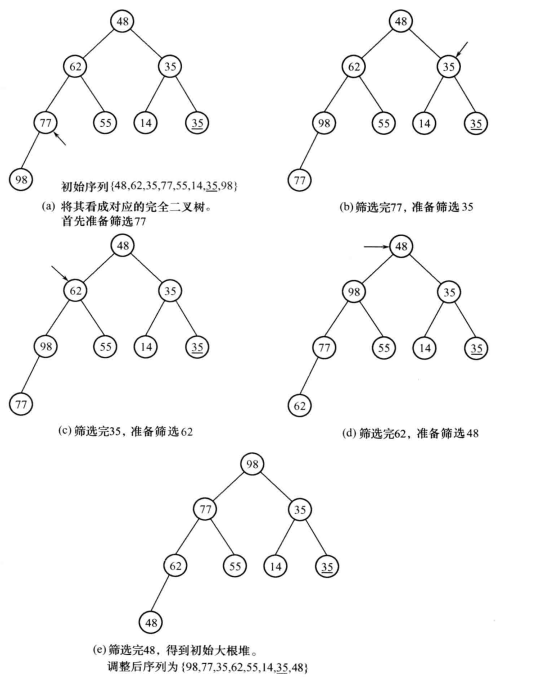

<!-- @import "[TOC]" {cmd="toc" depthFrom=1 depthTo=6 orderedList=false} -->

<!-- code_chunk_output -->

- [排序的基本概念](#排序的基本概念)
- [插入类排序](#插入类排序)
  - [直接插入排序](#直接插入排序)
  - [折半插入排序](#折半插入排序)
  - [希尔排序（缩小增量排序）](#希尔排序缩小增量排序)
- [交换类排序](#交换类排序)
  - [冒泡排序](#冒泡排序)
  - [快速排序](#快速排序)
- [选择类排序](#选择类排序)
  - [简单选择排序](#简单选择排序)
  - [树形选择排序](#树形选择排序)
  - [堆排序](#堆排序)
- [归并排序](#归并排序)
- [分配类排序](#分配类排序)
  - [多关键字排序](#多关键字排序)
  - [链式基数排序](#链式基数排序)
- [总结](#总结)
- [典型例题](#典型例题)

<!-- /code_chunk_output -->
# 排序的基本概念
**内部排序**：整个排序过程完全在内存中进行
**外部排序**：由于待排序记录数据量太大，内存无法容纳全部数据，排序需借助外部存储设备
**排序的稳定性**：假设在排序的序列中存在多个具有相同关键字的记录，设K~i~=K~j~，若在排序前的序列中R~i~领先于R~j~，经过排序后R~i~仍领先于R~j~，则称所用的排序方法是稳定的
向量结构：
```c
typedef int KeyType;
typedef struct{
    KeyType key;
    OtherType other_data;
}RecordType;
```
# 插入类排序
基本思想：在一个已经排好序的记录子集的基础上，每一步将下一个待排序的记录插到已排好序的子集中，直到将所有待排记录全部插入为止
## 直接插入排序
基本思想：将第i个记录的关键字K~i~，顺次与其前面记录的关键字K~i-1~，K~i-2~……，K~1~比较，将所有关键字大于K~i~的记录依次后移，直到遇见一个关键字小于或等于K~i~的记录K~j~，此时K~j~后面必为空，将第i个记录插入即可

假设待排序记录存放在r[1……length]中，为提高效率附设一个监视哨r[0]，使得r[0]始终存放待插入的记录
- 备份待插入的记录，以便前面关键字较大的记录后移
- 防止越界
```c
void InsSort(RecordType r[],int length)
{
    for(i=2;i<=length;i++)
    {
        r[0]=r[i];
        j=i-1;
        while(r[0].key<r[j].key)
        {
            r[j+1]=r[j];
            j=j-1;
        }
        r[j+1]=r[0];
    }
}
```
T(n)=O(n^2^)
S(n)=O(1)
稳定
## 折半插入排序
```c
void BinSort(RecordType r[],int length)
{
    for(i=2;i<=length;++i)
    {
        x=r[i];
        low=1;
        high=i-1;
        while(low<=high)
        {
            mid=(low+high)/2;
            if(x.key<r[mid].key) high=mid-1;
            else low=mid+1;
        }
        for(j=i-1;j>=low;--j)
        r[j+1]=r[j];
        r[low]=x;
    }
}
```
改善了比较次数的数量级O(nlog~2~n)，但没有改善移动元素的时间耗费，T(n)=O(n^2^)
## 希尔排序（缩小增量排序）
算法思想：将待排序的关键字分成若干较小的子序列，对子序列进行插入排序
- 首先选定间距为d~i~(i=1)，在整个待排序记录序列中，将所有间隔为d~i~的记录分为一组，组内进行插入排序
- 取i=i+1，记录间的距离为d~i~，在整个待排序记录序列中，将所有间隔为d~i~的记录分为一组，组内进行插入排序
- 重复②多次，直至d~i~=1，此时整个只有一个子序列，对该序列进行直接插入排序

注意:当子序列记录间的间隔为d时,共有d个子序列,需要对d个子序列分别进行插入排序。但是,算法在具体实现时,并不是先对一个子序列完成插入排序,再对另一个子序列进行插入排序,而是**从第一个子序列的第二个记录开始,顺序扫描整个待排序记录序列**,当前记录属于哪一个子序列,就在哪一个子序列中进行插入排序。
当从第一个子序列的第二个记录开始,顺序扫描整个待排序记录序列时,各子序列的记录将会轮流出现,所以算法将会在每一个子序列中轮流进行插入排序。

```c
void ShellInsert(RecordType r[],int length,int delta)
{
    for(i=1+delta;i<=length;i++)
    if(r[i].key<r[i-delta].key)
    {
        r[0]=r[i];
        for(j=i-delta;j>0&&r[0].key<r[j].key;j-=delta)
           r[j+delta]=r[j];
        r[j+delta]=r[0];
    }
}

void ShellSort(RecordType r[],int length,int delta[],int n)
{
    for(i=0;i<=n-1;++i)
       ShellInsert(r,legth,delta[i]);
}
```
**T(n)=O(n^1.5^)**
增量的取法：
Shell：取d=$\lfloor n/2 \rfloor$，再取d=$\lfloor d/2 \rfloor$，直到d=1
- 缺点：奇数位置的元素在最后一步才会与偶数位置的元素比较，使效率降低

Knuth：d=$\lfloor n/3 \rfloor$+1
**逆转数**：某个记录的关键字在它之前比此关键字大的关键字个数

希尔排序对于中等规模（n≤1000）的序列具有较高效率
希尔排序**不稳定**

# 交换类排序
## 冒泡排序
**算法思想**：反复扫描待排序记录序列，在扫描过程中顺次比较相邻的两个元素的大小，若逆序就交换
第一次n个
第二次前n-1个
第三次前n-2个
……
共n-1趟
```c
void BubbleSort(RecordType r[],int n)
{
    change=TRUE;
    for(i=1;i<=n-1&& change;++i)
    {
        change=FALSE;
        for(j=1;j<=n-i;++j)
           if(r[j].key>r[j+1].key)
           {
               x=r[j];
               r[j]=r[j+1];
               r[j+1]=x;
               change=TRUE;
           }
    }
}
```
冒泡排序最坏情况是待排序记录按关键字逆序排列，此时第i趟冒泡排序需n-i次比较，3(n-i)次移动，经n-1趟排序后，总比较次数：
$$\sum_{i=1}^{n-1}n-i=n(n-1)/2$$
总移动次数3n(n-1)/2，所以**T(n)=O(n^2^)**
**稳定排序**
## 快速排序
**算法思想**：
- 从待排序记录中选取一个记录，其关键字为K~1~，然后将关键字小于K~1~的记录移到K~1~前，将关键字大于或等于K~1~的记录移到K~1~后，最后将K~1~插到分界处，将此过程称为一趟快速排序
- 对两个子表继续进行快排，直至所有子表长度不超过1

**算法步骤**：
假设待划分序列为r[low],r[low+1],……,r[high]
- 首先将r[low]移至x，使r[low]相当于空单元，然后反复进行如下扫描过程，直到high和low相遇
  - high从右向左扫描，直到r[high].key<x.key，将r[high]移至空单元r[low]，此时r[high]相当于空单元
  - low从右向左扫描，直到r[low].key≥x.key，将r[low]移至空单元r[high]，此时r[low]相当于空单元
- 当low和high相遇，r[low](r[high])相当于空单元，将基准记录移至r[low]，就完成依一次划分


完整的快排算法
```c
void QKSort(RecordType r[],int low,int high)
{
    if(low<high){
       pos=OKPass(r,low,high);
       QKSort(r,low,pos-1);
       QKSort(r,pos+1,high);
    }
}
```
一趟快排
```c
int QKPass(RecordType r[],int low,int high)
{
    x=r[low];
    while(low<high)
    {
        while(low<high&&r[high].key>=x.key)
             high--;
        if(low<high) {
            r[low]=r[high];
            low++;
        }
        while(low<high&&r[low].key<x.key)
            low++;
        if(low<high){
            r[high]=r[low];
            high--;
        }
    }
    r[low]=x;
    return low;
}
```
- 最好情况：每趟将序列一分两半，正好在表中间
  
- 最坏情况：已经排好序，其比较次数：
  

**T~avg~(n)=Knlog~2~n**
在所有O(nlog~2~n)的算法中，快排的常数因子K最小
**S~avg~(n)=log~2~n**
**不稳定**
e.g{3,3,2}
为避免枢轴元素是最大值或最小值：
- 采用三元素取中间值pivot=mid(r[low].key,r[$\lfloor (low+high)/2\rfloor$].key,r[high].key)
- 随机选取，将其与首元素互换
# 选择类排序
## 简单选择排序
**算法思想**：
第一趟，从第一个记录开始，通过n-1次比较，从n个记录中选出关键字最小的记录，并和第一个元素交换
第二趟，从第二个记录开始，通过n-2次比较，从n-1个记录中选出关键字最小的记录，并和第二个元素交换
……
第i趟，从第i个记录开始，通过n-i次比较，从n-i+1个记录中选出关键字最小的记录，并和第i个元素交换
**算法描述**：
```c
void SelectSort(RecordType r[],int n)
{
    for(i=1;i<=n-1;++i)
    {
        k=i;
        for(j=i+1;j<=n;++j)
           if(r[j].key<r[k].key) k=j;
        if(k!=i)
        {
            x=r[i];
            r[i]=r[k];
            r[k]=x;
        }
    }
}
```
- 最好情况：待排序序列已是正序排列，则不需移动记录
- 最坏情况：第一个记录最大，其余记录从小到大有序排列，需移动3(n-1)次

$$\sum_{i=1}^{n-1}n-i=(n-1)+(n-2)+……+2+1=n(n-1)/2$$
T(n)=O(n^2^)
## 树形选择排序
**算法思想**：
先把待排序的n个记录关键字两两比较，取出较小者，然后在$\lfloor n/2 \rfloor$个较小者中，采用同样的方法比较，直至选出最小关键字
这个过程可以用一棵满二叉树表示，不满时用∞补满，选出最小关键字记录就是这棵树的根结点，在输出最小关键字之后，为选出次小关键字，将选出的最小关键字所对应的叶子结点的关键字置为∞，然后从该叶结点开始和其兄弟结点的关键字比较，修改从该叶结点到根结点路径上各结点的值，则根结点即为次小关键字

**算法分析**：
假设排序所用满二叉树的深度为h，在树形选择排序中，除了最小关键字，被选出的其他较小关键字都是走了一条由叶子结点到根结点的比较过程且均需比较h-1次
含n个叶子结点的完全二叉树的深度h=$\lceil log_2n \rceil$+1，所以每选出一个次小关键字需比较$\lceil log_2n \rceil$次
**T(n)=O(nlog~2~n)**
与简单选择排序相比降低了比较次数的数量级，增加了n-1个额外的存储空间，同时增加了与∞进行比较的时间耗费
**稳定**
## 堆排序
**算法思想**：把待排序的记录关键字存放在数组r[1……n]之中，将r看成一棵完全二叉树的顺序表示，每个结点表示一个记录，第一个记录r[1]作为二叉树的根，r[2]~r[n]依次逐层从左到右顺序排列，任意结点r[i]的**左孩子是r[2i]**，**右孩子是r[2i+1]**，**双亲是r[$\lfloor i/2 \rfloor$]**
**堆定义**：
称各结点的关键字值满足条件：**r[i].key≥r[2i].key且r[i].key≥r[2i+1].key**的完全二叉树为**大根堆**反之，**r[i].key≤r[2i].key且r[i].key≤r[2i].key**，称为**小根堆**

**重建堆**
- 首先将与堆对应的完全二叉树的根结点中的记录移出，该记录称为待调整记录，此时根结点为空，从空结点的左右子树中选出一个较大的记录，如果该记录的关键字大于待调整记录的关键字，则将该记录上移至空结点
- 此时那个关键字较大的子结点相当于空结点，重复上述过程
- 直到空结点的左右子树的关键字均小于待调整记录的关键字，此时，将待调整记录放入空结点即可


```c
void sift(RecordType r[],int k,int m)
//r[k……m]
{
    t=r[k];//暂存根
    x=r[k].key;
    i=k;
    j=2*i;
    finished=FALSE;
    while(j<=m&&!finished)
    {
        if(j+1<=m&&r[j].key<r[j+1].key) j=j+1;//若存在右子树且右子树根的关键字大，则筛选右分支
        if(x>=r[j].key) finished=TRUE;//筛选完毕
        else
        {
            r[i]=r[j];
            i=j;
            j=2*i;
        }
    }
    r[i]=t;//填入到适当位置
}
```
**建初堆**
**算法思想**：将任意一个序列看成是对应的完全二叉树，由于叶结点可以视为单元素的堆，因而可以反复利用上述调整堆算法，自底向上逐层把所有子树调整为堆，完全二叉树中最后一个非叶节点位于的$\lfloor n/2 \rfloor$个位置，因此筛选需从第$\lfloor n/2 \rfloor$个结点开始，直到根。

```c
void crt_heap(RecordType r[],int n)
{
    for(i=n/2;i>=1;--i)
        sift(r,i,n);
}
```
**堆排序算法实现**
- 建初堆，输出堆顶元素
- 调整剩余记录，利用筛选法将前n-i个元素重新筛选建成一个新堆，在输出堆顶元素
- 重复②，进行n-1次筛选


堆排序算法
```c
void HeapSort(RecordType r[],int n)
{
    crt_heap(r,n);
    for(i=n;i>=2;--i)
    {
        b=r[1];//将堆顶记录和堆尾记录交换
        r[1]=r[i];
        r[i]=b;
        sift(r,1,i-1);//调整使r[1……i-1]变成堆
    }
}
```

在最坏情况下，**T(n)=O(nlog~2~n)**，只需存放一个记录的辅助空间，也称原地排序
**不稳定**，不适用n较少的情况
e.g{5,5,3}
# 归并排序
基本思想：基于合并，将两个或两个以上有序表合并成一个新的有序表
2-路归并排序
**算法思想**：
假设初始序列含n个记录，首先将这n个记录看成n个有序的子序列，每个子序列长度为1，然后两两归并，得到$\lceil n/2 \rceil$个长度为2的有序子序列，再对长度为2的有序子序列进行两两归并，得到长度为4的子序列，重复直到得到长度为n的有序序列

相邻两个有序子序列的合并算法
```c
void Merge(RecordType r1[],int low,int mid,int high,RecordType r2[])
//r1[low……mid],r2[mid+1……high]按有序排列，将他们合并存放在r2[low……high]
{
    i=low;j=mid+1;k=low;
    while(i<=mid)&&(j<=high)
    {
        if(r1[i].key<=r1[j].key)
        {r2[k]=r1[i];++i}
        else {r2[k]=r1[j];++j}
        ++k;
    }
    while(i<=mid)
    {r2[k]=r1[i];k++,i++}
    while(j<=high)
    {r2[k]=r1[j];k++,j++}
}
```
O(n)
**2-路归并的递归算法**
- r1[]前半段归并排序后放在r2[]前半段
- r1[]后半段归并排序后放在r2[]后半段
- r2[]前半段和r2[]后半段合并到r3[]

```c
void MSort(RecordType r1[],int low,int mid,int high,RecordType r3[])
{
    RecordType *r2;
    r2=(RecordType*)malloc(sizeof(RecordType)*(high-low+1));
    if(low==high) r3[low]=r1[low];
    else
    {
        mid=(low+high)/2;
        MSort(r1,low,mid,r2);
        MSort(r1,mid+1,high,r2);
        Msort(r2,low,mid,high,r3);
    }
    free(r2);
}
```
**2-路归并初始调用**
```c
void MergeSort(RecordType r[],int n)
{
    Msort(r,1,n,r);
}
```

**稳定**，归并思想主要用于外部排序
# 分配类排序
## 多关键字排序

## 链式基数排序
**算法思想**：
基于“低位优先”，通过反复进行分配与收集完成排序
假设记录r[i]的关键字为key~i~,key~i~是由d位十进制数字构成的，即key~i~=K1~i~……Kd~i~，则每一位可视为一个子关键字，其中K1~i~是最高位，Kd~i~是最低位，每一位的值都在0~9范围内，此时基数rd=10
排序时先按最低位的值对记录进行初步排序，在此基础上再按次低位的值进一步排序，以此类推直到最高位

采用静态链表存储：
```c
#define RADIX 10
#define KEY_SIZE 6
#define LIST_SIZE 20
typedef int KeyType;
typedef struct{
    KEYType keys[KEY_SIZE];
    OtherType other_data;
    int next;
}RecordType;
typedef struct{
    RecordType r[LIST_SIZE+1];
    int length;
    int keynum;
}SLinkList;
typedef int PVector[RADIX];
```
链式基数排序算法：
```c
void Distribute(RecordType r[],int i,PVector head,PVector tail)
{
    for(j=0;j<=RADIX-1;++j)
       head[j]=0;
    p=r[0].next;
    while(p!=0)
    {
        j=Order(r[p].key[i]);
        if(head[j]==0)  head[j]=p;
        else r[tail[j]].next=p;
        tail[j]=p;
        p=r[p].next;
    }
}

void Collect(RecordType r[],PVector head,PVector tail)
{
    j=0;
    while(head[j]==0) ++j;
    r[0].next=head[j];
    t=tail[j];
    while(j<RADIX-1)
    {
        ++j;
        while((j<RADIX-1)&&(head[j]==0)) ++j;
        if(head[j]!=0)
        {r[t].next=head[j];t=tail[j];}
    }
    r[t].next=0;
}

void RadixSort(RecordType r[],int n,int d)
{
    n=length;
    for(i=0;i<=n-1;++i) r[i].next=i+1;
    r[n].next=0;
    for(i=d-1;i>=0;--i)
    {
        Distribute(r,i,head,tail);
        Collect(r,head,tail);
    }
}
```
T(n)=O(d(n+RADIX))
# 总结


# 典型例题
1.排序方法选择

2.荷兰国旗问题

简单选择排序：
```c
void Sort(int L[],int n)
{
    int i,j,x;
    i=0;//i指向第一个红色条块应该放的位置
    for(j=i;j<n;j++)//j扫描所有未放置好的条块，寻找红色
      if(L[j]==1)
      {
          if(j!=i)
          {
              x=L[j];
              L[j]=L[i];
              L[i]=x;          
          }
          i++;
      }
      for(j=i;j<n;j++)
      if(L[j]==2)//j扫描所有未放置好的条块，寻找白色
      {
          if(j!=i)
          {
              x=L[j];
              L[j]=L[i];
              L[i]=x;          
          }
          i++;
      }
}
```
快速排序：
设置三个整型变量r，w，b，其中r指向红色条块区的下一个单元
开始令r和w为0，b为n-1，w相当于low，b相当于high
```c
void Sort(int L[],int n)
{
    int x;
    int r;//r指向红色条块区的下一个单元(白色条块区的第一个单元)
    int w;//w指向白色条块区的下一个单元(low)
    int b;//b指向蓝色条块区的前一个单元(high)
    r=w=0;
    b=n-1;
    while(w<=b)
    {
        x=L[w];
        if(x==1)//L[w]是红色条块，并且在白色条块区的下一个单元
        {
            L[w]=L[r];//L[r]是第一个白色条块，将其移到白色条块区最后
            w++;//w指向白色条块区的下一单元
            L[r]=x;//将红色条块x放到红色条块区的下一单元
            r++;//r指向红色条块区的下一单元
        }
        else if(x==2)//L[w]是白色条块，并且在白色条块区的下一个单元
              w++;//w指向白色条块区的下一个单元
        else{//L[w]是蓝色条块
            L[w]=L[b];//b指向蓝色条块区的前一单元，将L[b]与L[w]交换
            L[b]=x;//
            b--;//b指向蓝色条块区的前一个单元
        }
    }
}
```
3.哈希排序

